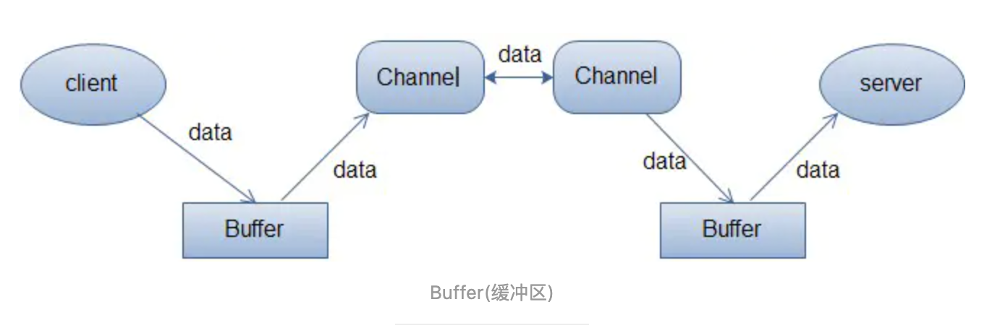
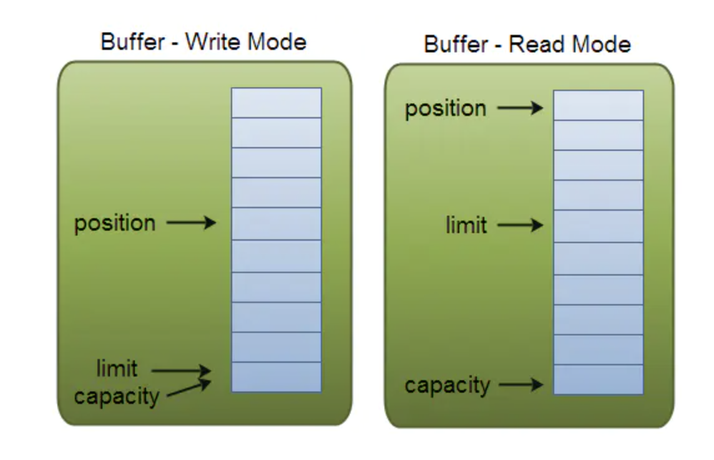

## 1、阻塞和非阻塞

阻塞与非阻塞是描述进程在访问某个资源时，数据是否准备就绪的的一种处理方式。

- 阻塞：线程持续等待资源中数据准备完成，直到返回响应结果。
- 非阻塞：线程直接返回结果，不会持续等待资源准备数据结束后才响应结果。

## 2、同步和异步

同步与异步是指访问数据的机制。

- 同步：主动请求数据后，等待IO操作完成的方式。
- 异步：主动请求数据后便可以继续处理其它任务，随后等待IO操作完毕的通知。


老王烧开水：

1、普通水壶烧水，站在旁边，主动的看水开了没有。【同步阻塞】

2、普通水壶烧水，去干点别的事，过一段时间看水开了没有，没开就走人。【同步非阻塞】

3、报警水壶烧水，站在旁边，不会每过一段时间主动看水开了没有。如果水开了，水壶自动通知。【异步阻塞】

4、报警水壶烧水，去干点别的事，如果水开了，水壶自动通知。【异步非阻塞】


## 基础概念

### 1、传统BIO模型

传统BIO是一种同步的阻塞IO，IO在进行读写时，该线程将被阻塞，线程无法进行其它操作。IO流在进行读取时，会阻塞。直到发生以下情况：

- 有数据可以读取。
- 数据读取完成。
- 发生异常。

### 2、伪异步IO模型

以传统BIO模型为基础，借助线程池的方式维护所有的IO线程，实现相对较高的线程开销及管理。

### 3、NIO模型

NIO模型是一种同步非阻塞IO，主要有三大核心：Channel（通道），Buffer（缓冲区），Selector（多路复用器）。传统IO基于字节流和字符流进行操作，而NIO基于Channel和Buffer进行操作，数据总是从缓冲区写入到通道，或者从通道读取到缓冲区中。Selector用于监听多个通道的事件（比如：连接打开、数据到达）。因此，单个线程可以监听多个数据通道。

NIO和传统IO之间第一个最大的区别就是IO是面向流的，NIO是面向缓冲区的。Java IO面向流意味着每次从流中读取一个或多个字节，它没有被缓存在任何地方。此外，不能前后移动流中的数据，如果需要前后移动从流中读取的数据，需要先缓存到一个缓冲区。NIO不同，数据读取到一个稍后处理的缓冲区，需要时可能在缓冲区中前后移动。这就增加了处理过程中的灵活性。但是，还需要检查该缓冲区中是否包含所有您需要处理的数据。而且，需确保当更多的数据读入缓冲区时，不要覆盖缓冲区里尚未处理的数据。

IO的各种流是阻塞的，这意味着，当一个线程调用read或write时，该线程被阻塞，直到有一些数据被读取或数据完全写入，该线程在此期间不能在干任何事情。NIO的非阻塞模式，使一个线程从某个通道发送请求读取数据，但是它仅能得到目前可用的数据，如果没有数据可用，就什么不会获取，而不是保持线程阻塞，所以直到数据发生改变之前，该线程可以继续做其他事情。非阻塞写也是如此。一个线程请求写入一些数据到某通道，但不需要等待它完全写入，这个线程同时可以去做别的事情。 线程通常将非阻塞IO的空闲时间用于在其它通道上执行IO操作，所以一个单独的线程现在可以管理多个输入和输出通道（channel）。


### NIO的优点：

1. 通过Channel注册到Selector上的状态来实现一种客户端与服务端的通信。
2. Channel中数据的读取是通过Buffer , 一种非阻塞的读取方式。
3. Selector 多路复用器 单线程模型， 线程的资源开销相对比较小。

### Channel

传统IO操作对read()或write()方法的调用，可能会因为没有数据可读/可写而阻塞，直到有数据响应。也就是说读写数据的IO调用，可能会无限期的阻塞等待，效率依赖网络传输的速度。最重要的是在调用一个方法前，无法知道是否会被阻塞。

NIO的Channel抽象了一个重要特征就是可以通过配置它的阻塞行为，来实现非阻塞式的通道。

Channel是一个双向通道，与传统IO操作只允许单向的读写不同的是，NIO的Channel允许在一个通道上进行读和写的操作。

常见的Channel：

- FileChannel
- ServerSocketChannel
- SocketChannel

### Buffer

Bufer顾名思义，它是一个缓冲区，实际上是一个容器，一个连续数组。Channel提供从文件、网络读取数据的渠道，但是读写的数据都必须经过Buffer。



Buffer缓冲区本质上是一块可以写入数据，然后可以从中读取数据的内存。这块内存被包装成NIO Buffer对象，并提供了一组方法，用来方便的访问该模块内存。为了理解Buffer的工作原理，需要熟悉它的三个属性：capacity、position和limit。

position和limit的含义取决于Buffer处在读模式还是写模式。不管Buffer处在什么模式，capacity的含义总是一样的。见下图：



- capacity：作为一个内存块，Buffer有固定的大小值，也叫作“capacity”，只能往其中写入capacity个byte、long、char等类型。一旦Buffer满了，需要将其清空（通过读数据或者清楚数据）才能继续写数据。
- position：当写数据到Buffer中时，position表示当前的位置。初始时的position值为0，当写入一个字节数据到Buffer中后，position会向前移动到下一个可插入数据的Buffer单元。position最大可为capacity-1。当读取数据时，也是从某个特定位置读，将Buffer从写模式切换到读模式，position会被重置为0。当从Buffer的position处读取一个字节数据后，position向前移动到下一个可读的位置。
- limit：在写模式下，Buffer的limit表示你最多能往Buffer里写多少数据。 写模式下，limit等于Buffer的capacity。当切换Buffer到读模式时， limit表示你最多能读到多少数据。因此，当切换Buffer到读模式时，limit会被设置成写模式下的position值。换句话说，你能读到之前写入的所有数据（limit被设置成已写数据的数量，这个值在写模式下就是position）。

### Buffer的分配：

对Buffer对象的操作必须首先进行分配，Buffer提供一个allocate(int capacity)方法分配一个指定字节大小的对象。

向Buffer中写入数据：

1. 从channel写到buffer

   ```java
   int bytes = channel.read(buf); //将channel中的数据读取到buf中
   ```

2. 通过buffer的put方法写到buffer

   ```java
   buf.put(byte); //将数据通过put()方法写入到buf中
   ```

从Buffer中读取数据：

1. 从Buffer读取数据到Channel

   ```java
   int bytes = channel.write(buf); //将buf中的数据读取到channel中
   ```

2. 通过Buffer的get方法读取数据

   ```java
   byte bt = buf.get(); //从buf中读取一个byte
   ```

- flip方法：将Buffer从写模式切换到读模式，调用flip()方法会将position设置为0，并将limit设置为之前的position的值。

- rewind()方法：Buffer.rewind()方法将position设置为0，使得可以重读Buffer中的所有数据，limit保持不变。
- clear()与compact()方法：一旦读完Buffer中的数据，需要让Buffer准备好再次被写入，可以通过clear()或compact()方法完成。如果调用的是clear()方法，position将被设置为0，limit设置为capacity的值。但是Buffer并未被清空，只是通过这些标记告诉我们可以从哪里开始往Buffer中写入多少数据。如果Buffer中还有一些未读的数据，调用clear()方法将被"遗忘 "。compact()方法将所有未读的数据拷贝到Buffer起始处，然后将position设置到最后一个未读元素的后面，limit属性依然设置为capacity。可以使得Buffer中的未读数据还可以在后续中被使用。
- mark()与reset()方法：通过调用Buffer.mark()方法可以标记一个特定的position，之后可以通过调用Buffer.reset()恢复到这个position上。

### Selector

Selector与Channel是相互配合使用的，将Channel注册在Selector上之后，才可以正确的使用Selector，但此时Channel必须为非阻塞模式。Selector可以监听Channel的四种状态（Connect、Accept、Read、Write），当监听到某一Channel的某个状态时，才允许对Channel进行相应的操作。

- Connect：某一个客户端连接成功后
- Accept：准备好进行连接
- Read:可读
- Write:可写

Selector中的select方法是阻塞式调用的，直到有事件就绪时才会返回。

https://www.jianshu.com/p/5bb812ca5f8e

https://www.jianshu.com/p/f13aa939649e

