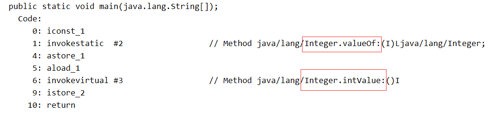

# 包装类

包装类都位于java.lang包下，并所有包装类使用final修饰，不能被继承，包装类和基本数据类型对应关系如下表所示：

| 基本数据类型 |  包装类   |
| :----------: | :-------: |
|     byte     |   Byte    |
|   boolean    |  Boolean  |
|    short     |   Short   |
|     char     | Character |
|     int      |  Integer  |
|     long     |   Long    |
|    float     |   Float   |
|    double    |  Double   |

## 为什么需要包装类

很多人会有疑问，既然Java中为了提高效率，提供了八种基本数据类型，为什么还要提供包装类呢？

因为Java是一种面向对象语言，很多地方都需要使用对象而不是基本数据类型。比如，在集合类中，我们是无法将int 、double等类型放进去的。因为集合的容器要求元素是Object类型。

为了让基本类型也具有对象的特征，就出现了包装类型，它相当于将基本类型“包装起来”，使得它具有了对象的性质，并且为其添加了属性和方法，丰富了基本类型的操作。

## 

## 浮点数

```java
public static final double NaN = 0.0d / 0.0; //非数
public static final double POSITIVE_INFINITY = 1.0 / 0.0;	//正无穷大
public static final double NEGATIVE_INFINITY = -1.0 / 0.0;	//负无穷大
```

在浮点数中才存在无穷的概念，在整数中不存在。

NaN，非数，也就是说它不是一个数，数值之间比较总是返回false，因此我们判断一个数是否为NaN，比较两个数值不相同即可。所有我们在判断时不要直接使用Double.NaN==某个浮点数。最好还是使用Double提供好的NaN方法。在输出的结果中，直接输出NaN。

POSITIVE_INFINITY，正无穷大，只要是大于0的浮点数除以0（包括浮点数），那么它的结果就是正无穷大。在输出的结果中，输出Infinity。

NEGATIVE_INFINITY，负无穷大，只要是小于0的浮点数除以0（包括浮点数），那么它的结果就是负无穷大。在输出的结果中，输出-Infinity。

看下如下几个例子

```java
int i = 0 / 0; //这里运行后会报错 java.lang.ArithmeticException: / by zero
double d = 0.0 / 0; //这里是不会报错的,打印出来的d为NaN,如果这里写成0 / 0 依旧会报错的.
boolean b = (d==d);  //返回false.
```

Double类中提供了判断一个浮点数是否为无穷大。判断是正无穷还是负无穷，直接判断浮点数的符号即可。

```java
public static boolean isInfinite(double v) {
    return (v == POSITIVE_INFINITY) || (v == NEGATIVE_INFINITY);
}

public static boolean isNaN(double v) {
    return (v != v);
}
```


### equals

浮点数和其它类型不一样，存在多个特殊值。

```java
public boolean equals(Object obj) {
    return (obj instanceof Double)
           && (doubleToLongBits(((Double)obj).value) ==
                  doubleToLongBits(value));
}
```

使用instanceof关键字判断obj对象是否为Double类(因为Double被final修饰，所以无子类)，不是直接返回false，否则还要判断Double包装类中的值是否相等。不过，值也要区分啊，毕竟Double中有三个特殊值，是吧。doubleToLongBits的作用就是返回根据IEEE754"双精度格式"位布局，返回指定浮点值的表示。

- 如果参数是正无穷大，其结果为0x7ff0000000000000L
- 如果参数是负无穷大，其结果为0xfff0000000000000L

- 如果参数时NaN，其结果为0x7ff8000000000000L

经过这样比较之后，NaN就转换成一个long类型了，直接对这个long进行比较。此时比较NaN时就会返回true。


## 缓存

在Integer类中提供了缓存机制，为了节省内存和提高性能。该类设置了一个区间，默认在[-128,127]之间可以不需要外部实例化一个Integer对象，当然也可以设置最高取值在jvm运行时。

```java
private static class IntegerCache {
  static final int low = -128;
  static final int high;
  static final Integer cache[];

  static {
      // high value may be configured by property
      int h = 127;
      String integerCacheHighPropValue =
          sun.misc.VM.getSavedProperty("java.lang.Integer.IntegerCache.high");
      if (integerCacheHighPropValue != null) {
          try {
              int i = parseInt(integerCacheHighPropValue);
              i = Math.max(i, 127);
              // Maximum array size is Integer.MAX_VALUE
              h = Math.min(i, Integer.MAX_VALUE - (-low) -1);
          } catch( NumberFormatException nfe) {
              // If the property cannot be parsed into an int, ignore it.
          }
      }
      high = h;

      cache = new Integer[(high - low) + 1];
      int j = low;
      for(int k = 0; k < cache.length; k++)
          cache[k] = new Integer(j++);

      // range [-128, 127] must be interned (JLS7 5.1.7)
      assert IntegerCache.high >= 127;
  }

  private IntegerCache() {}
}
```


## 拆箱与装箱

那么，有了基本数据类型和包装类，肯定有些时候要在他们之间进行转换。比如把一个基本数据类型的int转换成一个包装类型的Integer对象。

我们认为包装类是对基本类型的包装，所以，把基本数据类型转换成包装类的过程就是打包装，英文对应于boxing，中文翻译为装箱。

反之，把包装类转换成基本数据类型的过程就是拆包装，英文对应于unboxing，中文翻译为拆箱。

在SE5之前，要进行装箱，需要通过一下代码。

```java
Integer i = new Integer(10);
```

## 自动拆箱与自动装箱

在SE55中，为了减少开发人员的工作，Java提供了自动拆箱与自动装箱功能。

自动装箱：就是基本数据类型转换成包装类型。

自动拆箱：将包装类型转换成基本类型。

```java
Integer i = 1;	//自动装箱
int b = i;	//自动拆箱
```

`Integer i=1` 可以替代`Integer i = new Integer(1)`。这是因为Java帮我们提供了自动装箱的功能，不需要我们手动去new一个Integer对象。

## 自动拆箱与装箱原理

既然Java提供了自动拆装箱的能力，那么，我们就来看一下，到底是什么原理，Java是如何实现的自动拆装箱功能。

我们有以下自动拆装箱的代码：

```java
public static void main(String[] args) {
    Integer integer = 1; //自动装箱
    int i = integer;	//自动拆箱
}
```

对其进行反汇编，执行命令`javap -c xxx.class`



可以看到在序号1后面调用了valueOf方法创建了一个Integer对象，序号6后面调用了intValue方法将一个Integer转换成基本类型。

可以总结出自动装箱都是通过包装类的valueOf()方法来实现的，自动拆箱都是通过包装类对象的xxxValue()方法来实现的。并且valueOf方法通常都会有缓存机制(除了float,double,boolean)，具体看源码。

## 哪些地方会有自动拆装箱

我们了解过原理之后，在来看一下，什么情况下，Java会帮我们进行自动拆装箱。前面提到的变量的初始化和赋值的场景就不介绍了，那是最简单的也最容易理解的。

我们主要来看一下，那些可能被忽略的场景。

### 将基本数据类型放入集合类

我们知道，Java中的集合类只能接受对象类型，那么以下代码为什么不报错呢?

```
List<Integer> li = new ArrayList<>();
for (int i = 1; i < 50; i ++){
    li.add(i);
}
```


对其进行反汇编后，可以看到在add前，调用了Integer中的valueOf将i进行了自动装箱操作。


### 包装类型和基本类型的大小比较

有没有人想过，当我们对Integer对象与基本类型进行大小比较的时候，实际上比较的是什么内容呢？看以下代码：

```
Integer a=1;
System.out.println(a==1?"等于":"不等于");
Boolean bool=false;
System.out.println(bool?"真":"假");
```


可以看到以上操作先装箱后拆箱。也就是说，包装类与基本类型进行比较运算，是先将包装类进行拆箱成基本类型，然后进行比较的。


### 包装类型的运算

有没有人想过，当我们对Integer对象进行四则运算的时候，是如何进行的呢？看以下代码：

```
Integer i = 10;
Integer j = 20;
 
System.out.println(i+j);
```

反汇编后代码如下：

```
Integer i = Integer.valueOf(10);
Integer j = Integer.valueOf(20);
System.out.println(i.intValue() + j.intValue());
```

我们发现，两个包装类型之间的运算，会被自动拆箱成基本类型进行。


### 三目运算符的使用

这是很多人不知道的一个场景，看一个简单的三目运算符的代码：

```
boolean flag = true;
Integer i = 0;
int j = 1;
int k = flag ? i : j;
```

很多人不知道，其实在`int k = flag ? i : j;`这一行，会发生自动拆箱。反编译后代码如下：

```
boolean flag = true;
Integer i = Integer.valueOf(0);
int j = 1;
int k = flag ? i.intValue() : j;
```

这其实是三目运算符的语法规范：当第二，第三位操作数分别为基本类型和对象时，其中的对象就会拆箱为基本类型进行操作。

因为例子中， ``flag ? i : j;`` 片段中，i是一个包装类型的对象，j是一个基本类型，所以会对包装类进行自动拆箱。如果这个时候i的值为null，那么久会发生空指针异常。


### 函数参数与返回值

```
//自动拆箱
public int getNum1(Integer num) {
 return num;
}
//自动装箱
public Integer getNum2(int num) {
 return num;
}
```

### 自动拆装箱与缓存

Java SE的自动拆装箱还提供了一个和缓存有关的功能，我们先来看以下代码，猜测一下输出结果：

```
public static void main(String... strings) {
 
    Integer integer1 = 3;
    Integer integer2 = 3;
 
    if (integer1 == integer2)
        System.out.println("integer1 == integer2"); //
    else
        System.out.println("integer1 != integer2");
 
    Integer integer3 = 300;
    Integer integer4 = 300;
 
    if (integer3 == integer4)
        System.out.println("integer3 == integer4");
    else
        System.out.println("integer3 != integer4"); //
 
}
```

我们普遍认为上面的两个判断的结果都是false。虽然比较的值是相等的，但是由于比较的是对象，而对象的引用不一样，所以会认为两个if判断都是false的。

在Java中，==比较的是对象应用，而equals比较的是值。

所以，在这个例子中，不同的对象有不同的引用，所以在进行比较的时候都将返回false。奇怪的是，这里两个类似的if条件判断返回不同的布尔值。

上面这段代码真正的输出结果：

```
integer1 == integer2
integer3 != integer4
```

原因就和Integer中缓存机制有关，在JDK5中，Integer的操作上引入了一个新功能来节省内存和提高性能。整型对象通过使用相同的对象引用实现了缓存和重用。

适用于整数区间-128至+127

只适用于自动装箱。使用构造函数创建对象不适用。

其中的javadoc详细的说明了缓存支持-128到127之间的自动装箱过程。最大值127可以通过-XX:AutoBoxCacheMax=size修改。


### 自动拆箱带来的问题

当然，自动拆装箱是一个很好的功能，大大节省了开发人员的精力，不再需要关心到底什么时候需要拆装箱。但是，他也会引入一些问题。
包装对象的数值比较，不能简单的使用==，虽然-128到127之间的数字可以，但是这个范围之外还是需要使用equals比较。
前面提到，有些场景会进行自动拆装箱，同时也说过，由于自动拆箱，如果包装类对象为null，那么自动拆箱时就有可能抛出NPE。
如果一个for循环中有大量拆装箱操作，会浪费很多资源。

参考链接:https://blog.csdn.net/wufaliang003/article/details/82347077