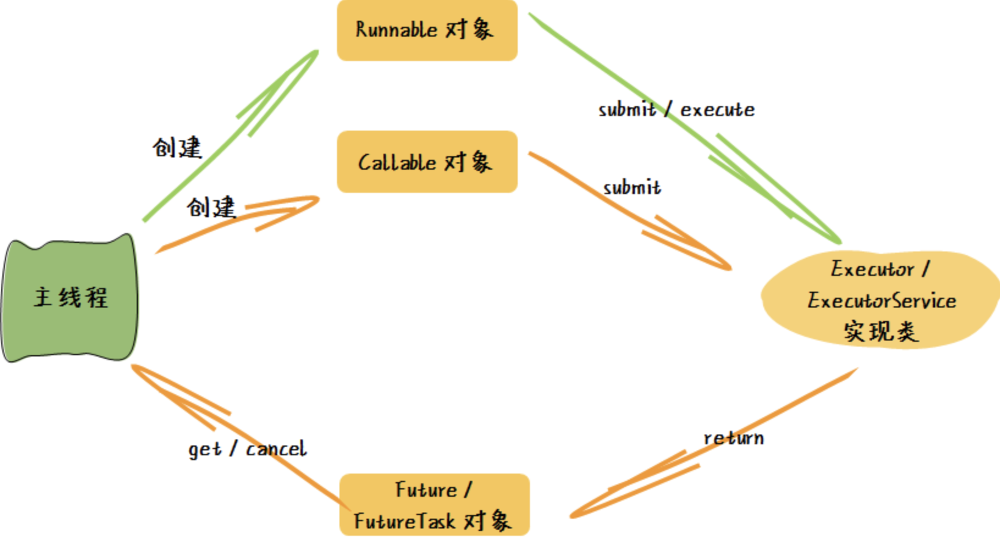

# 并发框架—Executor

## Executor

从 JDK 1.5 开始，java 中将工作单元和执行机制做了分离，于是 Executor 并行框架出现。

什么是工作单元（或称为任务）呢？其实就是我们需要运行的一段逻辑代码。不管什么逻辑的工作单元，最终都需要通过线程运行。

Executor 并行框架对工作单元、以及工作单元的执行做了高度抽象，形成了一整套完整模型。这个模型包括 3 大部分：

1. 对工作单元的抽象，即任务；
2. 任务的执行机制，即如何组织任务的提交、如何管理提交的任务、如何组织多个线程执行；
3. 对任务执行结果的抽象，即如何跟踪任务执行状态，如何获取任务执行结果；

整个 Executor 框架的核心接口和实现类型如下：

1. 工作单元：Runnable，Callable；
2. 工作单元执行：Executor，ExecutorService；
3. 工作单元执行结果：Future，FutureTask；

图片来源于网络

### 工作单元

当不需要关注任务执行结果时，使用 Runnable 很合适，反之使用 Callable。

### 工作单元执行

Executor 接口定义了一个用于执行工作单元【任务】的 execute 方法。

ExecutorService 是 Executor 的子接口，其职责是对一堆用于执行任务的线程做管理，即定义了线程池的基本操作接口，有很多具体的实现子类，其核心操作有：

1. execute (Runnable)：提交 Runnable 任务；
2. submit (Callable 或 Runnable)：提交 Callable 或 Runnable 任务，并返回代表此任务的工作单元执行结果；
3. shutdown ()：关闭新的外部任务提交；
4. shutdownNow ()：尝试中断正在执行的所有任务，清空并返回待执行的任务列表；
5. isTerminated ()：测试是否所有任务都执行完毕了；
6. isShutdown ()：测试是否该 ExecutorService 已被关闭；

### 工作单元执行结果

Future 接口定义了对任务执行结果的取消、状态查询、结果获取方法。FutureTask 是 Future 的唯一实现类，其职责是提供方便地构建带有返回结果的任务。

Future 接口的核心操作有：

1. cancel (boolean)：尝试取消已经提交的任务；
2. isCancelled ()：查询任务是否在完成之前被取消了；
3. isDone ()：查询任务是否已经完成；
4. get ()：获取异步任务的执行结果（如果任务没执行完将等待）；

注意事项：

1. Executors 是 Executor 框架体系中的一个独立的工具类，用于快速创建各类线程池，在实际应用中，如果需要对线程池的各类参数做更多的自定义，可以参考此类的实现；
2. 做好评估权衡，当需要处理的数据量不是特别大时，没有必要使用 Executor。其底层使用多线程的方式处理任务，涉及到线程上下文的切换，当数据量不大的时候使用串行会比使用多线程快；
3. 在使用时，如果主线程不关心子任务的执行结果，使用 Runnable 接口封装任务的执行逻辑；

## ForkJoin

从JDK1.7开始，java 提供了一套大任务分解成小任务并行执行的框架 ForkJoin ，并且在 JDK 1.8 中进一步做了优化。

相比Executor并发框架而言，ForkJoin 框架更倾向于任务拆分并行执行的场合，而 Executor 框架更适合于更一般的任务彼此之间无内在关系的场合。

ForkJoin 框架的基本思想是将一个大任务拆分成多个处理逻辑相同的子任务，最后将这些子任务的结果再汇总起来，从而得到大任务的结果。即在任务处理时，先进行任务切分，然后进行切分后的各子任务的计算，最后做结果合并。子任务还可以继续切分。

整个 ForkJoin 框架的核心接口和实现类：

1. 线程池 ForkJoinPool，代表执行任务的线程池。
2. 执行线程 ForkJoinWorkerThread，代表 ForkJoinPool 线程池中的一个执行任务的线程。
3. 任务 ForkJoinTask ，代表运行在 ForkJoinPool 中的任务。

### ForkJoinPool

ForkJoinPool 代表了任务的执行器，当采用 ForkJoin 框架执行我们的任务时，首先需要创建一个 ForkJoinPool 对象，所有后继执行的过程控制都交给此对象完成。

### ForkJoinWorkerThread

ForkJoinWorkerThread 是 ForkJoin 框架中用于执行任务的线程实现。一般情况下我们无需显式地使用此类，由 ForkJoinPool 类内部自行创建并维护。

### ForkJoinTask

ForkJoinTask 是一个抽象类，定义了任务的主要操作接口。

1. fork ()：在当前线程运行的线程池中再创建提交一个子任务；
2. join ()：当任务完成的时候返回计算结果；
3. invoke ()：开始执行任务，如果必要等待计算完成；

共有两个子类：

1. RecursiveAction：提供了无需关心任务执行结果场合下的默认实现；
2. RecursiveTask：提供了最终需获取任务执行结果的场合下的默认实现；