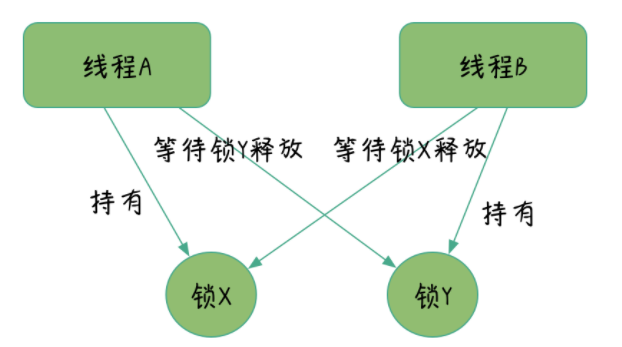

# 多线程引发的问题

## 安全性问题

线程安全：多个线程访问某个类时，这个类始终表现出正确的行为；

### 原子性

一系列操作，要么全部完成，要么全部不完成，不可被分割，不会结束在中间某个环节;

```java
public class Test {

    //剩余的火车票数量
    public static Integer leftTicketTotal =  10000;
    //售出的火车票数量
    public static Integer selledTicketTotal = 0;

    public static class TicketWindow implements Runnable {

        @Override
        public void run() {
             while (leftTicketTotal > 0) {
                selledTicketTotal++;
                leftTicketTotal--;
            }
        }
    }

    public static void main(String[] args) throws InterruptedException {
        //启动窗口1售票线程
        Thread thread1 = new Thread(new TicketWindow());
        thread1.start();
        //启动窗口2售票线程
        Thread thread2 = new Thread(new TicketWindow());
        thread2.start();
        //启动窗口3售票线程
        Thread thread3 = new Thread(new TicketWindow());
        thread3.start();

        //等待三个线程执行完成
        thread1.join();
        thread2.join();
        thread3.join();
        //输出最终火车票数量
        System.out.println("售出火车票数量:" + selledTicketTotal + " 剩余火车票数量:" + leftTicketTotal);
    }
}
```

运行后，我们得到的输出结果却是，售出火车票数与总数不一致，而且我们发现每次输出的结果都不一样。简单的分析下，++操作实际上包括三个操作，读取 selledTicketTotal 的值，进行加 1 操作，写入新的值；

对一个变量的非原子操作往往会产生非预期的结果，比如线程 A 和线程 B 都在执行 `selledTicketTotal++`，线程 A 读到 selledTicketTotal=10, 由于非原子操作是可被分割的，此时线程 B 不会等待 A 操作完成执行加 1 操作，而是同样读到了 selledTicketTotal=10，线程 A 和 B 以 10 做基数分别做加 1 操作，selledTicketTotal 最终结果为 11，而不是预期的 12，这就是非原子操作带来数据不一致。

> 原子性：指不可被分割的一系列操作；

原子性的手段：单线程、加锁、CAS。

### 可见性

当一个线程修改了对象状态（对象属性）后，其他线程能够看到发生的状态变化;

```java
public class Tests {
  public static boolean flag = true;
  public static class R1 implements Runnable {
    @Override
    public void run() {
        while (flag) {
            try {
              System.out.println("AAA");
              Thread.sleep(1000);
            } catch (InterruptedException e) {
              e.printStackTrace();
            }
        }
    }
  }
  
public static void main(String[] args) throws InterruptedException {
    Thread thread = new Thread(new R1());
    thread.start();

    Thread.sleep(1000);
    flag = false;
    System.out.println("BBB");
    //一定概率下,会继续输出水AAA
    thread.join();
  }
}
```

当一个线程更新了一个变量，另一个线程并不能及时得到变量修改后的值。当读操作和写操作在不同的线程中执行时，我们无法确保执行读操作的线程能实时看到其他线程写入的值。


保持可见性手段：插入内存屏障；

## 上下文切换

Java 中的线程与 CPU 单核执行是一对一的，即单个处理器同一时间只能处理一个线程的执行；而 CPU 是通过时间片算法来执行任务的，不同的线程活跃状态不同，CPU 会在多个线程间切换执行，在切换时会保存上一个任务的状态，以便下次切换回这个任务时可以再加载到这个任务的状态，这种任务的保存到加载就是一次上下文切换。

线程数越多，带来的上下文切换越严重，上下文切换会带来 CPU 系统态使用率占用，这就是为什么当我们开启大量线程，系统反而更慢的原因。


如何减少上下文切换？

- 减少锁等待：锁等待意味着，线程频繁在活跃与等待状态之间切换，增加上下文切换，锁等待是由对同一份资源竞争激烈引起的，在一些场景我们可以用一些手段减轻锁竞争，比如数据分片或者数据快照等方式；
- CAS 算法：利用 Compare and Swap, 即比较再交换可以避免加锁；
- 使用合适的线程数或者协程：使用合适的线程数而不是越多越好，在 CPU 密集的系统中，比如我们倾向于启动最多 2 倍处理器核心数量的线程；协程由于天然在单线程实现多任务的调度，所以协程实际上避免了上下文切换；

## 活跃性问题

当某些操作迟迟得不到执行时，就被认为是产生了活跃性问题，活跃性分为两类，一类是死锁，一类是饥饿。

死锁是最常见的活跃性问题，除此之外还有饥饿、活锁。在多线程开发中，我们要避免线程安全问题，势必要对共享的数据资源进行加锁，而加锁处理不当即会带来死锁。

当线程由于无法访它所需的资源而不能继续执行时，就发生了饥饿。



避免死锁：

- 获取锁的顺序是固定的；

