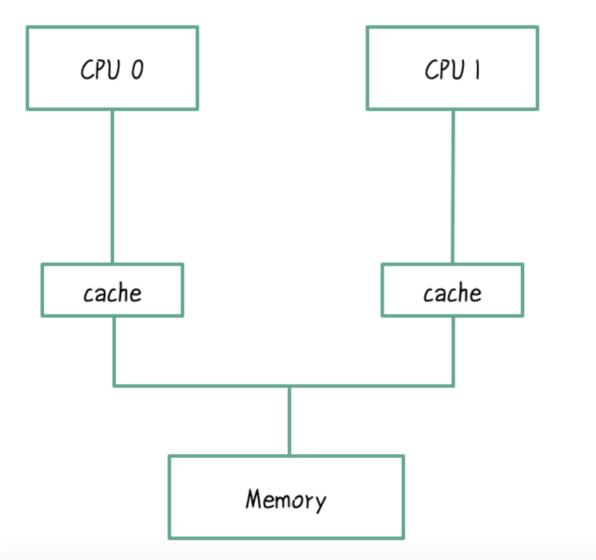
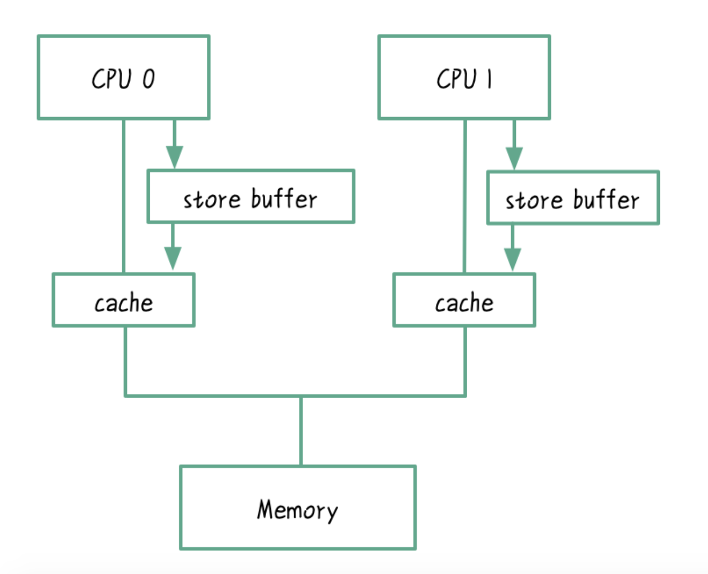

# 并发理论

## 指令重排序

重排序：编译器和处理器为了优化程序性能而对指令序列进行重排序的手段。

指令重排序分为：编译器指令重排序和处理器指令重排序。

### 编译器指令重排序

编译器的作用就是将高级语言编写的代码翻译成机器指令，经过编译优化后，最后编译的指令顺序有可能和我们写的代码顺序不一致；

```java
int a = 0; //1
for (int i = 0 ; i< 10000; i++) {
    a = 6; //2
    System.out.println(i);
    //此时下面打印的变量一直是6
    System.out.println(a);
}
```

这段代码执行的是打印 0 到 9999。一个聪明的编译器会分析在循环里每次对 a 的赋值是多余的，只需要一次赋值能达到同样的结果。

```java
//线程A开始执行
int a = 6; //2
for (int i = 0 ; i< 10000; i++) {
    //此时线程B修改了变量a，赋值为8
    System.out.println(i);
    //此时下面打印的变量有可能一直是8而不是6
    System.out.println(a);
}
```

结合代码来看，如果在线程 A 执行循环的过程中，线程 B 恰好对 a 做了修改，比如 a=8，那么可能发生的情况是 a 永远是 8，即使循环还未结束，也不会有修改操作了，这意味着操作 for 循环的线程 A 对 a 的修改无法被其他线程看到，其他线程看到的永远是 8。这就说明编译器的指令重排造成了对象不可见。【**为啥线程B能修改变量a**】


### 处理器指令重排序

在 CPU 执行指令期间，势必涉及到数据的读取和写入，而程序运行过程中数据是放在内存中的，而从内存的读取与 CPU 执行指令的速度比起来要慢的多。于是 CPU 厂商对每核处理器都配备了一个高速缓存，减少与内存的直接交互，拷贝一份临时数据缓存在 CPU 内 (数据是以缓存行的形式存放的)，提升存取效率。



> 缓存行 (cache line) 是内存与缓存交换的最小单元，根据操作系统位数的不同，一般是 32byte 或 64byte。

它由三部分组成，状态、地址和数据。


解决了内存存取效率问题，新的问题又出现了。在多线程中，线程运行于不同的 CPU 中，每核 CPU 都有一份单独的缓存，假设两个线程执行代码 `count++` 操作，两个不同的线程会分别读取 count 的值并存入各自的 CPU 缓存中，然后各自 CPU 同时对本地缓存的 count 执行加 1 操作，初始值都为 0，加 1 操作后，各自 CPU 缓存中的 count 副本结果都为 1，两个不同的 CPU 也没有进行协商，而是直接将本地缓存的 count 写入主内存，造成 count 变量最终结果变成了 1 而不是 2, 为了避免这一问题，Intel 处理器最早推出了缓存一致性协议 (MESI)。


## 缓存一致性协议（MESI）

多核 CPU 的情况下有多个一级缓存，保证缓存内部数据的一致，不让系统数据混乱，MESI可以保证缓存的一致性。

MESI协议一种广为使用的缓存一致性协议， MESI 约定了缓存行的4个状态，分别为M修改、E独享、S共享、I无效。

- M（Modified）：数据被修改后，数据与内存中的不一致，数据只存在于当前CPU缓存中；
- E（Exclusive）：数据与内存一致，数据只存在于当前CPU缓存中；
- S（Shared）：数据与内存一致，数据存在多个CPU缓存中；
- I（Invalid）：表示该缓存行无效；


缓存一致性协议的目的是保证缓存的一致性，协议要求：

1. 在 CPU 写数据时，先写入到 Store Buffer 中，如果该缓存行是共享状态，会广播 read invalidate 消息，收到该消息的 CPU 会将本地的缓存行置为无效状态，并返回 ack 响应给即将做写入操作的 CPU，写入 CPU 在收到所有响应后，才会做真正的缓存写入操作，然后该缓存行状态会变为修改状态。
2. 在 CPU 读数据时，如果该缓存行在其他 CPU 存在，当前 CPU 会向缓存行所在 CPU 发送 read 消息，接收到 read 消息的 CPU 会将缓存行传输到请求数据的 CPU，缓存行状态会变成共享状态

其中 Store Buffer 是作为缓存和 CPU 之间的桥梁，当缓存行在其他 CPU 缓存中都置为 invalid 后，Store Buffer 中的数据才会真正写入缓存行。




## 内存屏障

内存屏障指令，是一类同步屏障指令，它使得 CPU 或编译器在对内存进行操作的时候，严格按照一定的顺序来执行；


## CAS

## 锁


硬件层面链接：https://blog.csdn.net/wll1228/article/details/107775976