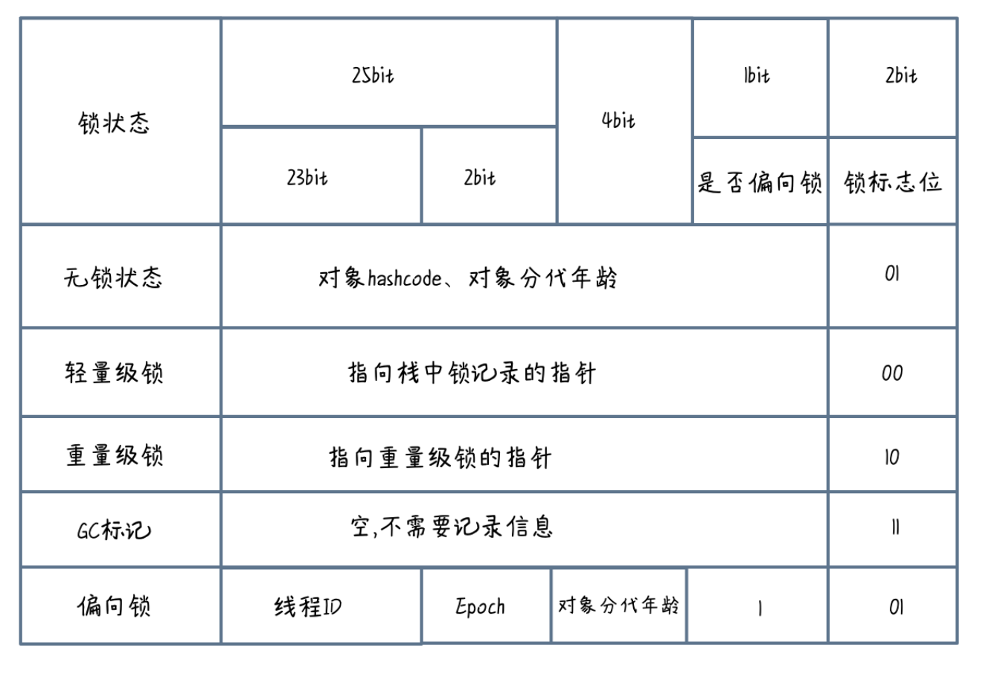
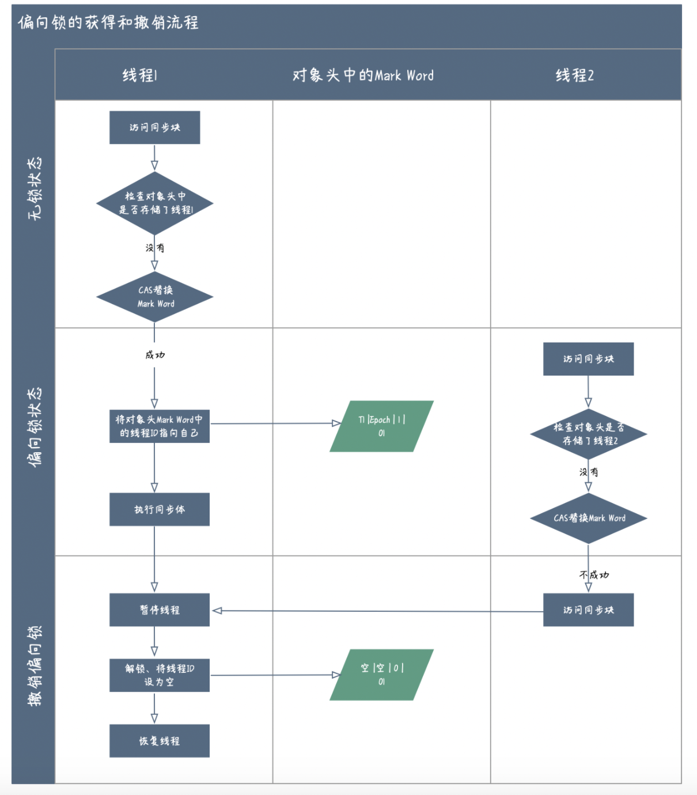
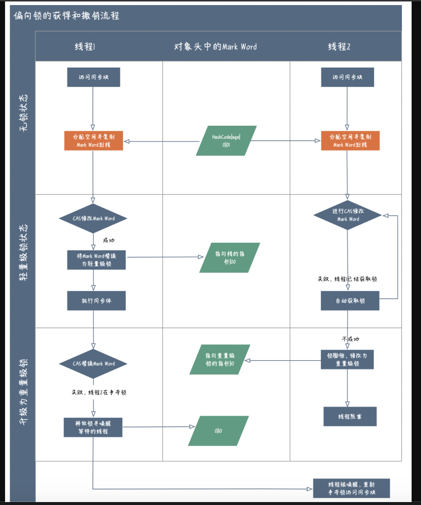

# Sync

Synchronized可以修饰静态方法、实例方法，在类对象、实例对象进行加锁。在jdk1.5，JUC里多了一个ReentrantLock锁，ReentrantLock同样可以实现Sync锁的功能，并且在当时性能要比Sync锁高。在jdk1.6之后，对Sync做了各种优化，比如减少了获取锁和释放锁带来的性能消耗，引入了无锁、偏向锁，轻量级锁，重量级锁，使得 Synchronized 性能有了很多提升，至此 ReentrantLock 锁在性能上已经没有明显优势了。

## Sync锁的实现

在 JVM 中的对象内存布局分为三部分：分别是对象头，实例数据和对齐填充；其中对象头用三个字 (32 位虚拟机是 32bit，64 位虚拟机是 64bit) 宽，可以划分为 Mark Word、类型指针和数据长度，每个占用一个字长。

Synchronized 锁的记录信息就存放在 Mark Word 中，以32位虚拟机为例。

Java1.6 之后，为了提升 synchronized 的性能，引入了偏向锁和轻量级锁，在资源竞争不激烈的条件下优先使用这两种锁状态，以此来抢占互斥锁产生的开销，在代码层面我们是感知不到的，JVM 只是在运行阶段根据资源竞争情况逐渐升级，锁状态只会升级而不会降级。

### 偏向锁实现

大部分场景下，线程在进入 synchronized 同步块时，往往只有一个线程多次获取锁 (多次重入)，其他线程不会参与竞争，这个时候是没必要每次做 CAS 操作 Mark Word 的，只需要判断 Mark Word 中的线程 ID 是否属于当前线程即可，因此 Mark word 中存放了记录获取锁的线程 ID 的记录。

(图片来源于并发编程网)

偏向锁的获取锁流程:

1. 线程 1 首先访问同步块，检查偏向锁线程 ID 是否等于当前线程 ID，不相等则做 CAS 替换
2. 相等，将当前线程 ID 和偏向锁标记写入 mark word
3. 执行同步块

退出同步块偏向锁不会立即被释放，而是等待有新的线程竞争时触发撤销时才会被释放，偏向锁的撤销，需要等待全局安全点，即这个时间点没有正在执行的字节码，暂停线程并将线程 ID 设置为空，最后再恢复线程。

被撤销后的偏向锁可以继续偏向于其他线程，竞争达到一定程度后，会被标记为不适合作为偏向锁，之后的线程再进入同步块，会自动升级为轻量级锁。

偏向锁在 Java1.6 之后可以通过 JVM 参数关闭的: -XX:-UseBiaseLocking=false, 同步块会默认直接进入轻量级锁状态。

### 轻量级锁实现

轻量级锁相比偏向锁能支持的竞争程度更高，mark word 会存放一个指向栈的指针，这个指针指向持有锁线程栈的一块内存区域，这块内存区域是在访问同步块，将 mark word 拷贝到线程栈时分配的 (被称作 LockRecord)。

拷贝完之后，持有锁的线程会对 mark word 做 CAS 修改，标记为轻量级锁状态，并且将 mark word 指针指向存储在当前线程栈的 LockRecord。

其余线程在获取锁失败后，会发生自旋，自旋多次不成功，当前处于轻量级锁状态的锁就会升级为重量级锁，并且指针指向重量级锁。

持有锁的线程在轻量级锁释放之前，会再次 CAS 替换将 mark word 置为空，但如果有其他线程捷足先登修改了 mark word 做了锁升级，那么当前线程会释放锁并唤醒等待的线程。

### 重量级锁实现

引入轻量级锁的主要目的是在没有多线程竞争的前提下，减少传统的重量级锁使用操作系统互斥量产生的性能消耗。之所以优化 Synchronized，主要是为了避免重量级锁的出现频率，而重量级锁为什么会消耗性能呢？ 这是因为当产生锁互斥时，获锁失败的线程将发生阻塞，发生阻塞时线程不会消耗 CPU，但重新被唤醒后，会带来上下文切换，造成 CPU 内核态使用率升高，带来系统吞吐量下降。而轻量级锁的失败自旋的设计都是为了解决此问题的。

锁对比

|    锁    |                       优点                       |                缺点                |                场景                |
| :------: | :----------------------------------------------: | :--------------------------------: | :--------------------------------: |
|  偏向锁  | 单线程重入锁和释放锁无需额外消耗 (减少 CAS 开销) |           撤销锁开销较大           |        单线程访问同步块场景        |
| 轻量级锁 |   获锁失败的线程不会立即阻塞，减少了上下文切换   | 长时间获取不到锁发生自旋会消耗 cpu |     锁竞争一般的情况下比较适用     |
| 重量级锁 |                   不会发生自旋                   |      线程阻塞，带来上下文切换      | 同步块执行较快且竞争较激烈的情况。 |

synchronized 锁总结如下

- 按照状态可以把 synchronized 锁分为无锁、偏向锁、轻量级锁、重量级锁
- 随竞争加剧逐渐升级，状态只升不降
- Mark Word 最后 2bit 存放锁的状态，偏向锁状态单独有 1bit 进行存放
- 有锁状态时，Mark Word 都会记录锁的指针或持有锁的线程 ID

加锁原则：

- 控制锁粒度，减少锁住的代码行数；
- 加锁顺序，避免死锁；