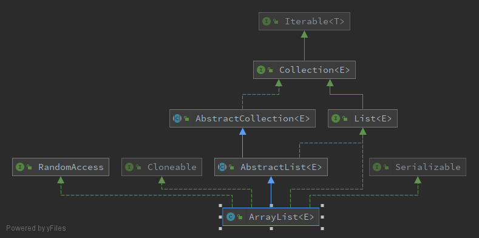
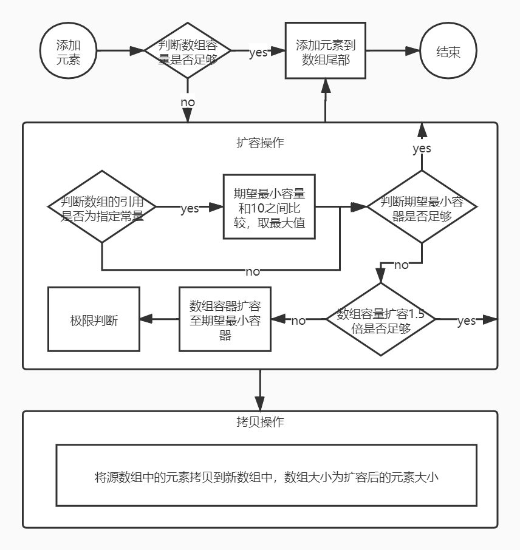

# ArrayList

## 概述

ArrayList是Collection框架的一个成员，ArrayList在jdk1.7和1.8做了一些变动，主要针对的是扩容。


为什么在jdk中需要引入ArrayList？

1. 在jdk中，数组一旦确定空间就不能修改，如果超出了数组空间，那么会抛出异常；
2. 如果初始化开辟一个大空间数组，而其中存储的数据量又特别少，造成了内存资源的浪费；

而ArrayList是一个基于数组实现的动态数组，即数组容量能够根据需要进行扩容，同时也提供了缩容的API。其类图如下：



- 实现了Cloneable接口：说明ArrayList支持拷贝，重写了Object中的clone拷贝方法；
- 实现了Serializable接口：说明ArrayList支持序列华，通过序列化传输数据，反序列化解析数据；
- 实现了RandomAccess接口：说明ArrayList支持随机快速访问元素；
- 继承AbstractList抽象类：所有List接口的默认实现；

## 底层数据结构

```java
transient Object[] elementData; // non-private to simplify nested class access
```

ArrayList的元素存储在数组中，后面的增删操作都是基于该字段来进行操作；ArrayList的容量就是这个数组的长度，实际元素个数<=容器；


为什么使用Object作为底层数组的类型？

1. 所有的对象都是Object类型的子类，任何对象都可以向该数组中添加数据，多态性；
2. 泛型是在jdk1.5提出的，而该类是在1.2就已经提出了；


为什么需要加上transient关键字？

- 该数组默认不会被序列化，因为该数组的实际元素可能并不多；
- 重新了反序列化readObject和序列化writeObject方法；


## CRUD

### 添加

向ArrayList中添加一个元素，主要分为三步：判断容器+进行扩容、拷贝、添加元素。

```java
public boolean add(E e) {
    ensureCapacityInternal(size + 1);
    elementData[size++] = e;
    return true;
}
```





向ArrayList指定位置添加一个元素，大致的流程和上图一致。

1. 确保位置正常；
2. 确保容器足够；
3. 通过拷贝移动元素【原地移位】，原数组中该位置的元素往后挪一位，该位置空留出用来保存要添加的元素；

执行addXX方法时，修改都会被加1，多线程并发修改时，会触发fast-fail；

在Java中，原地移动元素通过System#arraycopy实现，它是一个native方法，通过C/C++实现；

### 删除

删除指定位置中的元素。

```java
public E remove(int index) {
    rangeCheck(index);

    modCount++;
    E oldValue = elementData(index);

    int numMoved = size - index - 1;
    if (numMoved > 0)
        System.arraycopy(elementData, index+1, elementData, index,
                         numMoved);
    elementData[--size] = null; // clear to let GC do its work

    return oldValue;
}
```

1. 判断位置是否正确；
2. 计算是否需要移动元素；【删除最后一个元素不需要移动】
3. 返回原数据；


### 修改

```java
public E set(int index, E element) {
    rangeCheck(index);

    E oldValue = elementData(index);
    elementData[index] = element;
    return oldValue;
}
```

修改指定索引号的元素，返回修改前的元素；


### 查找

```java
public E get(int index) {
    rangeCheck(index);
    return elementData(index);
}
```

ArrayLis底层使用的就是数组类型，数组的特点就是可以通过下标进行获取元素。

```java
public int indexOf(Object o) {
    if (o == null) {
        for (int i = 0; i < size; i++)
            if (elementData[i]==null)
                return i;
    } else {
        for (int i = 0; i < size; i++)
            if (o.equals(elementData[i]))
                return i;
    }
    return -1;
}
```

从头开始查找指定元素，未找到就返回-1；由于ArrayList底层支持添加null元素，因此当需要查找该null元素时也是需要支持的，分两次比较是因为可能出现空指针异常；当然可以使用Objects#equals方法进行优化，代码如下：

```java
public int indexOf(Object o) {
        for (int i = 0; i < size; i++) {
            if (Objects.equals(o, elementData[i])) return i;
        }
        return -1;
    }
```

当然也提供了从尾向前查找指定元素，逻辑和indexOf类似；


### 缩容

```java
public void trimToSize() {
    modCount++;
    if (size < elementData.length) {
        elementData = (size == 0) ? EMPTY_ELEMENTDATA : Arrays.copyOf(elementData, size);
    }
}
```

当数组添加到1万大小，就添加了一个元素，触发了一次扩容，容量变为1.5万，浪费了4900个内存空间，此时通过缩容即可避免多余内存空间的消耗。

引发的问题：

- 缩容操作需要对原数组进行拷贝，存在时间消耗；
- 缩容操作后，如果还需要添加元素，还需要触发一次扩容操作；

因此，大部分场景中是不需要进行缩容的。


## 快速失败机制

“快速失败”也就是fail-fast，它是Java集合的一种错误检测机制。当多个线程对集合进行结构上改变的操作时，有可能会产生fail-fast机制。

例如：假设存在两个线程(线程A和线程B)，线程A在Iterator遍历集合A中的元素，在某个时候线程B修改了集合A的结构（是结构上的修改，而不是简单的修改集合元素的内容），那么程序就会抛出并发修改异常。

要了解fail-fast机制，首先要对ConcurrentModificationException异常有所了解。当方法检测到对象的并发修改，但不允许这种修改就抛出该异常。在单线程情况下，如果在forEach遍历的时候使用add/remove方法，也有机会抛出该异常。


## 多线程安全问题

例子：线程A、线程B同时向ArrayList中添加元素；

```java
public void testTwoThread() throws InterruptedException {
    List<String> strings = new ArrayList<>();
    Thread t1 = new Thread(() -> {
        for (int j = 0; j < 1000; j++) {
            strings.add(String.valueOf(j));
            try {
                // 提高线程t2执行
                Thread.sleep(10);
            } catch (InterruptedException e) {
                e.printStackTrace();
            }
        }
    });
    t1.start();

    Thread t2 = new Thread(() -> {
        for (int i = 1000; i < 2000; i++) {
            strings.add(String.valueOf(i));
            try {
                // 提高线程t1执行
                Thread.sleep(10);
            } catch (InterruptedException e) {
                e.printStackTrace();
            }
        }
    });

    t2.start();
	
    t1.join();
    t2.join();

    System.out.println(strings.size());
}
```

这个例子中，创建了线程t1和线程t2两个线程，并且t1和t2线程都优先于主线程执行，可确保元素已经添加到ArrayList后，打印元素的大小。

- 异常

  ```
  Exception in thread "Thread-0" java.lang.ArrayIndexOutOfBoundsException: 823
  	at java.util.ArrayList.add(ArrayList.java:465)
  ```

- 小于2000

- size符合预期，中间有null值存在：https://segmentfault.com/a/1190000023807751


### 在哪会出现线程安全问题

```java
elementData[size++] = e;
```

size++为非原子操作，在语言层面分为

```java
elementData[size] = e;
size = size + 1;
```

在jvm指令层面分为取值、加1、存值。

```java
0:iconst_0
1:istore_1
2:iinc 1, 1
```


### 为什么会有线程安全问题

数组越界：线程t1向ArrayList中添加元素823，线程t1执行完判断逻辑可以添加元素，由于CPU调度，线程t2去执行，线程t2向ArrayList中添加元素1300，执行后，容量刚好不够了，线程t1恢复执行`elementData[size++] = e`，导致数组越界。

比实际容量小：线程t1执行`elementData[size] = e`后，CPU调度，线程t2去执行添加元素，此时线程t2的size拿的还是线程t1执行时的size，t2线程执行完size自增1，此时线程t1并不知道size已经加1，使用的依旧是旧值自增，此时线程t1的值就将线程t2中的值给覆盖了。


试想size如果使用并发包原子类是否存在容量问题呢？


### 怎么解决

- Collections#synchronizedCollection
- CopyOnWriteArrayList


总结：ArrayList在多线程环境不适用，适合于读多写少的场景。

