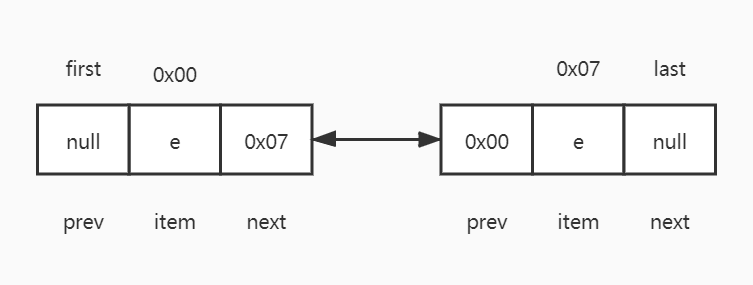

# LinkedList

## 概述

为什么需要引入LinkedList？

我们知道ArrayList的插入和删除的需要移动元素，时间最坏复杂度为O(N)。ArrayList不适合频繁的插入和删除元素，因此引入了链表结构。

LinkedList底层数据结构是一个双向链表。和单向链表相比，单向链表不能往回查找元素，而双向链表可以。

单链表的结构如下：


我们主要看双链表结构：


从结构中我们可以看出，链表中的每个节点都可以向前或向后查找元素，其中有几个相关概念：

- 链表每个节点我们叫做为Node，Node有prev属性，代表前一个节点的位置；next属性，代表后一个节点的位置；
- first是双向链表的头节点，它的前一个节点是null；
- last是双向链表的尾节点，它的后一个节点是null；
- 当链表中没有数据时，first和last是同一个节点，前后指向都是null；
- 因为是个双向链表，只要机器内存足够强大，是没有大小限制的；

```java
private static class Node<E> {
    E item;
    Node<E> next;
    Node<E> prev;
    Node(Node<E> prev, E element, Node<E> next) {
        this.item = element;
        this.next = next;
        this.prev = prev;
    }
}
```


LinkedList的继承树


- LinkedList继承了AbstractSequentialList抽象类；
- LinkedList实现Queue接口，表明LinkedList符合队列结构；
- LinkedList实现Deque接口，表明LinkedList符合双端队列结构；

为什么需要新添加一个AbstractSequentialList抽象类，而不直接使用AbstractList?

首先，我们需要知道ArrayList、LinkedList的数据结构，数组是支持随机访问的。而链表结构中的内存不是按顺序存放的，而是将引用连在了一起，为了访问某一元素，必须顺着链表的引用逐个找。


## CRUD方法

### 添加

#### linkLast

从链表的尾节点后添加一个节点。

```java
void linkLast(E e) {
    //把尾节点数据据暂时保存下来
    final Node<E> l = last;
    //新建一个节点  l:新节点的前一个节点,e当前新增节点,当前新增节点后一个节点是null
    final Node<E> newNode = new Node<>(l, e, null);
    //新建节点作为尾节点
    last = newNode;
    //如果链表为空(尾节点为空,链表即空表),此时头节点和尾节点都是同一个节点
    if (l == null)
        first = newNode;//新建节点作为头节点
    //否则把尾节点的下一个节点指向当前尾节点.
    else
        l.next = newNode;
    size++;
    modCount++;
}
```

首次添加元素前，头节点和尾节点都为空，添加完后，头节点和尾节点都是同一个元素。结构如下：


但有多个节点时，再添加一个节点。结构如下：



保留尾节点【last】的作用主要有两点：

1. 判断链表是否为空表；
2. 支持从后往前查找元素；

#### linkFirst

从链表的头节点前添加一个元素。

```java
private void linkFirst(E e) {
    //将链表中的头节点保存下来
    final Node<E> f = first;
    //创建新节点,新节点的next节点就是保存下来的头节点
    final Node<E> newNode = new Node<>(null, e, f);
    //将新节点做为头节点
    first = newNode;
    //如果没有头节点,当前节点即为头节点,也为尾节点.
    if (f == null)
        last = newNode;
    else
        f.prev = newNode;//修改保存下来头节点的prev节点
    //更新节点个数及版本
    size++;
    modCount++;
}
```

该方法可实现队列的操作，先进先出。

首次添加元素前结构与linkLast一致。linkFirst和linkLast添加节点非常类似，前者是更换上一个节点(last:0x01)的prev指向，后者是更换上一个节点(first:0x01)的next指向。结构图如下：


#### linkBefore

### 删除

#### unlinkLast

#### unlinkFirst

#### unlink

### 修改

### 查找

#### node

#### indexOf

