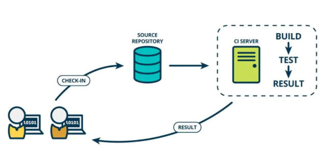
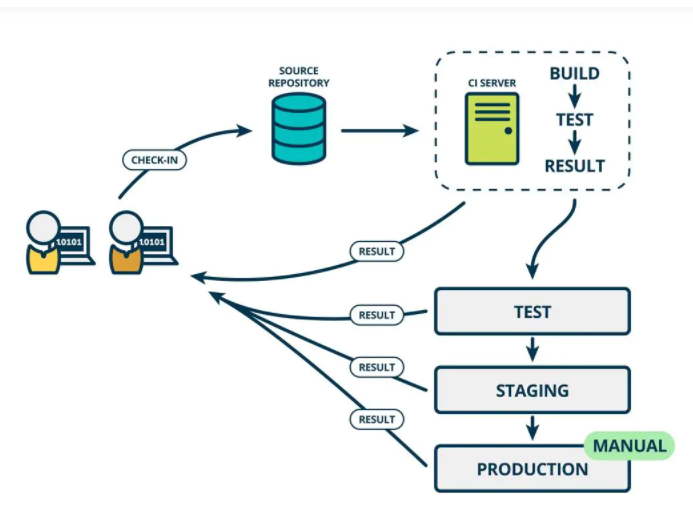
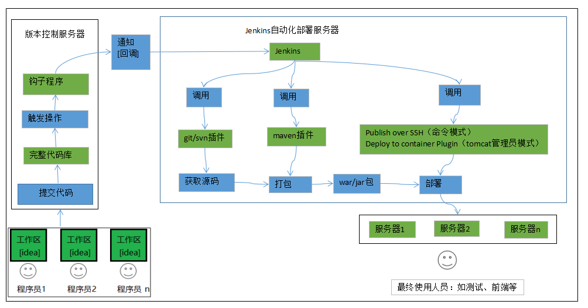

# 一、Jenkins

## JenKins是什么?

Jenkins是一个开源的、提供友好操作界面的持续集成(CI)工具，起源于Hudson（Hudson是商用的），主要用于持续、自动的构建/测试软件项目、监控外部任务的运行。Jenkins用Java语言编写，可在Tomcat等流行的servlet容器中运行，也可独立运行。通常与版本管理工具(SCM)、构建工具结合使用。常用的版本控制工具有SVN、GIT，构建工具有Maven、Ant、Gradle。


## CI/CD是什么?

CI(Continuous integration，中文意思是持续集成)是一种软件开发时间。持续集成强调开发人员提交了新代码之后，立刻进行构建、（单元）测试。根据测试结果，我们可以确定新代码和原有代码能否正确地集成在一起。



CD(Continuous Delivery， 中文意思持续交付)是在持续集成的基础上，将集成后的代码部署到更贴近真实运行环境(类生产环境)中。比如，我们完成单元测试后，可以把代码部署到连接数据库的Staging环境中更多的测试。如果代码没有问题，可以继续手动部署到生产环境。下图反应的是CI/CD 的大概工作模式。




## Jenkins自动化部署实现原理




## Gitlab服务器搭建

|      名称      |     服务器     |                      安装软件                       |
| :------------: | :------------: | :-------------------------------------------------: |
| 代码托管服务器 | 192.168.17.128 |                    Gitlab-12.4.2                    |
|  持续集成服务  | 192.168.17.128 | Jenkins-2.190.3，JDK1.8，Maven3.6.2，Git，SonarQube |
| 应用测试服务器 |                |                  JDK1.8，Tomcat8.5                  |


jenkins的jdk配置文件

```bash
vi /etc/init.d/jenkins
```


```
sed -i 's/http:\/\/updates.jenkinsci.org\/download/https:\/\/mirrors.tuna.tsinghua.edu.cn\/jenkins/g' default.json && sed -i 's/http:\/\/www.google.com/https:\/\/www.baidu.com/g' default.json
```

