# 一、准备工作

## JDK

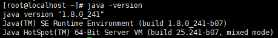

## Maven

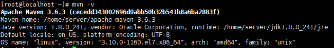

## Git

```bash
yum install git
```

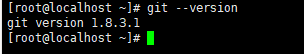

## 环境配置

```bash
vi /etc/profile
```

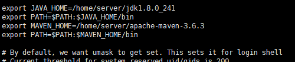

```bash
source /etc/profile
```


## 下载Jenkins war包

Jenkins 项目产生两个发行线, 长期支持版本 (LTS) 和每周更新版本
两个版本都以 `.war` 文件, 原生包, 安装程序, 和 Docker 容器的形式分发。

### 启动

下载好我们的 **jenkins.war** 后，放到linux服务上，执行`java -jar Jenkins.war`启动服务，启动过程中我们会看到下面的日志信息：

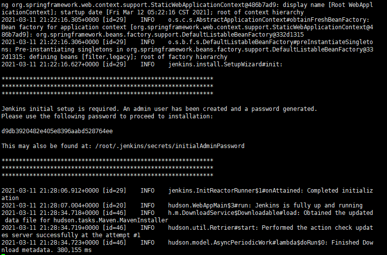

第一次加载的时候Jenkins会比较慢，它会把需要持久化的信息放到文件夹`/root/.jenkins/`，所以会比较慢，我们需要耐心进行等待。当出现Jenkins is fully up and running表示已经启动。

访问地址：http://ip:8080/

**注意：如果你的地址加端口不能访问，首先确定你的Jenkins起来没有，如果Jenkins启动成功了，那么记得开放8080端口。**

```bash
systemctl stop firewalld.service
```

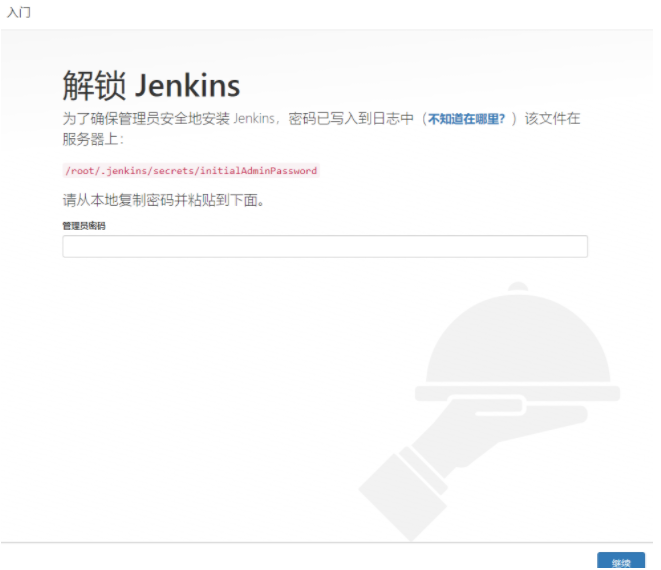

输入在控制台中看到的密钥，如果找不到可以到 `/root/.jenkins/secrets/initialAdminPassword` 中查看密钥。

### 配置

1. 选择插件来安装，不要选择安装推荐的插件，不然可能会下载一天，会很慢。

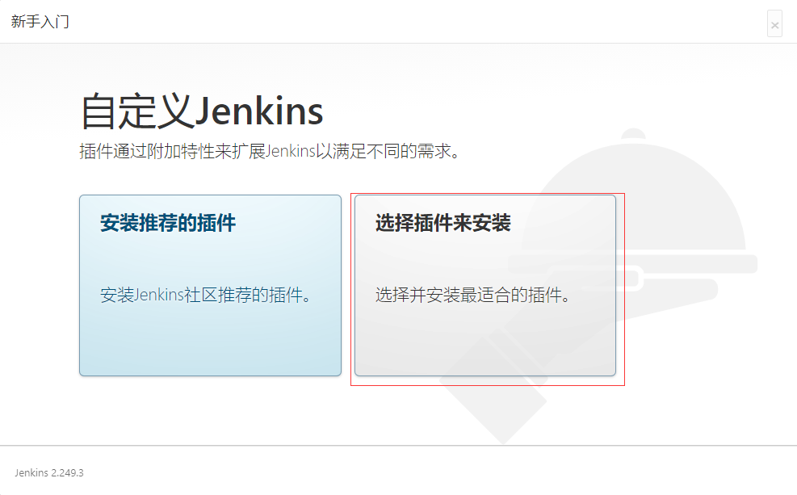

2. 这里选择无，不安装插件，点击安装,，插件我们后续只需安装我们需要的即可。
3. 输入我们的用户名和密码之后，点击保存并完成。
4. 实例配置，默认就行，一般是和服务器地址匹配的。
5. 开始使用Jenkins。


配置成功之后看到的Jenkins的首页地址，但是里面什么插件都没有，接下来就需要我们去配置对应的插件地址。

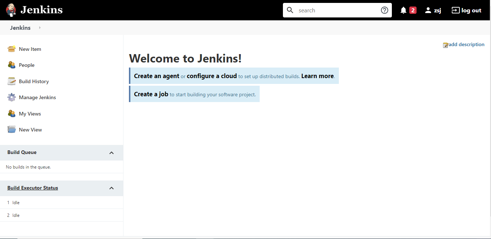

### 手动安装插件

点击 Manage Jenkins -> Manage Pulgins -> Available

1. 中文汉化插件

   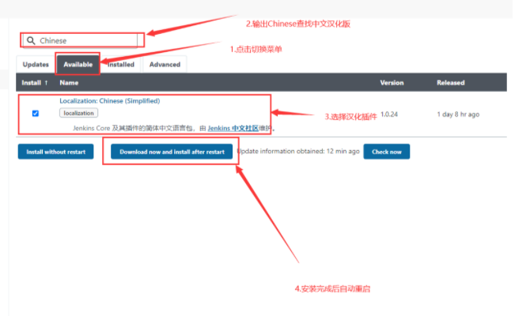

   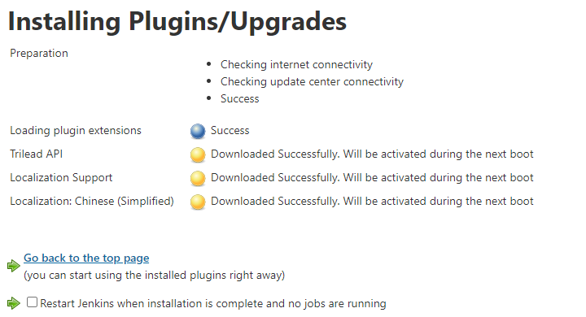

   重启之后Jenkins会自动刷新，到登录页面，这个时候我们输入我们刚开始配置的用户名和密码，就可以进行登录了。

2. Git

3. Maven Integration

Git和Maven Integration与下载汉化的方式类似。

到这Jenkins的安装和配置就已经完成了。

# 二、Jenkins + Maven + Git自动化集成/测试

## Git拉取项目

生成公钥私钥对出来，命令：`ssh-keygen -t rsa -C "你的邮箱地址"`

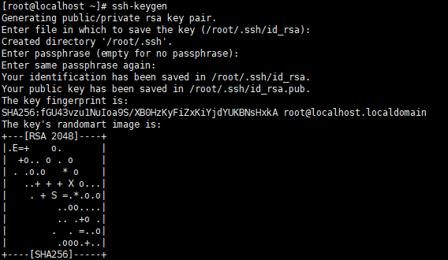

进入密钥目录：`cd /root/.ssh/`，公钥保存在id_rsa.pub文件下，将公钥文件里面的内容复制到GitHub上。


创建一个测试项目，使用git命令下载项目到我们的服务器上：`git clone git@github.com:lazy-mark/workflow.git`。

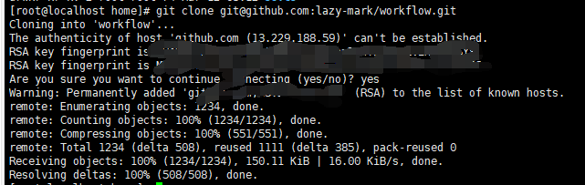

如果下载成功了说明我们就配置好了，同时添加一些全局的身份认证信息。

```bash
git config --global user.name "用户名"
git config --global user.email "邮箱"
```


## 新建Jenkins项目

1. 选择新建任务
2. 输入任务名称，然后选择Maven项目，点击确定
3. 输入描述，源码管理选择Git

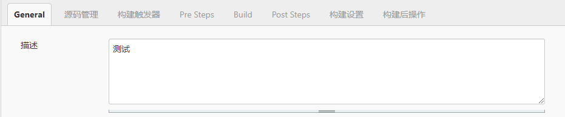

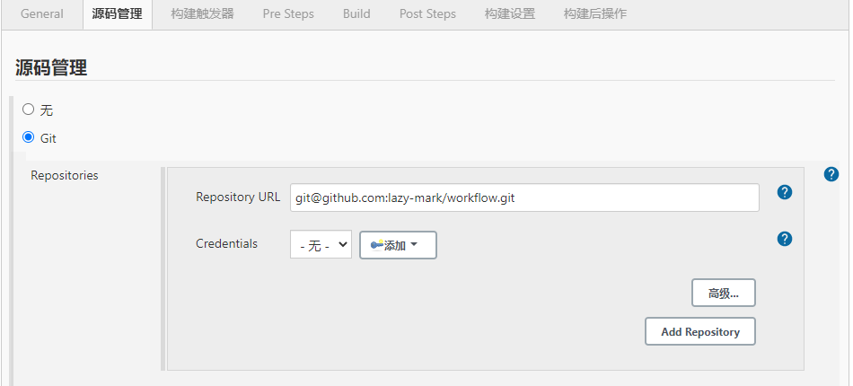

4. 点击添加，选择Jenkins配置，添加凭据
5. 配置凭据

类型选择SSH，私有输入我们刚才生成的，在目录 `/root/.ssh`，文件名为：`id_rsa`，将里面的私钥复制进去。

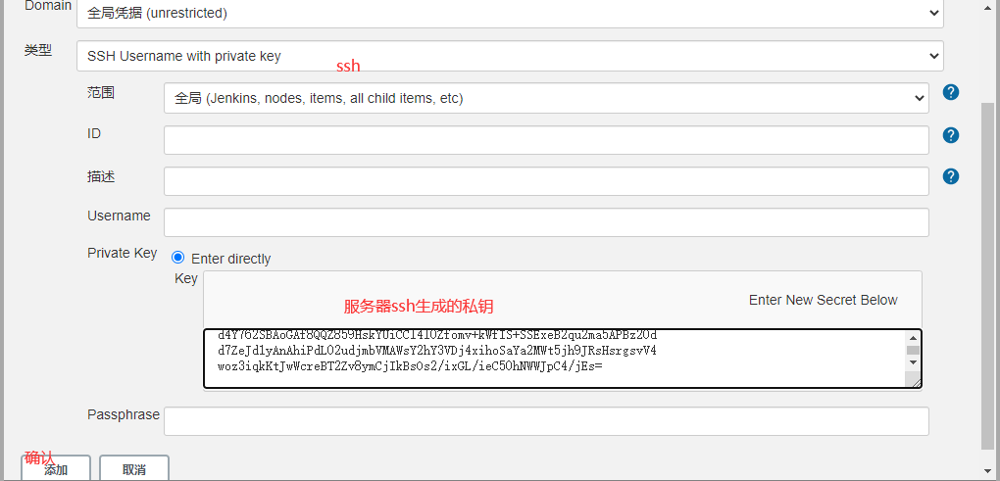

添加好凭据后选择root。

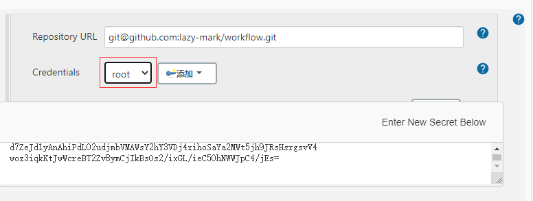

5. 轮询

   填写 `* * * * *`意思是每分钟执行。

   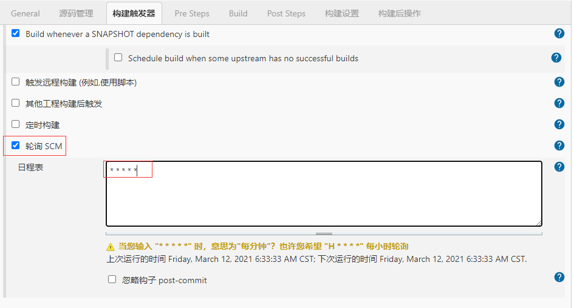

6. 环境变量

   当我们第一次配置Jenkins 的时候，由于我们没有在Jenkins上配置环境变量，会提醒我们需要配置变量，我们点击下图中的链接，进入配置页面。

   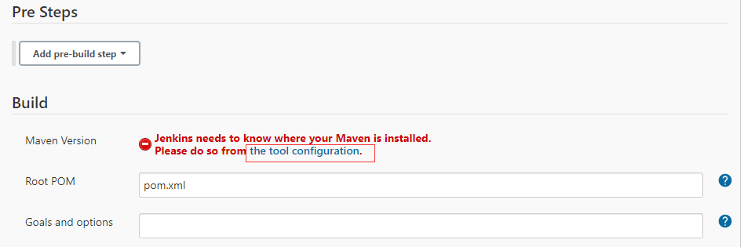

7. JDK配置

   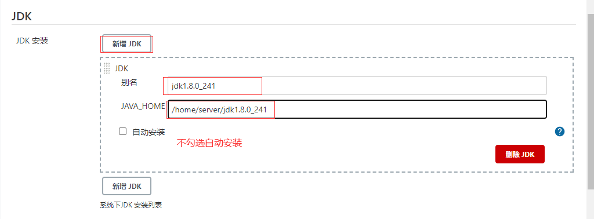

   注意：JAVA_HOME的输入框下面，不要有警告或者错误信息，否则就是路径不正确。

8. Maven配置

   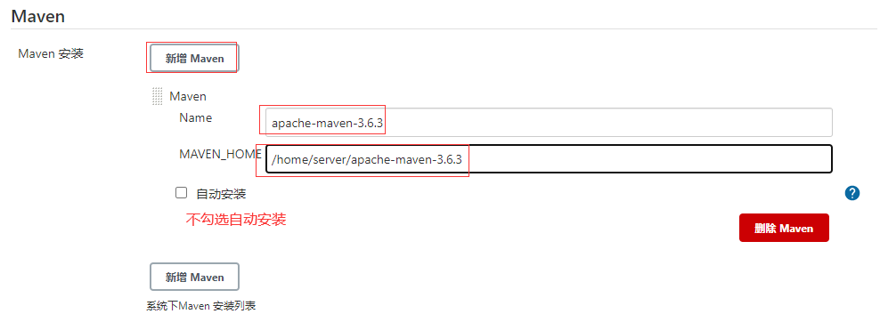

   注意：MAVEN_HOME 输入框下面，不要有警告或者错误信息，否则就是路径不正确。点击保存或者应用。