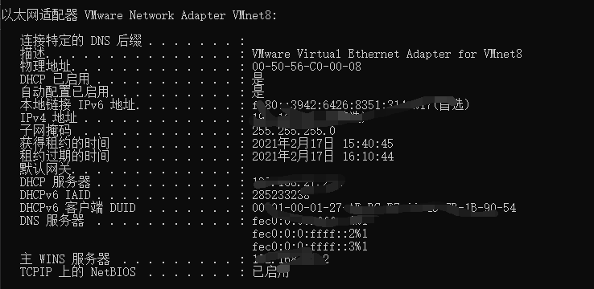

# VM + Centos 7网卡配置

Windows cmd输入如下命令，查询虚拟网卡IP，注意不是局域网的IP。

```bash
ipconfig /all
```



修改Windows中的适配器


IP地址中的最后一位不能和Windows发生冲突，默认网关的前三位和ip地址保持一致，最后一位默认为1。

Vmware修改虚拟网络编辑器


网关需要和适配器中的网关保持一致。


进行Centos 7.x系统，将动态获取IP地址改为静态获取IP地址。

```bash
vi /etc/sysconfig/network-scripts/ifcfg-ens32
```

将DHCP修改为static，并且添加静态IP、网关、子网掩码、DNS。


重启网卡

```bash
systemctl restart network
```

