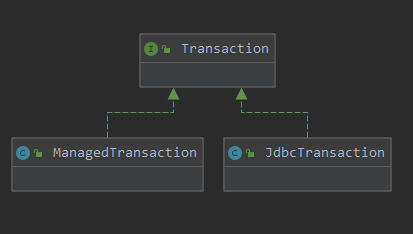
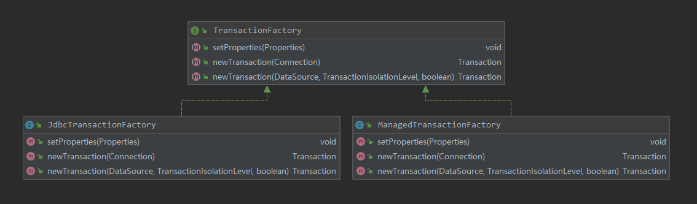

# Mybatis之事务篇

## 事务管理

对于一个事务，存在创建、提交、回滚、关闭的操作，相应的，mybatis封装了一个接口。


在 mybatis 源码的 transaction 包下就存放了管理事务的操作。我们在 transaction 包中看到了子包，其实，mybatis 管理事务分为两种形式：

1. 使用JDBC的事务管理机制，利用 `java.sql.Connection` 对象完成对事务的提交。
2. 使用 managed 的事务管理机制，这种机制 mybatis 自身不会去实现事务管理，而是让程序的容器来实现对事务的管理。


在哪里体现 mybatis 的事务管理呢?

在 mybatis 的全局配置文件，我们可以配置环境，例如，

```xml
<configuration>  
	<environments default="development">  
		<environment id="development">  
            <!--配置事务的管理方式-->  
            <transactionManager type="JDBC" />  
            <!-- 配置数据库连接信息 -->  
            <dataSource type="POOLED">  
                <property name="driver" value="com.mysql.jdbc.Driver" />  
                <property name="url" value="jdbc:mysql://localhost:3306/mybatis" />  
                <property name="username" value="root" />  
                <property name="password" value="root" />  
            </dataSource>  
		</environment>  
	</environments>      
</configuration>  
```

`transactionManager`的设置项表明mybatis 就是使用了JDBC来管理事务。

mybatis 提供了事务接口 `Transaction`，以及两个实现类 `ManagedTransaction` 和 `JdbcTransaction` 。对于我们常用的Spring框架，我们查看Spring与 Mybatis 整合篇详看。下面提供了 Transactions 的类图。



我们先来看看 `Transaction` 接口，提供抽象的获取数据库连接、提交一个事务、回滚一个事务、关闭数据库连接方法，熟悉JDBC的小伙伴看到应该很熟悉。

```java
public interface Transaction {
  Connection getConnection() throws SQLException;
  void commit() throws SQLException;
  void rollback() throws SQLException;
  void close() throws SQLException;
}
```

再来看看第一种JDBC管理事务的方式，

```java
public class JdbcTransaction implements Transaction {
  protected Connection connection;
  protected DataSource dataSource;
  /** 事务隔离级别 */
  protected TransactionIsolationLevel level;
  /** 默认不自动提交 */
  protected boolean autoCommit;

  public JdbcTransaction(DataSource ds, TransactionIsolationLevel desiredLevel, boolean desiredAutoCommit) {
    dataSource = ds;
    level = desiredLevel;
    autoCommit = desiredAutoCommit;
  }

  public JdbcTransaction(Connection connection) {
    this.connection = connection;
  }

  @Override
  public Connection getConnection() throws SQLException {
    // 如果数据库连接为空,从数据源的获得一个数据库连接
    if (this.connection == null) {
      openConnection();
    }
    return this.connection;
  }
  
  // 从数据源中获得一个数据库连接
  protected void openConnection() throws SQLException {
    this.connection = this.dataSource.getConnection();
    if (this.level != null) {
      this.connection.setTransactionIsolation(this.level.getLevel());
    }
    setDesiredAutoCommit(this.autoCommit);
  }
    
  protected void setDesiredAutoCommit(boolean desiredAutoCommit) {
    try {
      // 事务提交状态不一致,修改我们设置的提交状态
      if (connection.getAutoCommit() != desiredAutoCommit) {
        connection.setAutoCommit(desiredAutoCommit);
      }
    } catch (SQLException e) {
      // Only a very poorly implemented driver would fail here,
      // and there's not much we can do about that.
      throw new TransactionException("Error configuring AutoCommit.  "
          + "Your driver may not support getAutoCommit() or setAutoCommit(). "
          + "Requested setting: " + desiredAutoCommit + ".  Cause: " + e, e);
    }
  }

  // 手动提交事务
  @Override
  public void commit() throws SQLException {
    // 数据库连接不为空 并且 不是自动提交事务
    if (connection != null && !connection.getAutoCommit()) {
      // 提交事务
      connection.commit();
    }
  }

  // 手动回滚事务
  @Override
  public void rollback() throws SQLException {
    if (connection != null && !connection.getAutoCommit()) {
      connection.rollback();
    }
  }

  @Override
  public void close() throws SQLException {
    if (connection != null) {
      resetAutoCommit();
      connection.close();
    }
  }

  protected void resetAutoCommit() {
    try {
      if (!connection.getAutoCommit()) {
        // MyBatis does not call commit/rollback on a connection if just selects were performed.
        // Some databases start transactions with select statements
        // and they mandate a commit/rollback before closing the connection.
        // A workaround is setting the autocommit to true before closing the connection.
        // Sybase throws an exception here.
        connection.setAutoCommit(true);
      }
    } catch (SQLException e) {
      
    }
  }

}
```

最后，我们看看 `ManagedTransaction` 实现类：通过容器来进行事务管理，它对事务提交和回滚并不会做任何操作，直接上源码，

```java
public class ManagedTransaction implements Transaction {

  private DataSource dataSource;
  private TransactionIsolationLevel level;
  private Connection connection;
  private boolean closeConnection;

  public ManagedTransaction(Connection connection, boolean closeConnection) {
    this.connection = connection;
    this.closeConnection = closeConnection;
  }

  public ManagedTransaction(DataSource ds, TransactionIsolationLevel level, boolean closeConnection) {
    this.dataSource = ds;
    this.level = level;
    this.closeConnection = closeConnection;
  }

  @Override
  public Connection getConnection() throws SQLException {
    // 数据库连接为空,从数据源获取一个数据库连接
    if (this.connection == null) {
      openConnection();
    }
    // 数据库连接不为空,直接返回
    return this.connection;
  }
    
  protected void openConnection() throws SQLException {
    this.connection = this.dataSource.getConnection();
    if (this.level != null) {
      this.connection.setTransactionIsolation(this.level.getLevel());
    }
  }

  // 忽略所有的commit请求
  @Override
  public void commit() throws SQLException {
    // Does nothing
  }

  // 忽略所有的rollback请求
  @Override
  public void rollback() throws SQLException {
    // Does nothing
  }

  @Override
  public void close() throws SQLException {
    if (this.closeConnection && this.connection != null) {
      // 关闭数据库连接
      this.connection.close();
    }
  }

}
```


从源码分析后，我们可以知道，如果只使用 mybatis 构建程序，若将`transactionManager`中type设置为 `MANAGED`，那么，我们执行任何的update操作，即时最后执行了commit操作，数据也不会保存在数据库中。因此配置为Managed模式时，mybatis自己不管理事务，对数据库的update操作不会有任何的影响。


## 事务管理工厂

mybatis 事务的创建交给了 TransactionFactory 事务工厂来创建，该工厂定义了两种创建事务的方法：

- 通过指定的Connection对象创建 Transaction。
- 通过数据源DataSource来创建 Transaction。


TransactionFactory本身是一个接口，和 mybatis 事务管理的方式一样，有两个对应的实现子类，类图如下，




先来看下通过JDBC事务工厂来创建事务的过程，

```java
public class JdbcTransactionFactory implements TransactionFactory {

  @Override
  public void setProperties(Properties props) {
  }

  // 根据给定的数据库连接创建一个事务
  @Override
  public Transaction newTransaction(Connection conn) {
    return new JdbcTransaction(conn);
  }

  // 根据数据源、数据隔离级别、自动提交事务创建一个事务
  @Override
  public Transaction newTransaction(DataSource ds, TransactionIsolationLevel level, boolean autoCommit) {
    return new JdbcTransaction(ds, level, autoCommit);
  }
}
```

从源码知道，JdbcTransactionFactory 会创建 JDBC 类型的事务，即JdbcTransaction。类似地，ManagedTransactionFactory也会创建 ManagedTransaction 。


以上只是对事务类的分析，具体还需要结合全局xml的配置文件进行分析，解析xml的类在builder#xml包下。我们下回在分析。


相关文章：https://louluan.blog.csdn.net/article/details/37992171