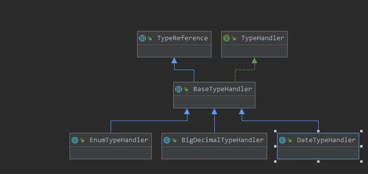

# Mybatis之类型篇

这里我们开始阅读 `type包` 下的源码类。


我们先来个最简单的吧，我们在mapper中定义javaType和jdbcType，mybatis是如何进行转换的，毕竟java中的数据类型和mysql中的数据类型是不一样的。

## 一节搞懂jdbcType

在 type包 下定义了一个JdbcType枚举，它的作用就是定义数据库表中字段的类型。

```java
public enum JdbcType {
    ARRAY(Types.ARRAY),
    BIT(Types.BIT),
    TINYINT(Types.TINYINT),
    SMALLINT(Types.SMALLINT),
    INTEGER(Types.INTEGER),
    BIGINT(Types.BIGINT),
    FLOAT(Types.FLOAT),
    REAL(Types.REAL),
    DOUBLE(Types.DOUBLE),
    NUMERIC(Types.NUMERIC),
    DECIMAL(Types.DECIMAL),
    CHAR(Types.CHAR),
    VARCHAR(Types.VARCHAR),
    LONGVARCHAR(Types.LONGVARCHAR),
    DATE(Types.DATE),
    TIME(Types.TIME),
    TIMESTAMP(Types.TIMESTAMP),
    BINARY(Types.BINARY),
    VARBINARY(Types.VARBINARY),
    LONGVARBINARY(Types.LONGVARBINARY),
    NULL(Types.NULL),
    OTHER(Types.OTHER),
    BLOB(Types.BLOB),
    CLOB(Types.CLOB),
    BOOLEAN(Types.BOOLEAN),
    CURSOR(-10), // Oracle
    UNDEFINED(Integer.MIN_VALUE + 1000),
    NVARCHAR(Types.NVARCHAR), // JDK6
    NCHAR(Types.NCHAR), // JDK6
    NCLOB(Types.NCLOB), // JDK6
    STRUCT(Types.STRUCT);

    public final int TYPE_CODE;
    private static Map<Integer, JdbcType> codeLookup = new HashMap<Integer, JdbcType>();

    static {
        for (JdbcType type : JdbcType.values()) {
            codeLookup.put(type.TYPE_CODE, type);
        }
    }

    JdbcType(int code) {
        this.TYPE_CODE = code;
    }

    public static JdbcType forCode(int code) {
        return codeLookup.get(code);
    }

}
```

再来看看Types类，它是java.sql包下的，作用用于标识通用SQL类型（称为JDBC类型）的常量的类。

比如SQL中的 `tinyint` 类型，在其中定义了它的常量为-6，对于其它类型请自行阅读。


以上仅仅是定义了jdbc支持操作的数据类型的一个枚举，真正干活的是类型处理器。


## 类型处理器

类型处理器 `TypeHandler` 是一个接口，类图如下（ctrl+alt+b可添加接口的实现类图）：



```java
public interface TypeHandler<T> {

    void setParameter(PreparedStatement ps, int i, T parameter, JdbcType jdbcType) throws SQLException;

    T getResult(ResultSet rs, String columnName) throws SQLException;

    T getResult(ResultSet rs, int columnIndex) throws SQLException;

    T getResult(CallableStatement cs, int columnIndex) throws SQLException;
}
```

这些接口不都是 jdbc 的吗？原来 mybatis 把 jdbc 设置参数和获取查询结果集对象抽象成了一个接口。为了防止SQL的注入，mybatis也使用的是 PreparedStatement 进行预编译SQL。


回顾一下jdbc的查询过程，

```java
public void queryOne(){
    Connection connection = null;
    PreparedStatement preparedStatement = null;
    ResultSet resultSet = null;
    try {
        // 获取数据库连接
        connection = JDBCUtils.getConnection();
        // 定义sql
        String sql = "select * from user where uid = ?";
        // 预编译sql
        preparedStatement = connection.prepareStatement(sql);
        // 设置查询参数
        preparedStatement.setString(1,"1");
        // 执行查询
        resultSet = preparedStatement.executeQuery();
        // 获取结果
        while (resultSet.next()){
            System.out.println(resultSet.getObject("uid") + " " + resultSet.getObject("username") + " " + resultSet.getObject("password"));
        }
    }catch (SQLException | ClassNotFoundException e){
        e.printStackTrace();
    }finally {
        JDBCUtils.release(resultSet,preparedStatement,connection);
    }
}
```


我们先来看看 `TypeReference` 抽象类，

3.1新增的类型引用，这个类的目的是在每一个具体的类型处理器持有所处理的Java类型的原生类型。

```java
public abstract class TypeReference<T> {

    private final Type rawType;

    protected TypeReference() {
        rawType = getSuperclassTypeParameter(getClass());
    }

    /**
     * 获取超类的参数化类型. 即T类型
     */
    Type getSuperclassTypeParameter(Class<?> clazz) {
        /**
         *  返回直接继承的父类. 和 getSuperClass 的区别?
         *      getSuperClass 由于编译擦除,没有显示泛型参数; getGenericSuperclass 包含泛型参数.
         *      getSuperClass 返回直接超类的Class对象【Object、接口、基本数据类型、void】;
         *      getGenericSuperclass 返回直接超类的 Type 对象【类、接口、基本数据类型、void】.
         **/
        Type genericSuperclass = clazz.getGenericSuperclass();
        if (genericSuperclass instanceof Class) {
            // try to climb up the hierarchy until meet something useful
            if (TypeReference.class != genericSuperclass) {
                return getSuperclassTypeParameter(clazz.getSuperclass());
            }

            throw new TypeException("xxx");
        }

        /**
         *  获取超类的参数化类型
         *  例如 BigDecimalTypeHandler extends BaseTypeHandler<BigDecimal> 返回的就是 BigDecimal.
         */
        Type rawType = ((ParameterizedType) genericSuperclass).getActualTypeArguments()[0];
        // TODO remove this when Reflector is fixed to return Types
        if (rawType instanceof ParameterizedType) {
            rawType = ((ParameterizedType) rawType).getRawType();
        }

        return rawType;
    }

    public final Type getRawType() {
        return rawType;
    }

    @Override
    public String toString() {
        return rawType.toString();
    }

}
```

可以看到，在类初始化的时候就将参数化类型保存下来了，`getRowType` 方法就是向外提供的接口。


我们再来看看 `TypeHandler` 接口的抽象实现类，

```java
public abstract class BaseTypeHandler<T> extends TypeReference<T> implements TypeHandler<T> {

    protected Configuration configuration;

    public void setConfiguration(Configuration c) {
        this.configuration = c;
    }

    @Override
    public void setParameter(PreparedStatement ps, int i, T parameter, JdbcType jdbcType) throws SQLException {
        if (parameter == null) {
            // 参数虽然为空,但也有类型.
            if (jdbcType == null) {
                throw new TypeException("xxx");
            }
            try {
                ps.setNull(i, jdbcType.TYPE_CODE);
            } catch (SQLException e) {
                throw new TypeException("xxx");
            }
        } else {
            try {
                // 参数不为空,由具体处理器执行
                setNonNullParameter(ps, i, parameter, jdbcType);
            } catch (Exception e) {
                throw new TypeException("xxx");
            }
        }
    }

    @Override
    public T getResult(ResultSet rs, String columnName) throws SQLException {
        T result;
        try {
            // 具体处理器根据表列名获取值
            result = getNullableResult(rs, columnName);
        } catch (Exception e) {
            throw new ResultMapException("xxx");
        }
        if (rs.wasNull()) {
            return null;
        } else {
            return result;
        }
    }

    @Override
    public T getResult(ResultSet rs, int columnIndex) throws SQLException {
        T result;
        try {
            // 具体处理器根据表索引序号获取值
            result = getNullableResult(rs, columnIndex);
        } catch (Exception e) {
            throw new ResultMapException("xxx");
        }
        if (rs.wasNull()) {
            return null;
        } else {
            return result;
        }
    }

    @Override
    public T getResult(CallableStatement cs, int columnIndex) throws SQLException {
        T result;
        try {
            result = getNullableResult(cs, columnIndex);
        } catch (Exception e) {
            throw new ResultMapException("xxx");
        }
        if (cs.wasNull()) {
            return null;
        } else {
            return result;
        }
    }

    public abstract void setNonNullParameter(PreparedStatement ps, int i, T parameter, JdbcType jdbcType) throws SQLException;

    public abstract T getNullableResult(ResultSet rs, String columnName) throws SQLException;

    public abstract T getNullableResult(ResultSet rs, int columnIndex) throws SQLException;

    public abstract T getNullableResult(CallableStatement cs, int columnIndex) throws SQLException;

}
```

可以看到该类使用了模板方法设计模式，四个抽象方法由具体的子类实现，并且必须实现，另外四个具体的方法实现了类型处理器TypeHandler接口中的方法。 


我们来看下具体的一个处理器，大部分的处理器都类似，

```java
public class IntegerTypeHandler extends BaseTypeHandler<Integer> {

    @Override
    public void setNonNullParameter(PreparedStatement ps, int i, Integer parameter, JdbcType jdbcType)
            throws SQLException {
        ps.setInt(i, parameter);
    }

    @Override
    public Integer getNullableResult(ResultSet rs, String columnName)
            throws SQLException {
        return rs.getInt(columnName);
    }

    @Override
    public Integer getNullableResult(ResultSet rs, int columnIndex)
            throws SQLException {
        return rs.getInt(columnIndex);
    }

    @Override
    public Integer getNullableResult(CallableStatement cs, int columnIndex)
            throws SQLException {
        return cs.getInt(columnIndex);
    }
}
```

处理Integer类型处理器比较简单，我们看下枚举类型的，

```java
public class EnumTypeHandler<E extends Enum<E>> extends BaseTypeHandler<E> {

    private Class<E> type;

    public EnumTypeHandler(Class<E> type) {
        if (type == null) {
            throw new IllegalArgumentException("Type argument cannot be null");
        }
        this.type = type;
    }

    @Override
    public void setNonNullParameter(PreparedStatement ps, int i, E parameter, JdbcType jdbcType) throws SQLException {
        if (jdbcType == null) {
            ps.setString(i, parameter.name());
        } else {
            ps.setObject(i, parameter.name(), jdbcType.TYPE_CODE); // see r3589
        }
    }

    @Override
    public E getNullableResult(ResultSet rs, String columnName) throws SQLException {
        String s = rs.getString(columnName);
        return s == null ? null : Enum.valueOf(type, s);
    }

    @Override
    public E getNullableResult(ResultSet rs, int columnIndex) throws SQLException {
        String s = rs.getString(columnIndex);
        return s == null ? null : Enum.valueOf(type, s);
    }

    @Override
    public E getNullableResult(CallableStatement cs, int columnIndex) throws SQLException {
        String s = cs.getString(columnIndex);
        return s == null ? null : Enum.valueOf(type, s);
    }
}
```

可以看到枚举类型处理器，在数据存储的是字符串类型，查询的时候会根据名称转换成枚举类。

`EnumTypeHandler<E extends Enum<E>>` 保证了使用枚举类型处理器的时候必须传入一个枚举类型的参数类型。


对于未知的处理器UnknownTypeHandler，默认将其作为Object类型处理。

```java
public class UnknownTypeHandler extends BaseTypeHandler<Object> {

    private static final ObjectTypeHandler OBJECT_TYPE_HANDLER = new ObjectTypeHandler();
	
    // 类型处理器注册表
    private TypeHandlerRegistry typeHandlerRegistry;

    public UnknownTypeHandler(TypeHandlerRegistry typeHandlerRegistry) {
        this.typeHandlerRegistry = typeHandlerRegistry;
    }

    @Override
    public void setNonNullParameter(PreparedStatement ps, int i, Object parameter, JdbcType jdbcType)
            throws SQLException {
        TypeHandler handler = resolveTypeHandler(parameter, jdbcType);
        handler.setParameter(ps, i, parameter, jdbcType);
    }

    @Override
    public Object getNullableResult(ResultSet rs, String columnName)
            throws SQLException {
        TypeHandler<?> handler = resolveTypeHandler(rs, columnName);
        return handler.getResult(rs, columnName);
    }

    @Override
    public Object getNullableResult(ResultSet rs, int columnIndex)
            throws SQLException {
        TypeHandler<?> handler = resolveTypeHandler(rs.getMetaData(), columnIndex);
        if (handler == null || handler instanceof UnknownTypeHandler) {
            handler = OBJECT_TYPE_HANDLER;
        }
        return handler.getResult(rs, columnIndex);
    }

    @Override
    public Object getNullableResult(CallableStatement cs, int columnIndex)
            throws SQLException {
        return cs.getObject(columnIndex);
    }

    private TypeHandler<? extends Object> resolveTypeHandler(Object parameter, JdbcType jdbcType) {
        TypeHandler<? extends Object> handler;
        // 参数类型为空,将当前类型处理器作为Object类型处理器
        if (parameter == null) {
            handler = OBJECT_TYPE_HANDLER;
        } else {
            handler = typeHandlerRegistry.getTypeHandler(parameter.getClass(), jdbcType);
            // check if handler is null (issue #270)
            if (handler == null || handler instanceof UnknownTypeHandler) {
                handler = OBJECT_TYPE_HANDLER;
            }
        }
        return handler;
    }

    private TypeHandler<?> resolveTypeHandler(ResultSet rs, String column) {
        try {
            Map<String,Integer> columnIndexLookup;
            columnIndexLookup = new HashMap<String,Integer>();
            ResultSetMetaData rsmd = rs.getMetaData();
            int count = rsmd.getColumnCount();
            for (int i=1; i <= count; i++) {
                String name = rsmd.getColumnName(i);
                columnIndexLookup.put(name,i);
            }
            Integer columnIndex = columnIndexLookup.get(column);
            TypeHandler<?> handler = null;
            if (columnIndex != null) {
                handler = resolveTypeHandler(rsmd, columnIndex);
            }
            if (handler == null || handler instanceof UnknownTypeHandler) {
                handler = OBJECT_TYPE_HANDLER;
            }
            return handler;
        } catch (SQLException e) {
            throw new TypeException("Error determining JDBC type for column " + column + ".  Cause: " + e, e);
        }
    }

    private TypeHandler<?> resolveTypeHandler(ResultSetMetaData rsmd, Integer columnIndex) throws SQLException {
        TypeHandler<?> handler = null;
        JdbcType jdbcType = safeGetJdbcTypeForColumn(rsmd, columnIndex);
        Class<?> javaType = safeGetClassForColumn(rsmd, columnIndex);
        if (javaType != null && jdbcType != null) {
            handler = typeHandlerRegistry.getTypeHandler(javaType, jdbcType);
        } else if (javaType != null) {
            handler = typeHandlerRegistry.getTypeHandler(javaType);
        } else if (jdbcType != null) {
            handler = typeHandlerRegistry.getTypeHandler(jdbcType);
        }
        return handler;
    }

    private JdbcType safeGetJdbcTypeForColumn(ResultSetMetaData rsmd, Integer columnIndex) {
        try {
            return JdbcType.forCode(rsmd.getColumnType(columnIndex));
        } catch (Exception e) {
            return null;
        }
    }

    private Class<?> safeGetClassForColumn(ResultSetMetaData rsmd, Integer columnIndex) {
        try {
            return Resources.classForName(rsmd.getColumnClassName(columnIndex));
        } catch (Exception e) {
            return null;
        }
    }
}
```


## 简单类型注册器

```java
public class SimpleTypeRegistry {

    /** 简单类型集合表 */
    private static final Set<Class<?>> SIMPLE_TYPE_SET = new HashSet<Class<?>>();

    static {
        SIMPLE_TYPE_SET.add(String.class);
        SIMPLE_TYPE_SET.add(Byte.class);
        SIMPLE_TYPE_SET.add(Short.class);
        SIMPLE_TYPE_SET.add(Character.class);
        SIMPLE_TYPE_SET.add(Integer.class);
        SIMPLE_TYPE_SET.add(Long.class);
        SIMPLE_TYPE_SET.add(Float.class);
        SIMPLE_TYPE_SET.add(Double.class);
        SIMPLE_TYPE_SET.add(Boolean.class);
        SIMPLE_TYPE_SET.add(Date.class);
        SIMPLE_TYPE_SET.add(Class.class);
        SIMPLE_TYPE_SET.add(BigInteger.class);
        SIMPLE_TYPE_SET.add(BigDecimal.class);
    }

    // 外部不能实例化
    private SimpleTypeRegistry() {
        // Prevent Instantiation
    }

    /*
     * Tells us if the class passed in is a known common type
     */
    public static boolean isSimpleType(Class<?> clazz) {
        return SIMPLE_TYPE_SET.contains(clazz);
    }

}
```

简单类型注册器只提供了一个 `isSimpleType` 静态方法提供给我们，判断是否是简单【常用】类型。该类在初始化的时候，我们常用的类对象被注册到内存中。


## 类型处理器注册器

该类由final修饰，不可继承修改。

主要作用是注册java类型和jdbc类型能够处理的类型处理器。如果我们在编写xml的时候，某个java类型对应的jdbc不太确定，我们可以查看该类。


