# 1.案例介绍

## 1.1业务分析

模拟电商网站网购场景中的【下单】和【支付】业务

### 1.1.1下单

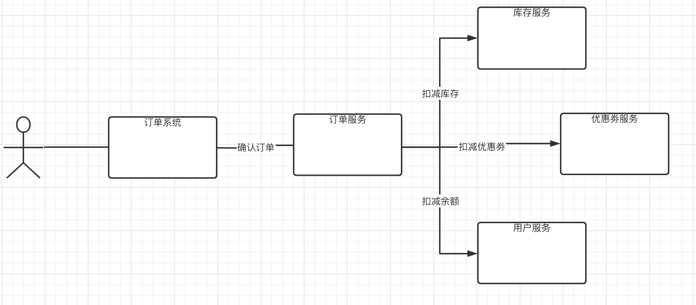

1. 用户请求订单系统下单
2. 订单系统通过RPC调用订单服务下单
3. 订单服务调用优惠劵服务，扣减优惠劵
4. 订单服务调用库存服务，校验并扣减库存
5. 订单服务调用用户服务，扣减用户余额
6. 订单服务完成确认订单

### 1.1.2支付

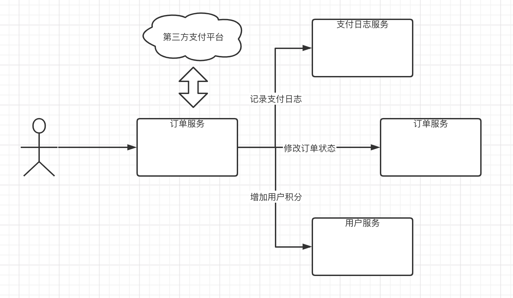

1. 用户请求支付系统
2. 支付系统调用第三方支付平台API进行发起支付流程
3. 用户通过第三方支付平台支付成功后，第三方支付平台回调通知支付系统
4. 支付系统调用订单服务修改订单状态
5. 支付系统调用积分服务添加积分
6. 支付系统调用日志服务记录日志

## 1.2问题分析

### 1.2.1问题1

用户提交订单后，扣减库存成功、扣减优惠劵成功、使用余额成功，但是在确认订单操作失败，需要对库存、优惠劵、余额进行回退。

如何保证数据的完整性？

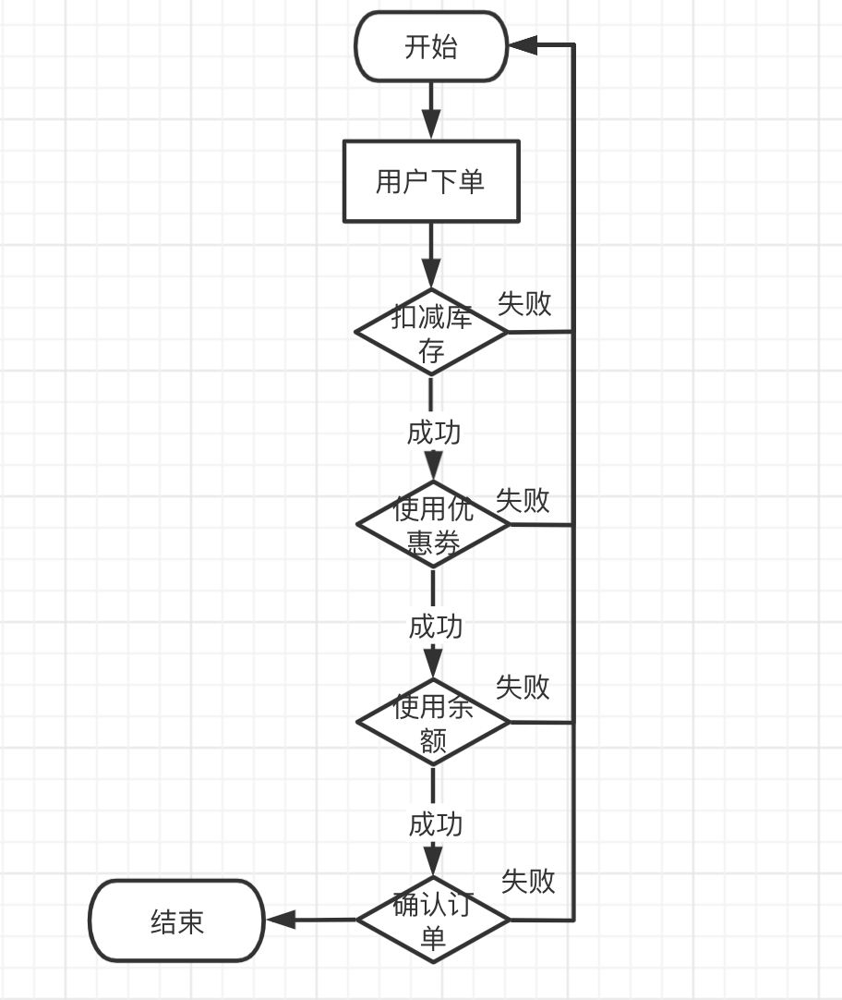

使用MQ保证在下单失败后系统数据的完整性

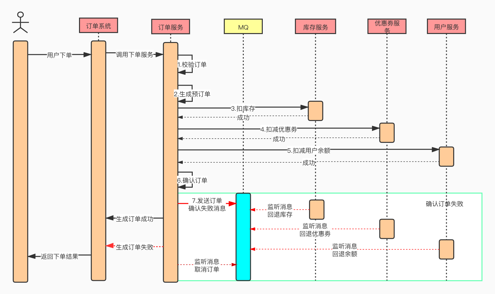

### 1.2.2问题2

用户通过第三方支付平台（支付宝、微信）支付成功后，第三方支付平台要通过回调API，异步通知商家支付系统用户支付结果，支付系统根据支付结果修改订单状态、记录支付日志和给用户增加积分。

商家支付系统如何保证在收到第三方支付平台的异步同志时，如何快速给第三方支付凭条作出回应？

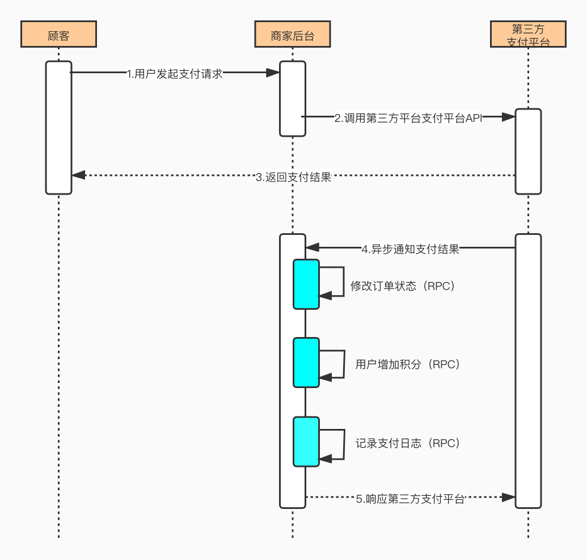

通过MQ进行数据分发，提高系统处理性能

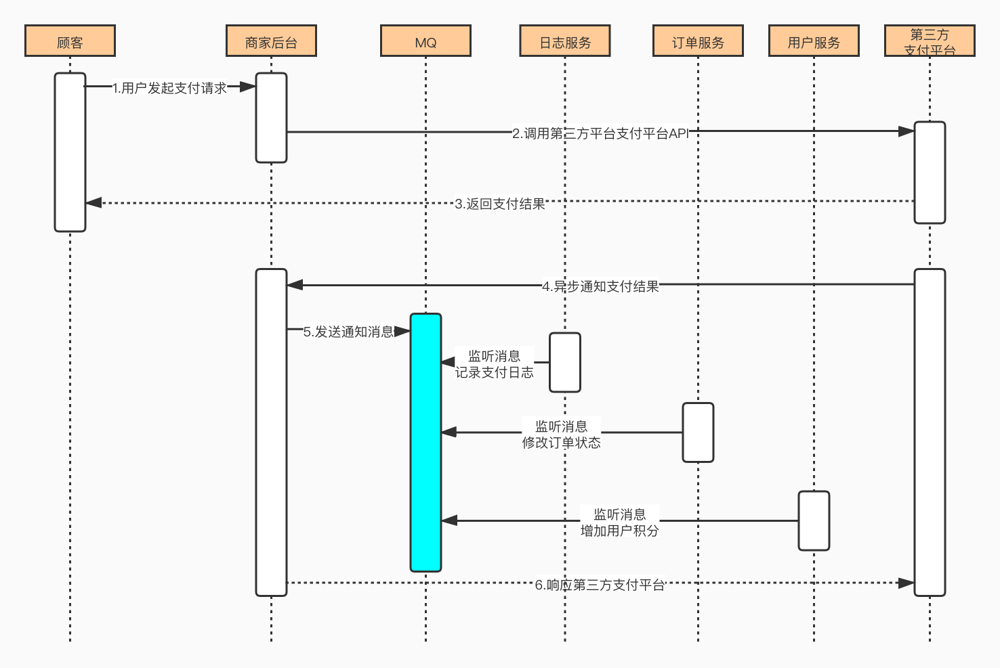

## 2.技术分析

## 2.1技术选型

- Spring Boot
- Dubbo
- Zookeeper
- RocketMQ
- MySQL

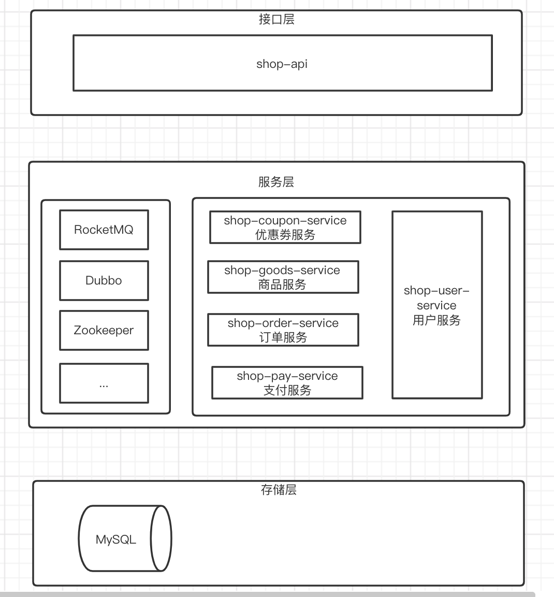

## 2.2SpringBoot整合RocketMQ

### 2.2.1消息生产者

**1）添加依赖**

```xml
<dependencies>
    <dependency>
        <groupId>org.apache.rocketmq</groupId>
        <artifactId>rocketmq-spring-boot-starter</artifactId>
    </dependency>
    <dependency>
        <groupId>org.projectlombok</groupId>
        <artifactId>lombok</artifactId>
    </dependency>
    <dependency>
        <groupId>org.springframework.boot</groupId>
        <artifactId>spring-boot-starter-test</artifactId>
    </dependency>
</dependencies>
```

**2）配置文件**

```properties
rocketmq.name-server=192.168.1.100:9876;192.168.1.120:9876
rocketmq.producer.group=my-group
```

**3）启动类**

```java
@SpringBootApplication
public class MQProducerApplication {

    public static void main(String[] args) {
        SpringApplication.run(MQProducerApplication.class, args);
    }

}
```

**4）测试类**

```java
@RunWith(SpringRunner.class)
@SpringBootTest
public class MQProducerTests {
    
    @Autowired
    private RocketMQTemplate rocketMQTemplate;

    @Test
    public void test1() {
        rocketMQTemplate.convertAndSend("springboot-mq", "hello spring boot rocket mq");
    }

}
```


### 2.2.2消息消费者

**1）添加依赖**

同生产者。

**2）配置文件**

同生产者。

**3）启动类**

```java
@SpringBootApplication
public class MQConsumerApplication {

    public static void main(String[] args) {
        SpringApplication.run(MQConsumerApplication.class, args);
    }

}
```


**4）消息监听器**

```java
@Slf4j
@Component
@RocketMQMessageListener(topic = "springboot-mq", consumerGroup = "springboot-mq-consumer-1")
public class SendMsgListener implements RocketMQListener<String> {

    @Override
    public void onMessage(String msg) {
        log.info("Receive msg: {}", msg);
    }
}
```


## 2.3SpringBoot整合Dubbo

### 2.3.1搭建Zookeeper集群

#### 1）准备工作

1. 安装JDK

2. 将Zookeeper上传到服务器

3. 解压Zookeeper，并创建data目录，将conf下的zoo_sample.cfg文件改名为zoo.cfg

4. 建立`/user/local/zookeeper-cluster`,将解压后的Zookeeper复制到以下三个目录

   ```
   /usr/local/zookeeper-cluster/zookeeper-1
   /usr/local/zookeeper-cluster/zookeeper-2
   /usr/local/zookeeper-cluster/zookeeper-3
   ```

5. 配置每一个 Zookeeper 的 dataDir（zoo.cfg） clientPort 分别为 2181 2182 2183

   修改/usr/local/zookeeper-cluster/zookeeper-1/conf/zoo.cfg

   ```
   clientPort=2181
   dataDir=/usr/local/zookeeper-cluster/zookeeper-1/data
   ```

   修改/usr/local/zookeeper-cluster/zookeeper-2/conf/zoo.cfg

   ```
   clientPort=2182
   dataDir=/usr/local/zookeeper-cluster/zookeeper-2/data
   ```

   修改/usr/local/zookeeper-cluster/zookeeper-3/conf/zoo.cfg

   ```
   clientPort=2183
   dataDir=/usr/local/zookeeper-cluster/zookeeper-3/data
   ```

#### 2）配置集群

1. 在每个 zookeeper 的 data 目录下创建一个 myid 文件，内容分别是 1、2、3 。这个文件就是记录每个服务器的 ID

2. 在每一个 zookeeper 的 zoo.cfg 配置客户端访问端口（clientPort）和集群服务器 IP 列表。

   集群服务器 IP 列表如下：

   ```
   server.1=192.168.25.140:2881:3881
   server.2=192.168.25.140:2882:3882
   server.3=192.168.25.140:2883:3883
   ```

   解释：server.服务器 ID=服务器 IP 地址：服务器之间通信端口：服务器之间投票选举端口

#### 3）启动集群

启动集群就是分别启动每个实例，分别通过zhServer.sh start启动。

### 2.3.2RPC服务接口

建立一个对外接口模块。

```java
public interface IUserService {

    String sayHello(String name);

}
```


### 2.3.3服务提供者

**1）添加依赖**

```xml
<dependencies>
  <dependency>
      <groupId>com.alibaba.spring.boot</groupId>
      <artifactId>dubbo-spring-boot-starter</artifactId>
  </dependency>
  <dependency>
      <groupId>org.apache.zookeeper</groupId>
      <artifactId>zookeeper</artifactId>
      <version>3.4.9</version>
      <exclusions>
          <exclusion>
              <groupId>org.slf4j</groupId>
              <artifactId>slf4j-log4j12</artifactId>
          </exclusion>
          <exclusion>
              <groupId>log4j</groupId>
              <artifactId>log4j</artifactId>
          </exclusion>
      </exclusions>
  </dependency>

  <dependency>
      <groupId>com.101tec</groupId>
      <artifactId>zkclient</artifactId>
      <version>0.9</version>
      <exclusions>
          <exclusion>
              <groupId>org.slf4j</groupId>
              <artifactId>slf4j-log4j12</artifactId>
          </exclusion>
      </exclusions>
  </dependency>

  <dependency>
      <groupId>com.zsj</groupId>
      <artifactId>rpc_api</artifactId>
      <version>0.0.1-SNAPSHOT</version>
  </dependency>
</dependencies>
```

**2）配置文件**

```properties
spring.application.name=dubbo-provider
spring.dubbo.application.id=dubbo-provider
spring.dubbo.application.name=dubbo-provider
spring.dubbo.registry.address=zookeeper://115.159.6.108:2181
spring.dubbo.server=true
spring.dubbo.protocol.name=dubbo
spring.dubbo.protocol.port=20880
```


**3）启动类**

```java
@SpringBootApplication
@EnableDubboConfiguration
public class RpcProducerApplication {

    public static void main(String[] args) {
        SpringApplication.run(RpcProducerApplication.class, args);
    }

}
```


**4）服务实现**

```java
@Component
@Service(interfaceClass = IUserService.class)
public class UserServiceImpl implements IUserService {
    @Override
    public String sayHello(String name) {
        return "hello:" + name;
    }
}
```

Service注解来自dubbo。


### 2.3.4服务消费者

**1）添加依赖**

```xml
<dependencies>
    <dependency>
        <groupId>org.springframework.boot</groupId>
        <artifactId>spring-boot-starter-web</artifactId>
    </dependency>

    <dependency>
        <groupId>com.alibaba.spring.boot</groupId>
        <artifactId>dubbo-spring-boot-starter</artifactId>
    </dependency>
    <dependency>
        <groupId>org.apache.zookeeper</groupId>
        <artifactId>zookeeper</artifactId>
        <version>3.4.9</version>
        <exclusions>
            <exclusion>
                <groupId>org.slf4j</groupId>
                <artifactId>slf4j-log4j12</artifactId>
            </exclusion>
            <exclusion>
                <groupId>log4j</groupId>
                <artifactId>log4j</artifactId>
            </exclusion>
        </exclusions>
    </dependency>

    <dependency>
        <groupId>com.101tec</groupId>
        <artifactId>zkclient</artifactId>
        <version>0.9</version>
        <exclusions>
            <exclusion>
                <groupId>org.slf4j</groupId>
                <artifactId>slf4j-log4j12</artifactId>
            </exclusion>
        </exclusions>
    </dependency>

    <dependency>
        <groupId>com.zsj</groupId>
        <artifactId>rpc_api</artifactId>
        <version>0.0.1-SNAPSHOT</version>
    </dependency>
</dependencies>
```


**2）配置文件**

```properties
spring.application.name=dubbo-consumer
spring.dubbo.application.name=dubbo-consumer
spring.dubbo.application.id=dubbo-consumer

spring.dubbo.registry.address=zookeeper://115.159.6.108:2181
```


**3）启动类**

```java
@SpringBootApplication
@EnableDubboConfiguration
public class RpcConsumerApplication {

    public static void main(String[] args) {
        SpringApplication.run(RpcConsumerApplication.class, args);
    }

}
```


**4）Controller**

```java
@RestController
@RequestMapping("user")
public class UserController {

    @Reference
    private IUserService userService;

    @GetMapping("hello")
    public String hello(String name) {
        return userService.sayHello(name);
    }

}
```

测试：访问http://localhost:8080/user/hello?name=xxx


# 3.环境搭建

## 3.1数据库

### 3.1.1优惠券表

```sql
create table coupon (
	coupon_id bigint(50) not null primary key,
 	coupon_price decimal(10,2) null comment '优惠劵金额',
  user_id bigint(50) null comment '用户id',
  order_id bigint(50) null comment '订单id',
  is_used int(1) null comment '是否使用,0未使用，1已使用',
  used_time timestamp null comment '使用时间'
)
```


| Field        | Type                | Comment                  |
| ------------ | ------------------- | ------------------------ |
| coupon_id    | bigint(50) NOT NULL | 优惠券ID                 |
| coupon_price | decimal(10,2) NULL  | 优惠券金额               |
| user_id      | bigint(50) NULL     | 用户ID                   |
| order_id     | bigint(32) NULL     | 订单ID                   |
| is_used      | int(1) NULL         | 是否使用 0未使用 1已使用 |
| used_time    | timestamp NULL      | 使用时间                 |

### 3.1.2商品表

```sql
create table goods (
	goods_id bigint(50) not null primary key,
  goods_name varchar(255) null comment '商品名称',
  goods_number int(11) null comment '商品库存',
  goods_price decimal(10,2) null comment '商品价格',
  goods_desc varchar(255) null comment '商品描述',
  add_time timestamp null comment '添加时间'
)
```


| Field        | Type                | Comment  |
| ------------ | ------------------- | -------- |
| goods_id     | bigint(50) NOT NULL | 主键     |
| goods_name   | varchar(255) NULL   | 商品名称 |
| goods_number | int(11) NULL        | 商品库存 |
| goods_price  | decimal(10,2) NULL  | 商品价格 |
| goods_desc   | varchar(255) NULL   | 商品描述 |
| add_time     | timestamp NULL      | 添加时间 |

### 3.1.3订单表

```sql
create table order (
	order_id bigint(50) not null primary key comment '订单id',
  user_id bigint(50) null comment '用户id',
  order_status int(1) null comment '订单状态，0未确认，1已确认，2已取消，3无效，4退款',
  pay_status int(1) null comment '支付状态，0未支付，1支付中，2已支付',
 	shipping_status int(1) null comment '发货状态，0未发货，1已发货，2已退款',
  address varchar(255) null comment '收获地址'，
  consignee varchar(255) null comment '收货人'，
  goods_id bigint(50) null comment '商品id',
  goods_number int(11) null comment '商品数量',
  goods_price decimal(10,2) null comment '商品价格',
  goods_amount decimal(10,0) null comment '商品总价',
  shipping_fee decimal(10,2) null comment '运费',
  order_amount decimal(10,2) null comment '订单价格',
  coupon_id bigint(50) null comment '优惠劵id',
  coupon_paid decimal(10,2) null comment '优惠劵',
  money_paid decimal(10,2) null comment '已付金额',
  pay_amount decimal(10,2) null comment '支付金额',
  add_time timestamp null comment '创建时间',
  confirm_time timestamp null comment '订单确认时间',
  pay_time timestampe null comment '支付时间'
)
```


| Field           | Type                | Comment                                      |
| --------------- | ------------------- | -------------------------------------------- |
| order_id        | bigint(50) NOT NULL | 订单ID                                       |
| user_id         | bigint(50) NULL     | 用户ID                                       |
| order_status    | int(1) NULL         | 订单状态 0未确认 1已确认 2已取消 3无效 4退款 |
| pay_status      | int(1) NULL         | 支付状态 0未支付 1支付中 2已支付             |
| shipping_status | int(1) NULL         | 发货状态 0未发货 1已发货 2已退货             |
| address         | varchar(255) NULL   | 收货地址                                     |
| consignee       | varchar(255) NULL   | 收货人                                       |
| goods_id        | bigint(50) NULL     | 商品ID                                       |
| goods_number    | int(11) NULL        | 商品数量                                     |
| goods_price     | decimal(10,2) NULL  | 商品价格                                     |
| goods_amount    | decimal(10,0) NULL  | 商品总价                                     |
| shipping_fee    | decimal(10,2) NULL  | 运费                                         |
| order_amount    | decimal(10,2) NULL  | 订单价格                                     |
| coupon_id       | bigint(50) NULL     | 优惠券ID                                     |
| coupon_paid     | decimal(10,2) NULL  | 优惠券                                       |
| money_paid      | decimal(10,2) NULL  | 已付金额                                     |
| pay_amount      | decimal(10,2) NULL  | 支付金额                                     |
| add_time        | timestamp NULL      | 创建时间                                     |
| confirm_time    | timestamp NULL      | 订单确认时间                                 |
| pay_time        | timestamp NULL      | 支付时间                                     |

### 3.1.4订单商品日志表

```sql
create table order_goods_log(
	goods_id int(11) not null comment '商品id',
  order_id varchar(32) not null comment '订单id',
  goods_number int(11) null comment '库存数量',
  log_time datetime null comment '记录时间'
)
```


| Field        | Type                 | Comment  |
| ------------ | -------------------- | -------- |
| goods_id     | int(11) NOT NULL     | 商品ID   |
| order_id     | varchar(32) NOT NULL | 订单ID   |
| goods_number | int(11) NULL         | 库存数量 |
| log_time     | datetime NULL        | 记录时间 |

### 

### 3.1.5用户表

```sql
create table user (
	user_id bigint(50) not null,
  user_name varchar(255) null comment '用户姓名',
  user_password varchar(255) null comment '用户密码',
  user_mobile varchar(11) null comment '手机号',
  user_score int(11) null comment '积分',
  user_reg_time timestamp null comment '注册时间',
  user_money decimal(10,2) null comment '用户余额'
)
```


| Field         | Type                | Comment  |
| ------------- | ------------------- | :------: |
| user_id       | bigint(50) NOT NULL |  用户ID  |
| user_name     | varchar(255) NULL   | 用户姓名 |
| user_password | varchar(255) NULL   | 用户密码 |
| user_mobile   | varchar(255) NULL   |  手机号  |
| user_score    | int(11) NULL        |   积分   |
| user_reg_time | timestamp NULL      | 注册时间 |
| user_money    | decimal(10,0) NULL  | 用户余额 |

### 3.1.6用户余额日志表

```sql
create table user_money_log (
	user_id bigint(50) not null,
  order_id bigint(50) not null,
  money_log_type int(1) not null comment '日志类型，1订单付款，2订单退款',
  use_money decimal(10,2) null comment '操作金额',
  create_time timestamp null comment '日志时间'
)
```


| Field          |        Type         |            Comment            |
| -------------- | :-----------------: | :---------------------------: |
| user_id        | bigint(50) NOT NULL |            用户ID             |
| order_id       | bigint(50) NOT NULL |            订单ID             |
| money_log_type |   int(1) NOT NULL   | 日志类型 1订单付款 2 订单退款 |
| use_money      | decimal(10,2) NULL  |           操作金额            |
| create_time    |   timestamp NULL    |           日志时间            |

### 

### 3.1.7订单支付表

```sql
create table pay (
	pay_id bigint(50) not null comment '支付编号',
  order_id bigint(50) null comment '订单编号',
  pay_amount decimal(10,2) null comment '支付金额'，
  is_paid int(1) null comment '是否支付，1否，2是'
)
```


| Field      | Type                | Comment            |
| ---------- | ------------------- | ------------------ |
| pay_id     | bigint(50) NOT NULL | 支付编号           |
| order_id   | bigint(50) NULL     | 订单编号           |
| pay_amount | decimal(10,2) NULL  | 支付金额           |
| is_paid    | int(1) NULL         | 是否已支付 1否 2是 |

### 3.1.8MQ消息生产表

```sql
create table mq_producer (
	id varchar(100) not null primary key,
  group_name varchar(100) null comment '生产者组名',
  msg_topic varchar(100) null comment '消息主题',
  msg_tag varchar(100) null comment 'Tag',
  msg_key varchar(100) null comment 'Key',
  msg_body varchar(500) null comment '消息内容',
  msg_status int(1) null comment '处理状态',
  create_time timestamp not null comment '记录时间'
)
```


| Field       | Type                  | Comment             |
| ----------- | --------------------- | ------------------- |
| id          | varchar(100) NOT NULL | 主键                |
| group_name  | varchar(100) NULL     | 生产者组名          |
| msg_topic   | varchar(100) NULL     | 消息主题            |
| msg_tag     | varchar(100) NULL     | Tag                 |
| msg_key     | varchar(100) NULL     | Key                 |
| msg_body    | varchar(500) NULL     | 消息内容            |
| msg_status  | int(1) NULL           | 0:未处理;1:已经处理 |
| create_time | timestamp NOT NULL    | 记录时间            |

### 3.1.9MQ消息消费表

```sql
create table mq_consumer (
	msg_id varchar(50) null,
  group_name varchar(100) null comment '消费者组名',
  msg_tag varchar(100) null comment 'Tag',
  msg_key varchar(100) null comment 'Key',
  msg_body varchar(500) null comment '消息体',
  consumer_status int(1) null comment '处理状态，0正在处理，1处理成功，2处理失败',
  consumer_times int(1) null comment '消费次数',
  consumer_timestamp timestamp not null comment '消费时间',
  remark varchar(500) null comment '备注'
)
```


| Field              | Type                  | Comment                          |
| ------------------ | --------------------- | -------------------------------- |
| msg_id             | varchar(50) NULL      | 消息ID                           |
| group_name         | varchar(100) NOT NULL | 消费者组名                       |
| msg_tag            | varchar(100) NOT NULL | Tag                              |
| msg_key            | varchar(100) NOT NULL | Key                              |
| msg_body           | varchar(500) NULL     | 消息体                           |
| consumer_status    | int(1) NULL           | 0:正在处理;1:处理成功;2:处理失败 |
| consumer_times     | int(1) NULL           | 消费次数                         |
| consumer_timestamp | timestamp NULL        | 消费时间                         |
| remark             | varchar(500) NULL     | 备注                             |

## 3.2项目初始化

### 3.2.1工程

- 父工程：shop_parent
  - 订单系统：shop-order-web
  - 支付系统：shop-pay-web
  - 优惠劵服务：shop-coupon-service
  - 订单服务：shop-order-service
  - 支付服务：shop-pay-service
  - 商品服务：shop-goods-service
  - 用户服务：shop-user-service
  - 实体类：shop-pojo
  - 持久层：shop-dao
  - 接口层：shop-api
  - 工具工程：shop-common

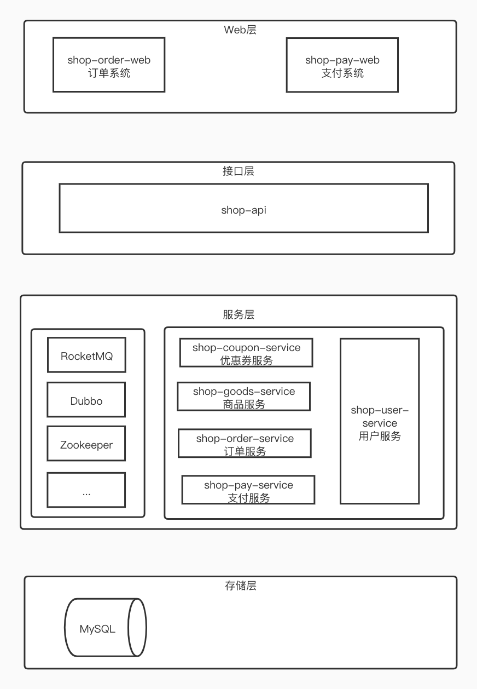

## 3.3Mybatis逆向工程

## 3.4公共类

- ID生成器

  IDWorker：Twitter雪花算法

- 异常处理类

  - CustomerException：自定义异常类
  - CastException：异常抛出类

- 常量类

  - ShopCode：系统状态类

- 响应实体类

  - Result：封装响应状态和响应信息

# 4.下单业务


## 4.1下单基本流程

### 4.1.1接口定义

```java
public interface IOrderService {
    /**
     * 确认订单
     * @param order
     * @return Result
     */
    Result confirmOrder(TradeOrder order);
}
```

### 4.1.2业务类实现

```java
@Slf4j
@Component
@Service(interfaceClass = IOrderService.class)
public class OrderServiceImpl implements IOrderService {

    @Override
    public Result confirmOrder(TradeOrder order) {
        //1.校验订单
       
        //2.生成预订单
       
        try {
            //3.扣减库存
            
            //4.扣减优惠券
           
            //5.使用余额
           
            //6.确认订单
            
            //7.返回成功状态
           
        } catch (Exception e) {
            //1.确认订单失败,发送消息
            
            //2.返回失败状态
        }

    }
}
```

### 4.1.3校验订单

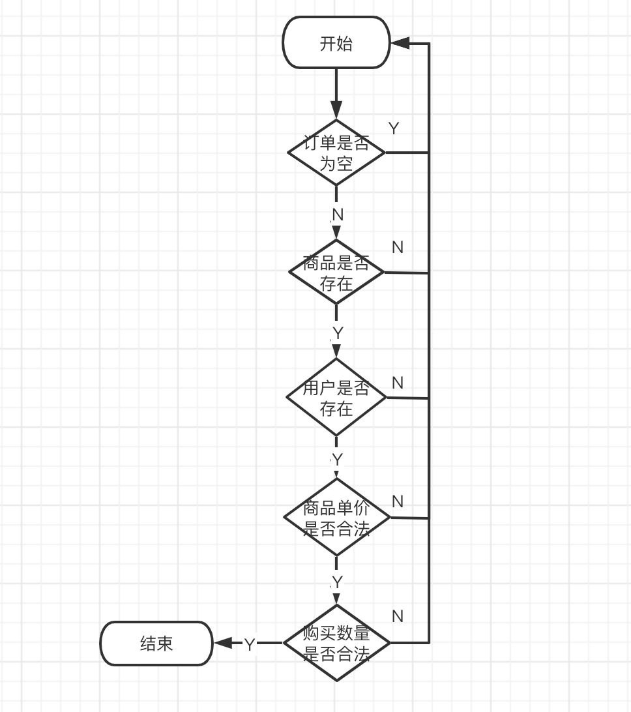

```java
private void checkOrder(TradeOrder order) {
        //1.校验订单是否存在
        if(order==null){
            CastException.cast(ShopCode.SHOP_ORDER_INVALID);
        }
        //2.校验订单中的商品是否存在
        TradeGoods goods = goodsService.findOne(order.getGoodsId());
        if(goods==null){
            CastException.cast(ShopCode.SHOP_GOODS_NO_EXIST);
        }
        //3.校验下单用户是否存在
        TradeUser user = userService.findOne(order.getUserId());
        if(user==null){
            CastException.cast(ShopCode.SHOP_USER_NO_EXIST);
        }
        //4.校验商品单价是否合法
        if(order.getGoodsPrice().compareTo(goods.getGoodsPrice())!=0){
            CastException.cast(ShopCode.SHOP_GOODS_PRICE_INVALID);
        }
        //5.校验订单商品数量是否合法
        if(order.getGoodsNumber()>=goods.getGoodsNumber()){
            CastException.cast(ShopCode.SHOP_GOODS_NUM_NOT_ENOUGH);
        }

        log.info("校验订单通过");
}
```


### 4.1.4生成预订单

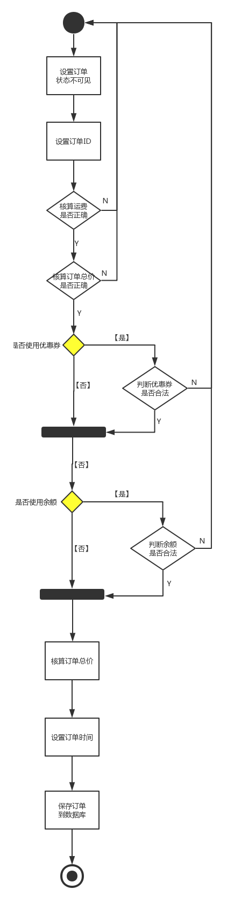

```java
private Long savePreOrder(TradeOrder order) {
        //1.设置订单状态为不可见
        order.setOrderStatus(ShopCode.SHOP_ORDER_NO_CONFIRM.getCode());
        //2.订单ID
        order.setOrderId(idWorker.nextId());
        //核算运费是否正确
        BigDecimal shippingFee = calculateShippingFee(order.getOrderAmount());
        if (order.getShippingFee().compareTo(shippingFee) != 0) {
            CastException.cast(ShopCode.SHOP_ORDER_SHIPPINGFEE_INVALID);
        }
        //3.计算订单总价格是否正确
        BigDecimal orderAmount = order.getGoodsPrice().multiply(new BigDecimal(order.getGoodsNumber()));
        orderAmount.add(shippingFee);
        if (orderAmount.compareTo(order.getOrderAmount()) != 0) {
            CastException.cast(ShopCode.SHOP_ORDERAMOUNT_INVALID);
        }

        //4.判断优惠券信息是否合法
        Long couponId = order.getCouponId();
        if (couponId != null) {
            TradeCoupon coupon = couponService.findOne(couponId);
            //优惠券不存在
            if (coupon == null) {
                CastException.cast(ShopCode.SHOP_COUPON_NO_EXIST);
            }
            //优惠券已经使用
            if ((ShopCode.SHOP_COUPON_ISUSED.getCode().toString())
                .equals(coupon.getIsUsed().toString())) {
                CastException.cast(ShopCode.SHOP_COUPON_INVALIED);
            }
            order.setCouponPaid(coupon.getCouponPrice());
        } else {
            order.setCouponPaid(BigDecimal.ZERO);
        }

        //5.判断余额是否正确
        BigDecimal moneyPaid = order.getMoneyPaid();
        if (moneyPaid != null) {
            //比较余额是否大于0
            int r = order.getMoneyPaid().compareTo(BigDecimal.ZERO);
            //余额小于0
            if (r == -1) {
                CastException.cast(ShopCode.SHOP_MONEY_PAID_LESS_ZERO);
            }
            //余额大于0
            if (r == 1) {
                //查询用户信息
                TradeUser user = userService.findOne(order.getUserId());
                if (user == null) {
                    CastException.cast(ShopCode.SHOP_USER_NO_EXIST);
                }
            //比较余额是否大于用户账户余额
            if (user.getUserMoney().compareTo(order.getMoneyPaid().longValue()) == -1) {
                CastException.cast(ShopCode.SHOP_MONEY_PAID_INVALID);
            }
            order.setMoneyPaid(order.getMoneyPaid());
        }
    } else {
        order.setMoneyPaid(BigDecimal.ZERO);
    }
    //计算订单支付总价
    order.setPayAmount(orderAmount.subtract(order.getCouponPaid())
                       .subtract(order.getMoneyPaid()));
    //设置订单添加时间
    order.setAddTime(new Date());

    //保存预订单
    int r = orderMapper.insert(order);
    if (ShopCode.SHOP_SUCCESS.getCode() != r) {
        CastException.cast(ShopCode.SHOP_ORDER_SAVE_ERROR);
    }
    log.info("订单:["+order.getOrderId()+"]预订单生成成功");
    return order.getOrderId();
}
```


### 4.1.5扣减库存

- 通过dubbo调用商品服务完成扣减库存

  ```java
  private void reduceGoodsNum(TradeOrder order) {
      TradeGoodsNumberLog goodsNumberLog = new TradeGoodsNumberLog();
      goodsNumberLog.setGoodsId(order.getGoodsId());
      goodsNumberLog.setOrderId(order.getOrderId());
      goodsNumberLog.setGoodsNumber(order.getGoodsNumber());
      Result result = goodsService.reduceGoodsNum(goodsNumberLog);
      if (result.getSuccess().equals(ShopCode.SHOP_FAIL.getSuccess())) {
          CastException.cast(ShopCode.SHOP_REDUCE_GOODS_NUM_FAIL);
      }
      log.info("订单:["+order.getOrderId()+"]扣减库存["+order.getGoodsNumber()+"个]成功");
  }
  ```

- 商品服务GoodsService扣减库存

  ```java
  @Override
  public Result reduceGoodsNum(TradeGoodsNumberLog goodsNumberLog) {
      if (goodsNumberLog == null ||
              goodsNumberLog.getGoodsNumber() == null ||
              goodsNumberLog.getOrderId() == null ||
              goodsNumberLog.getGoodsNumber() == null ||
              goodsNumberLog.getGoodsNumber().intValue() <= 0) {
          CastException.cast(ShopCode.SHOP_REQUEST_PARAMETER_VALID);
      }
      TradeGoods goods = goodsMapper.selectByPrimaryKey(goodsNumberLog.getGoodsId());
      if(goods.getGoodsNumber()<goodsNumberLog.getGoodsNumber()){
          //库存不足
          CastException.cast(ShopCode.SHOP_GOODS_NUM_NOT_ENOUGH);
      }
      //减库存
      goods.setGoodsNumber(goods.getGoodsNumber()-goodsNumberLog.getGoodsNumber());
      goodsMapper.updateByPrimaryKey(goods);
  
  
      //记录库存操作日志
      goodsNumberLog.setGoodsNumber(-(goodsNumberLog.getGoodsNumber()));
      goodsNumberLog.setLogTime(new Date());
      goodsNumberLogMapper.insert(goodsNumberLog);
  
      return new Result(ShopCode.SHOP_SUCCESS.getSuccess(),ShopCode.SHOP_SUCCESS.getMessage());
  }
  ```

  

### 4.1.6扣减优惠劵

- 通过dubbo完成扣减优惠券

  ```java
  private void changeCoponStatus(TradeOrder order) {
      //判断用户是否使用优惠券
      if (!StringUtils.isEmpty(order.getCouponId())) {
          //封装优惠券对象
          TradeCoupon coupon = couponService.findOne(order.getCouponId());
          coupon.setIsUsed(ShopCode.SHOP_COUPON_ISUSED.getCode());
          coupon.setUsedTime(new Date());
          coupon.setOrderId(order.getOrderId());
          Result result = couponService.changeCouponStatus(coupon);
          //判断执行结果
          if (result.getSuccess().equals(ShopCode.SHOP_FAIL.getSuccess())) {
              //优惠券使用失败
              CastException.cast(ShopCode.SHOP_COUPON_USE_FAIL);
          }
          log.info("订单:["+order.getOrderId()+"]使用扣减优惠券["+coupon.getCouponPrice()+"元]成功");
      }
  
  }
  ```

  

- 优惠券服务CouponService更改优惠券状态

  ```java
  @Override
  public Result changeCouponStatus(TradeCoupon coupon) {
      try {
          //判断请求参数是否合法
          if (coupon == null || StringUtils.isEmpty(coupon.getCouponId())) {
              CastException.cast(ShopCode.SHOP_REQUEST_PARAMETER_VALID);
          }
  		//更新优惠券状态为已使用
          couponMapper.updateByPrimaryKey(coupon);
          return new Result(ShopCode.SHOP_SUCCESS.getSuccess(), ShopCode.SHOP_SUCCESS.getMessage());
      } catch (Exception e) {
          return new Result(ShopCode.SHOP_FAIL.getSuccess(), ShopCode.SHOP_FAIL.getMessage());
      }
  }
  ```

  

### 4.1.7扣减用户余额

- 通过用户服务完成扣减余额

  ```java
  private void reduceMoneyPaid(TradeOrder order) {
      //判断订单中使用的余额是否合法
      if (order.getMoneyPaid() != null && order.getMoneyPaid().compareTo(BigDecimal.ZERO) == 1) {
          TradeUserMoneyLog userMoneyLog = new TradeUserMoneyLog();
          userMoneyLog.setOrderId(order.getOrderId());
          userMoneyLog.setUserId(order.getUserId());
          userMoneyLog.setUseMoney(order.getMoneyPaid());
          userMoneyLog.setMoneyLogType(ShopCode.SHOP_USER_MONEY_PAID.getCode());
          //扣减余额
          Result result = userService.changeUserMoney(userMoneyLog);
          if (result.getSuccess().equals(ShopCode.SHOP_FAIL.getSuccess())) {
              CastException.cast(ShopCode.SHOP_USER_MONEY_REDUCE_FAIL);
          }
          log.info("订单:["+order.getOrderId()+"扣减余额["+order.getMoneyPaid()+"元]成功]");
      }
  }
  ```

- 用户服务UserService,更新余额

  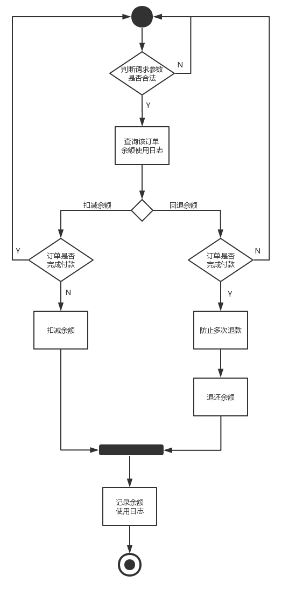

  ```java
  @Override
  public Result changeUserMoney(TradeUserMoneyLog userMoneyLog) {
      //判断请求参数是否合法
      if (userMoneyLog == null
              || userMoneyLog.getUserId() == null
              || userMoneyLog.getUseMoney() == null
              || userMoneyLog.getOrderId() == null
              || userMoneyLog.getUseMoney().compareTo(BigDecimal.ZERO) <= 0) {
          CastException.cast(ShopCode.SHOP_REQUEST_PARAMETER_VALID);
      }
  
      //查询该订单是否存在付款记录
      TradeUserMoneyLogExample userMoneyLogExample = new TradeUserMoneyLogExample();
      userMoneyLogExample.createCriteria()
              .andUserIdEqualTo(userMoneyLog.getUserId())
              .andOrderIdEqualTo(userMoneyLog.getOrderId());
     int count = userMoneyLogMapper.countByExample(userMoneyLogExample);
     TradeUser tradeUser = new TradeUser();
     tradeUser.setUserId(userMoneyLog.getUserId());
     tradeUser.setUserMoney(userMoneyLog.getUseMoney().longValue());
     //判断余额操作行为
     //【付款操作】
     if (userMoneyLog.getMoneyLogType().equals(ShopCode.SHOP_USER_MONEY_PAID.getCode())) {
             //订单已经付款，则抛异常
             if (count > 0) {
                  CastException.cast(ShopCode.SHOP_ORDER_PAY_STATUS_IS_PAY);
              }
         	   //用户账户扣减余额
             userMapper.reduceUserMoney(tradeUser);
         }
      //【退款操作】
      if (userMoneyLog.getMoneyLogType().equals(ShopCode.SHOP_USER_MONEY_REFUND.getCode())) {
           //如果订单未付款,则不能退款,抛异常
           if (count == 0) {
           CastException.cast(ShopCode.SHOP_ORDER_PAY_STATUS_NO_PAY);
       }
       //防止多次退款
       userMoneyLogExample = new TradeUserMoneyLogExample();
       userMoneyLogExample.createCriteria()
               .andUserIdEqualTo(userMoneyLog.getUserId())
                  .andOrderIdEqualTo(userMoneyLog.getOrderId())
                  .andMoneyLogTypeEqualTo(ShopCode.SHOP_USER_MONEY_REFUND.getCode());
       count = userMoneyLogMapper.countByExample(userMoneyLogExample);
       if (count > 0) {
           CastException.cast(ShopCode.SHOP_USER_MONEY_REFUND_ALREADY);
       }
       	//用户账户添加余额
          userMapper.addUserMoney(tradeUser);
      }
  
  
      //记录用户使用余额日志
      userMoneyLog.setCreateTime(new Date());
      userMoneyLogMapper.insert(userMoneyLog);
      return new Result(ShopCode.SHOP_SUCCESS.getSuccess(),ShopCode.SHOP_SUCCESS.getMessage());
  }
  ```

  

### 4.1.8确认订单

```java
private void updateOrderStatus(TradeOrder order) {
    order.setOrderStatus(ShopCode.SHOP_ORDER_CONFIRM.getCode());
    order.setPayStatus(ShopCode.SHOP_ORDER_PAY_STATUS_NO_PAY.getCode());
    order.setConfirmTime(new Date());
    int r = orderMapper.updateByPrimaryKey(order);
    if (r <= 0) {
        CastException.cast(ShopCode.SHOP_ORDER_CONFIRM_FAIL);
    }
    log.info("订单:["+order.getOrderId()+"]状态修改成功");
}
```


### 4.1.9小结

```java
@Override
public Result confirmOrder(TradeOrder order) {
    //1.校验订单
    checkOrder(order);
    //2.生成预订单
    Long orderId = savePreOrder(order);
    order.setOrderId(orderId);
    try {
        //3.扣减库存
        reduceGoodsNum(order);
        //4.扣减优惠券
        changeCoponStatus(order);
        //5.使用余额
        reduceMoneyPaid(order);
        //6.确认订单
        updateOrderStatus(order);
        log.info("订单:["+orderId+"]确认成功");
        return new Result(ShopCode.SHOP_SUCCESS.getSuccess(), ShopCode.SHOP_SUCCESS.getMessage());
    } catch (Exception e) {
        //确认订单失败,发送消息
        ...
        return new Result(ShopCode.SHOP_FAIL.getSuccess(), ShopCode.SHOP_FAIL.getMessage());
    }
}
```


## 4.2失败补偿机制

### 4.2.1消息发送方

- 配置RocketMQ属性值

  ```
  rocketmq.name-server=192.168.25.135:9876;192.168.25.138:9876
  rocketmq.producer.group=orderProducerGroup
  
  mq.order.consumer.group.name=order_orderTopic_cancel_group
  mq.order.topic=orderTopic
  mq.order.tag.confirm=order_confirm
  mq.order.tag.cancel=order_cancel
  ```

- 注入模板类和属性值信息

  ```java
   @Autowired
   private RocketMQTemplate rocketMQTemplate;
  
   @Value("${mq.order.topic}")
   private String topic;
  
   @Value("${mq.order.tag.cancel}")
   private String cancelTag;
  ```

- 发送下单失败消息

  ```java
  @Override
  public Result confirmOrder(TradeOrder order) {
      //1.校验订单
      //2.生成预订
      try {
          //3.扣减库存
          //4.扣减优惠券
          //5.使用余额
          //6.确认订单
      } catch (Exception e) {
          //确认订单失败,发送消息
          CancelOrderMQ cancelOrderMQ = new CancelOrderMQ();
          cancelOrderMQ.setOrderId(order.getOrderId());
          cancelOrderMQ.setCouponId(order.getCouponId());
          cancelOrderMQ.setGoodsId(order.getGoodsId());
          cancelOrderMQ.setGoodsNumber(order.getGoodsNumber());
          cancelOrderMQ.setUserId(order.getUserId());
          cancelOrderMQ.setUserMoney(order.getMoneyPaid());
          try {
              sendMessage(topic, 
                          cancelTag, 
                          cancelOrderMQ.getOrderId().toString(), 
                      JSON.toJSONString(cancelOrderMQ));
      } catch (Exception e1) {
          e1.printStackTrace();
              CastException.cast(ShopCode.SHOP_MQ_SEND_MESSAGE_FAIL);
          }
          return new Result(ShopCode.SHOP_FAIL.getSuccess(), ShopCode.SHOP_FAIL.getMessage());
      }
  }
  
  private void sendMessage(String topic, String tags, String keys, String body) throws Exception {
      //判断Topic是否为空
      if (StringUtils.isEmpty(topic)) {
          CastException.cast(ShopCode.SHOP_MQ_TOPIC_IS_EMPTY);
      }
      //判断消息内容是否为空
      if (StringUtils.isEmpty(body)) {
          CastException.cast(ShopCode.SHOP_MQ_MESSAGE_BODY_IS_EMPTY);
      }
      //消息体
      Message message = new Message(topic, tags, keys, body.getBytes());
      //发送消息
      rocketMQTemplate.getProducer().send(message);
  }
  ```

  

### 4.2.2消息接受方

- 配置RocketMQ属性值

  ```
  rocketmq.name-server=192.168.25.135:9876;192.168.25.138:9876
  mq.order.consumer.group.name=order_orderTopic_cancel_group
  mq.order.topic=orderTopic
  ```

- 创建监听类，消费消息

  ```java
  @Slf4j
  @Component
  @RocketMQMessageListener(topic = "${mq.order.topic}", 
                           consumerGroup = "${mq.order.consumer.group.name}",
                           messageModel = MessageModel.BROADCASTING)
  public class CancelOrderConsumer implements RocketMQListener<MessageExt>{
  
      @Override
      public void onMessage(MessageExt messageExt) {
          ...
      }
  }
  ```

#### 1）回退库存

- 流程分析

  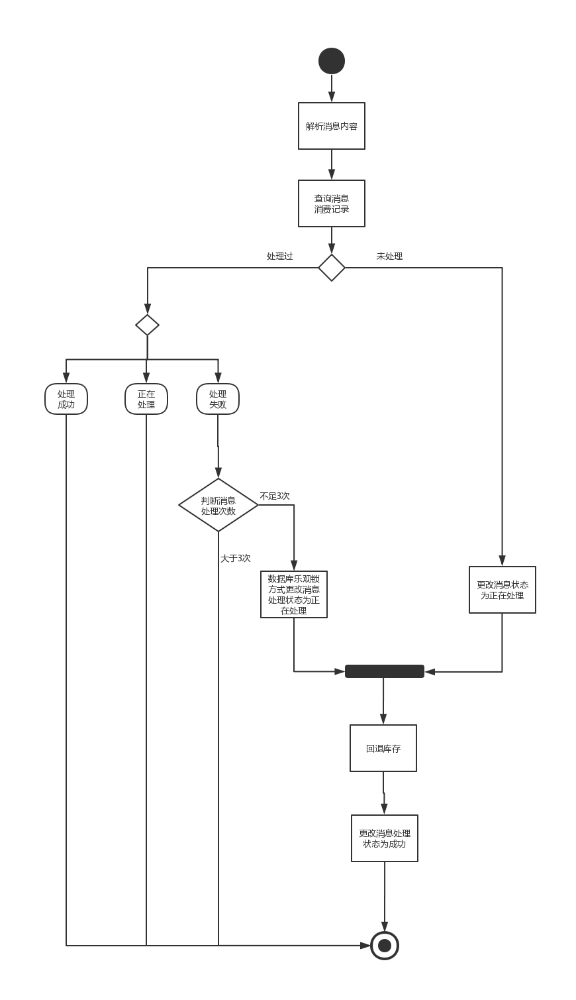

- 消息消费者

```java
@Slf4j
@Component
@RocketMQMessageListener(topic = "${mq.order.topic}",consumerGroup = "${mq.order.consumer.group.name}",messageModel = MessageModel.BROADCASTING )
public class CancelMQListener implements RocketMQListener<MessageExt>{


    @Value("${mq.order.consumer.group.name}")
    private String groupName;

    @Autowired
    private TradeGoodsMapper goodsMapper;

    @Autowired
    private TradeMqConsumerLogMapper mqConsumerLogMapper;

    @Autowired
    private TradeGoodsNumberLogMapper goodsNumberLogMapper;

    @Override
    public void onMessage(MessageExt messageExt) {
        String msgId=null;
        String tags=null;
        String keys=null;
        String body=null;
        try {
            //1. 解析消息内容
            msgId = messageExt.getMsgId();
            tags= messageExt.getTags();
            keys= messageExt.getKeys();
            body= new String(messageExt.getBody(),"UTF-8");

            log.info("接受消息成功");

            //2. 查询消息消费记录
            TradeMqConsumerLogKey primaryKey = new TradeMqConsumerLogKey();
            primaryKey.setMsgTag(tags);
            primaryKey.setMsgKey(keys);
            primaryKey.setGroupName(groupName);
            TradeMqConsumerLog mqConsumerLog = mqConsumerLogMapper.selectByPrimaryKey(primaryKey);

            if(mqConsumerLog!=null){
                //3. 判断如果消费过...
                //3.1 获得消息处理状态
                Integer status = mqConsumerLog.getConsumerStatus();
                //处理过...返回
                if(ShopCode.SHOP_MQ_MESSAGE_STATUS_SUCCESS.getCode().intValue()==status.intValue()){
                    log.info("消息:"+msgId+",已经处理过");
                    return;
                }

                //正在处理...返回
                if(ShopCode.SHOP_MQ_MESSAGE_STATUS_PROCESSING.getCode().intValue()==status.intValue()){
                    log.info("消息:"+msgId+",正在处理");
                    return;
                }

                //处理失败
                if(ShopCode.SHOP_MQ_MESSAGE_STATUS_FAIL.getCode().intValue()==status.intValue()){
                    //获得消息处理次数
                    Integer times = mqConsumerLog.getConsumerTimes();
                    if(times>3){
                        log.info("消息:"+msgId+",消息处理超过3次,不能再进行处理了");
                        return;
                    }
                    mqConsumerLog.setConsumerStatus(ShopCode.SHOP_MQ_MESSAGE_STATUS_PROCESSING.getCode());

                    //使用数据库乐观锁更新
                    TradeMqConsumerLogExample example = new TradeMqConsumerLogExample();
                    TradeMqConsumerLogExample.Criteria criteria = example.createCriteria();
                    criteria.andMsgTagEqualTo(mqConsumerLog.getMsgTag());
                    criteria.andMsgKeyEqualTo(mqConsumerLog.getMsgKey());
                    criteria.andGroupNameEqualTo(groupName);
                    criteria.andConsumerTimesEqualTo(mqConsumerLog.getConsumerTimes());
                    int r = mqConsumerLogMapper.updateByExampleSelective(mqConsumerLog, example);
                    if(r<=0){
                        //未修改成功,其他线程并发修改
                        log.info("并发修改,稍后处理");
                    }
                }

            }else{
                //4. 判断如果没有消费过...
                mqConsumerLog = new TradeMqConsumerLog();
                mqConsumerLog.setMsgTag(tags);
                mqConsumerLog.setMsgKey(keys);
                mqConsumerLog.setConsumerStatus(ShopCode.SHOP_MQ_MESSAGE_STATUS_PROCESSING.getCode());
                mqConsumerLog.setMsgBody(body);
                mqConsumerLog.setMsgId(msgId);
                mqConsumerLog.setConsumerTimes(0);

                //将消息处理信息添加到数据库
                mqConsumerLogMapper.insert(mqConsumerLog);
            }
            //5. 回退库存
            MQEntity mqEntity = JSON.parseObject(body, MQEntity.class);
            Long goodsId = mqEntity.getGoodsId();
            TradeGoods goods = goodsMapper.selectByPrimaryKey(goodsId);
            goods.setGoodsNumber(goods.getGoodsNumber()+mqEntity.getGoodsNum());
            goodsMapper.updateByPrimaryKey(goods);

            //记录库存操作日志
            TradeGoodsNumberLog goodsNumberLog = new TradeGoodsNumberLog();
            goodsNumberLog.setOrderId(mqEntity.getOrderId());
            goodsNumberLog.setGoodsId(goodsId);
            goodsNumberLog.setGoodsNumber(mqEntity.getGoodsNum());
            goodsNumberLog.setLogTime(new Date());
            goodsNumberLogMapper.insert(goodsNumberLog);

            //6. 将消息的处理状态改为成功
            mqConsumerLog.setConsumerStatus(ShopCode.SHOP_MQ_MESSAGE_STATUS_SUCCESS.getCode());
            mqConsumerLog.setConsumerTimestamp(new Date());
            mqConsumerLogMapper.updateByPrimaryKey(mqConsumerLog);
            log.info("回退库存成功");
        } catch (Exception e) {
            e.printStackTrace();
            TradeMqConsumerLogKey primaryKey = new TradeMqConsumerLogKey();
            primaryKey.setMsgTag(tags);
            primaryKey.setMsgKey(keys);
            primaryKey.setGroupName(groupName);
            TradeMqConsumerLog mqConsumerLog = mqConsumerLogMapper.selectByPrimaryKey(primaryKey);
            if(mqConsumerLog==null){
                //数据库未有记录
                mqConsumerLog = new TradeMqConsumerLog();
                mqConsumerLog.setMsgTag(tags);
                mqConsumerLog.setMsgKey(keys);
                mqConsumerLog.setConsumerStatus(ShopCode.SHOP_MQ_MESSAGE_STATUS_FAIL.getCode());
                mqConsumerLog.setMsgBody(body);
                mqConsumerLog.setMsgId(msgId);
                mqConsumerLog.setConsumerTimes(1);
                mqConsumerLogMapper.insert(mqConsumerLog);
            }else{
                mqConsumerLog.setConsumerTimes(mqConsumerLog.getConsumerTimes()+1);
                mqConsumerLogMapper.updateByPrimaryKeySelective(mqConsumerLog);
            }
        }

    }
}
```


#### 2）回退优惠劵

```java
@Slf4j
@Component
@RocketMQMessageListener(topic = "${mq.order.topic}",consumerGroup = "${mq.order.consumer.group.name}",messageModel = MessageModel.BROADCASTING )
public class CancelMQListener implements RocketMQListener<MessageExt>{


    @Autowired
    private TradeCouponMapper couponMapper;

    @Override
    public void onMessage(MessageExt message) {

        try {
            //1. 解析消息内容
            String body = new String(message.getBody(), "UTF-8");
            MQEntity mqEntity = JSON.parseObject(body, MQEntity.class);
            log.info("接收到消息");
            //2. 查询优惠券信息
            TradeCoupon coupon = couponMapper.selectByPrimaryKey(mqEntity.getCouponId());
            //3.更改优惠券状态
            coupon.setUsedTime(null);
            coupon.setIsUsed(ShopCode.SHOP_COUPON_UNUSED.getCode());
            coupon.setOrderId(null);
            couponMapper.updateByPrimaryKey(coupon);
            log.info("回退优惠券成功");
        } catch (UnsupportedEncodingException e) {
            e.printStackTrace();
            log.error("回退优惠券失败");
        }

    }
}
```


#### 3）回退余额

```java
@Slf4j
@Component
@RocketMQMessageListener(topic = "${mq.order.topic}",consumerGroup = "${mq.order.consumer.group.name}",messageModel = MessageModel.BROADCASTING )
public class CancelMQListener implements RocketMQListener<MessageExt>{


    @Autowired
    private IUserService userService;

    @Override
    public void onMessage(MessageExt messageExt) {

        try {
            //1.解析消息
            String body = new String(messageExt.getBody(), "UTF-8");
            MQEntity mqEntity = JSON.parseObject(body, MQEntity.class);
            log.info("接收到消息");
            if(mqEntity.getUserMoney()!=null && mqEntity.getUserMoney().compareTo(BigDecimal.ZERO)>0){
                //2.调用业务层,进行余额修改
                TradeUserMoneyLog userMoneyLog = new TradeUserMoneyLog();
                userMoneyLog.setUseMoney(mqEntity.getUserMoney());
                userMoneyLog.setMoneyLogType(ShopCode.SHOP_USER_MONEY_REFUND.getCode());
                userMoneyLog.setUserId(mqEntity.getUserId());
                userMoneyLog.setOrderId(mqEntity.getOrderId());
                userService.updateMoneyPaid(userMoneyLog);
                log.info("余额回退成功");
            }
        } catch (UnsupportedEncodingException e) {
            e.printStackTrace();
            log.error("余额回退失败");
        }

    }
}
```


#### 4）取消订单

```java
@Override
    public void onMessage(MessageExt messageExt) {
        String body = new String(messageExt.getBody(), "UTF-8");
        String msgId = messageExt.getMsgId();
        String tags = messageExt.getTags();
        String keys = messageExt.getKeys();
        log.info("CancelOrderProcessor receive message:"+messageExt);
        CancelOrderMQ cancelOrderMQ = JSON.parseObject(body, CancelOrderMQ.class);
        TradeOrder order = orderService.findOne(cancelOrderMQ.getOrderId());
		order.setOrderStatus(ShopCode.SHOP_ORDER_CANCEL.getCode());
        orderService.changeOrderStatus(order);
        log.info("订单:["+order.getOrderId()+"]状态设置为取消");
        return order;
    }

```


## 4.3测试

### 4.3.1准备测试环境

```java
@RunWith(SpringRunner.class)
@SpringBootTest(classes = ShopOrderServiceApplication.class)
public class OrderTest {

    @Autowired
    private IOrderService orderService;
}
```

#### 1）准备测试数据

- 用户数据
- 商品数据
- 优惠券数据

#### 2）测试下单成功流程

```java
@Test    
public void add(){
    Long goodsId=XXXL;
    Long userId=XXXL;
    Long couponId=XXXL;

    TradeOrder order = new TradeOrder();
    order.setGoodsId(goodsId);
    order.setUserId(userId);
    order.setGoodsNumber(1);
    order.setAddress("北京");
    order.setGoodsPrice(new BigDecimal("5000"));
    order.setOrderAmount(new BigDecimal("5000"));
    order.setMoneyPaid(new BigDecimal("100"));
    order.setCouponId(couponId);
    order.setShippingFee(new BigDecimal(0));
    orderService.confirmOrder(order);
}
```

执行完毕后,查看数据库中用户的余额、优惠券数据，及订单的状态数据

#### 3）测试下单失败流程

代码同上。

执行完毕后，查看用户的余额、优惠券数据是否发生更改，订单的状态是否为取消。

# 5.支付业务

## 5.1创建支付订单


```java
public Result createPayment(TradePay tradePay) {
    //查询订单支付状态
    try {
        TradePayExample payExample = new TradePayExample();
        TradePayExample.Criteria criteria = payExample.createCriteria();
        criteria.andOrderIdEqualTo(tradePay.getOrderId());
        criteria.andIsPaidEqualTo(ShopCode.SHOP_ORDER_PAY_STATUS_IS_PAY.getCode());
        int count = tradePayMapper.countByExample(payExample);
        if (count > 0) {
            CastException.cast(ShopCode.SHOP_ORDER_PAY_STATUS_IS_PAY);
        }

        long payId = idWorker.nextId();
        tradePay.setPayId(payId);
        tradePay.setIsPaid(ShopCode.SHOP_ORDER_PAY_STATUS_NO_PAY.getCode());
        tradePayMapper.insert(tradePay);
        log.info("创建支付订单成功:" + payId);
    } catch (Exception e) {
        return new Result(ShopCode.SHOP_FAIL.getSuccess(), ShopCode.SHOP_FAIL.getMessage());
    }
    return new Result(ShopCode.SHOP_SUCCESS.getSuccess(), ShopCode.SHOP_SUCCESS.getMessage());
}
```


## 5.2支付回调

### 5.2.1流程分析

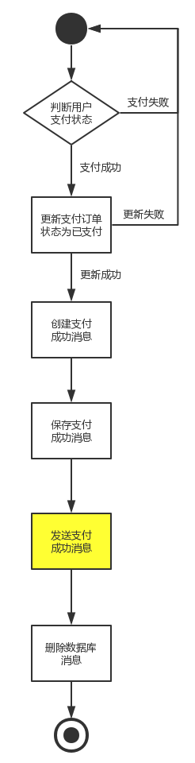

### 5.2.2代码实现

```java
public Result callbackPayment(TradePay tradePay) {

    if (tradePay.getIsPaid().equals(ShopCode.SHOP_ORDER_PAY_STATUS_IS_PAY.getCode())) {
        tradePay = tradePayMapper.selectByPrimaryKey(tradePay.getPayId());
        if (tradePay == null) {
            CastException.cast(ShopCode.SHOP_PAYMENT_NOT_FOUND);
        }
        tradePay.setIsPaid(ShopCode.SHOP_ORDER_PAY_STATUS_IS_PAY.getCode());
        int i = tradePayMapper.updateByPrimaryKeySelective(tradePay);
        //更新成功代表支付成功
        if (i == 1) {
            TradeMqProducerTemp mqProducerTemp = new TradeMqProducerTemp();
            mqProducerTemp.setId(String.valueOf(idWorker.nextId()));
            mqProducerTemp.setGroupName("payProducerGroup");
            mqProducerTemp.setMsgKey(String.valueOf(tradePay.getPayId()));
            mqProducerTemp.setMsgTag(topic);
            mqProducerTemp.setMsgBody(JSON.toJSONString(tradePay));
            mqProducerTemp.setCreateTime(new Date());
            mqProducerTempMapper.insert(mqProducerTemp);
            TradePay finalTradePay = tradePay;
            executorService.submit(new Runnable() {
                @Override
                public void run() {
                    try {
                        SendResult sendResult = sendMessage(topic, 
                                                            tag, 
                                                            finalTradePay.getPayId(), 
                                                            JSON.toJSONString(finalTradePay));
                        log.info(JSON.toJSONString(sendResult));
                        if (SendStatus.SEND_OK.equals(sendResult.getSendStatus())) {
                            mqProducerTempMapper.deleteByPrimaryKey(mqProducerTemp.getId());
                            System.out.println("删除消息表成功");
                        }
                    } catch (Exception e) {
                        e.printStackTrace();
                    }
                }
            });
        } else {
            CastException.cast(ShopCode.SHOP_PAYMENT_IS_PAID);
        }
    }
    return new Result(ShopCode.SHOP_SUCCESS.getSuccess(), ShopCode.SHOP_SUCCESS.getMessage());
}
```

#### 线程池优化消息发送逻辑

- 创建线程池对象

  ```java
  @Bean
  public ThreadPoolTaskExecutor getThreadPool() {
  
      ThreadPoolTaskExecutor executor = new ThreadPoolTaskExecutor();
  
      executor.setCorePoolSize(4);
  
      executor.setMaxPoolSize(8);
  
      executor.setQueueCapacity(100);
  
      executor.setKeepAliveSeconds(60);
  
      executor.setThreadNamePrefix("Pool-A");
  
      executor.setRejectedExecutionHandler(new ThreadPoolExecutor.CallerRunsPolicy());
  
      executor.initialize();
  
      return executor;
  
  }
  ```

  

- 使用线程池

  ```java
  @Autowired
  private ThreadPoolTaskExecutor executorService;
  
  executorService.submit(new Runnable() {
      @Override
      public void run() {
          try {
              SendResult sendResult = sendMessage(topic, tag, finalTradePay.getPayId(), JSON.toJSONString(finalTradePay));
              log.info(JSON.toJSONString(sendResult));
              if (SendStatus.SEND_OK.equals(sendResult.getSendStatus())) {
                  mqProducerTempMapper.deleteByPrimaryKey(mqProducerTemp.getId());
                  System.out.println("删除消息表成功");
              }
          } catch (Exception e) {
              e.printStackTrace();
          }
      }
  });
  ```

  

### 5.2.3处理消息

支付成功后，支付服务payService发送MQ消息，订单服务、用户服务、日志服务需要订阅消息进行处理

1. 订单服务修改订单状态为已支付
2. 日志服务记录支付日志
3. 用户服务负责给用户增加积分

以下用订单服务为例说明消息的处理情况

#### 1）配置RocketMQ属性值

```
mq.pay.topic=payTopic
mq.pay.consumer.group.name=pay_payTopic_group
```

#### 2）消费消息

- 在订单服务中，配置公共的消息处理类

  ```java
  public class BaseConsumer {
  
      public TradeOrder handleMessage(IOrderService 
                                      orderService, 
                                      MessageExt messageExt,Integer code) throws Exception {
          //解析消息内容
          String body = new String(messageExt.getBody(), "UTF-8");
          String msgId = messageExt.getMsgId();
          String tags = messageExt.getTags();
          String keys = messageExt.getKeys();
          OrderMQ orderMq = JSON.parseObject(body, OrderMQ.class);
          
          //查询
          TradeOrder order = orderService.findOne(orderMq.getOrderId());
  
          if(ShopCode.SHOP_ORDER_MESSAGE_STATUS_CANCEL.getCode().equals(code)){
              order.setOrderStatus(ShopCode.SHOP_ORDER_CANCEL.getCode());
          }
  
          if(ShopCode.SHOP_ORDER_MESSAGE_STATUS_ISPAID.getCode().equals(code)){
              order.setPayStatus(ShopCode.SHOP_ORDER_PAY_STATUS_IS_PAY.getCode());
          }
          orderService.changeOrderStatus(order);
          return order;
      }
  
  }
  ```

  

- 接受订单支付成功消息

  ```java
  @Slf4j
  @Component
  @RocketMQMessageListener(topic = "${mq.pay.topic}", 
                           consumerGroup = "${mq.pay.consumer.group.name}")
  public class PayConsumer extends BaseConsumer implements RocketMQListener<MessageExt> {
  
      @Autowired
      private IOrderService orderService;
  
      @Override
      public void onMessage(MessageExt messageExt) {
          try {
              log.info("CancelOrderProcessor receive message:"+messageExt);
              TradeOrder order = handleMessage(orderService, 
                                               messageExt, 
                                               ShopCode.SHOP_ORDER_MESSAGE_STATUS_ISPAID.getCode());
              log.info("订单:["+order.getOrderId()+"]支付成功");
          } catch (Exception e) {
              e.printStackTrace();
              log.error("订单支付失败");
          }
      }
  }
  ```

  

# 6.联调

通过Rest客户端请求shop-order-web和shop-pay-web完成下单和支付操作

## 6.1准备工作

### 6.1.1配置RestTemplate类

```java
@Configuration
public class RestTemplateConfig {

    @Bean
    @ConditionalOnMissingBean({ RestOperations.class, RestTemplate.class })
    public RestTemplate restTemplate(ClientHttpRequestFactory factory) {

        RestTemplate restTemplate = new RestTemplate(factory);

        // 使用 utf-8 编码集的 conver 替换默认的 conver（默认的 string conver 的编码集为"ISO-8859-1"）
        List<HttpMessageConverter<?>> messageConverters = restTemplate.getMessageConverters();
        Iterator<HttpMessageConverter<?>> iterator = messageConverters.iterator();
        while (iterator.hasNext()) {
            HttpMessageConverter<?> converter = iterator.next();
            if (converter instanceof StringHttpMessageConverter) {
                iterator.remove();
            }
        }
        messageConverters.add(new StringHttpMessageConverter(Charset.forName("UTF-8")));

        return restTemplate;
    }

    @Bean
    @ConditionalOnMissingBean({ClientHttpRequestFactory.class})
    public ClientHttpRequestFactory simpleClientHttpRequestFactory() {
        SimpleClientHttpRequestFactory factory = new SimpleClientHttpRequestFactory();
        // ms
        factory.setReadTimeout(15000);
        // ms
        factory.setConnectTimeout(15000);
        return factory;
    }
}
```

### 6.1.2配置请求地址

- 订单系统

  ```
  server.host=http://localhost
  server.servlet.path=/order-web
  server.port=8080
  shop.order.baseURI=${server.host}:${server.port}${server.servlet.path}
  shop.order.confirm=/order/confirm
  
  ```

- 支付系统

  ```
  server.host=http://localhost
  server.servlet.path=/pay-web
  server.port=9090
  shop.pay.baseURI=${server.host}:${server.port}${server.servlet.path}
  shop.pay.createPayment=/pay/createPayment
  shop.pay.callbackPayment=/pay/callbackPayment
  ```

## 6.2下单测试

```java
@RunWith(SpringRunner.class)
@ContextConfiguration(classes = ShopOrderWebApplication.class)
@TestPropertySource("classpath:application.properties")
public class OrderTest {

   @Autowired
   private RestTemplate restTemplate;

   @Value("${shop.order.baseURI}")
   private String baseURI;

   @Value("${shop.order.confirm}")
   private String confirmOrderPath;

   @Autowired
   private IDWorker idWorker;
  
  /**
    * 下单
    */
   @Test
   public void confirmOrder(){
       Long goodsId=XXXL;
       Long userId=XXXL;
       Long couponId=XXXL;

       TradeOrder order = new TradeOrder();
       order.setGoodsId(goodsId);
       order.setUserId(userId);
       order.setGoodsNumber(1);
       order.setAddress("北京");
       order.setGoodsPrice(new BigDecimal("5000"));
       order.setOrderAmount(new BigDecimal("5000"));
       order.setMoneyPaid(new BigDecimal("100"));
       order.setCouponId(couponId);
       order.setShippingFee(new BigDecimal(0));

       Result result = restTemplate.postForEntity(baseURI + confirmOrderPath, order, Result.class).getBody();
       System.out.println(result);
   }

}
```


## 6.3支付测试

```java
@RunWith(SpringRunner.class)
@ContextConfiguration(classes = ShopPayWebApplication.class)
@TestPropertySource("classpath:application.properties")
public class PayTest {

    @Autowired
    private RestTemplate restTemplate;

    @Value("${shop.pay.baseURI}")
    private String baseURI;

    @Value("${shop.pay.createPayment}")
    private String createPaymentPath;

    @Value("${shop.pay.callbackPayment}")
    private String callbackPaymentPath;

    @Autowired
    private IDWorker idWorker;

   /**
     * 创建支付订单
     */
    @Test
    public void createPayment(){

        Long orderId = 346321587315814400L;
        TradePay pay = new TradePay();
        pay.setOrderId(orderId);
        pay.setPayAmount(new BigDecimal(4800));

        Result result = restTemplate.postForEntity(baseURI + createPaymentPath, pay, Result.class).getBody();
        System.out.println(result);
    }
   
    /**
     * 支付回调
     */
    @Test
    public void callbackPayment(){
        Long payId = 346321891507720192L;
        TradePay pay = new TradePay();
        pay.setPayId(payId);
        pay.setIsPaid(ShopCode.SHOP_ORDER_PAY_STATUS_IS_PAY.getCode());
        Result result = restTemplate.postForEntity(baseURI + callbackPaymentPath, pay, Result.class).getBody();
        System.out.println(result);

    }

}
```


