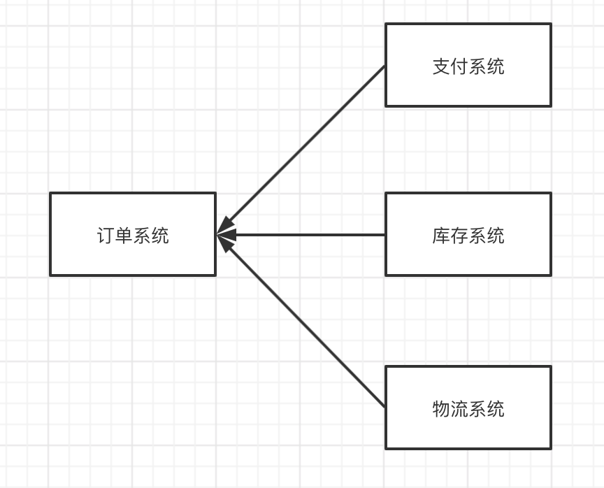
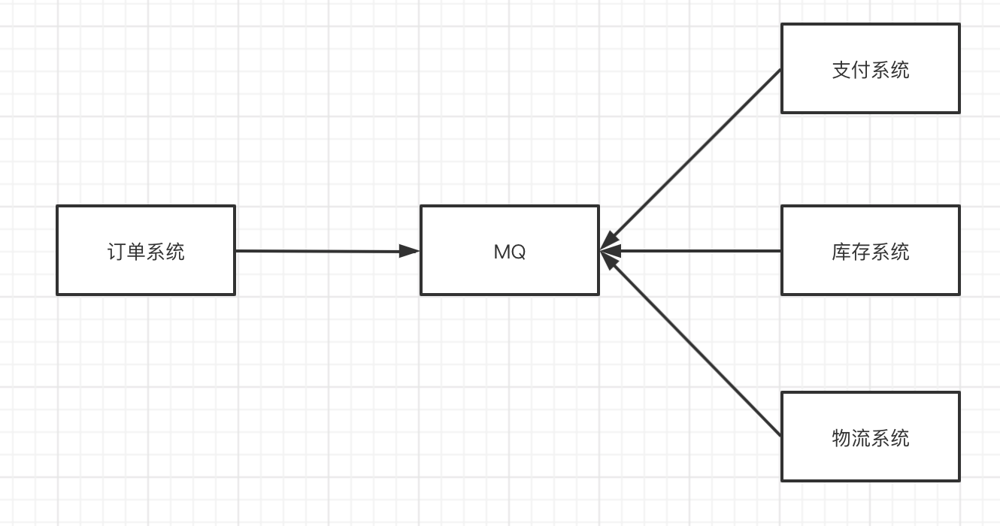
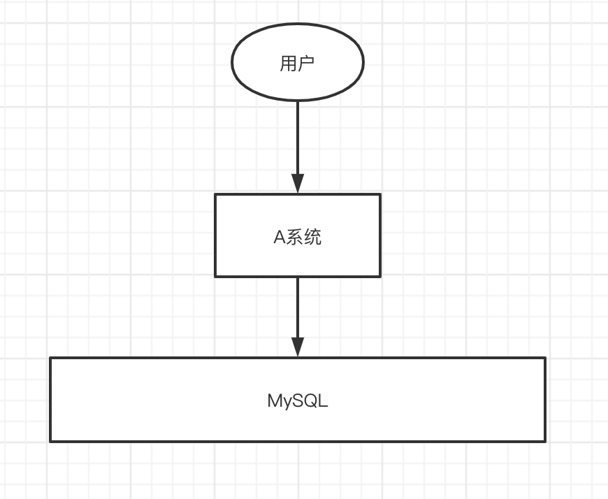
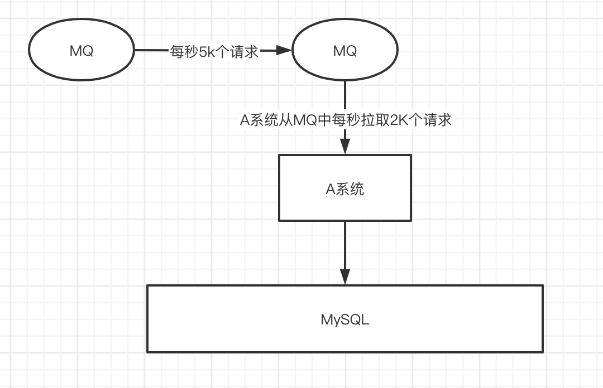
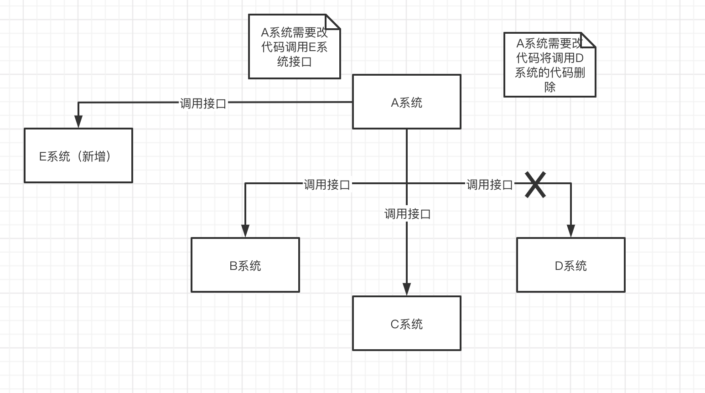
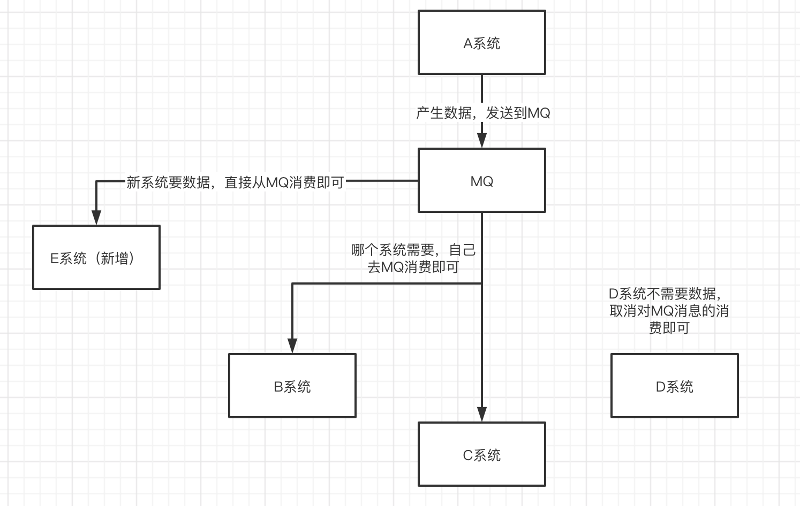
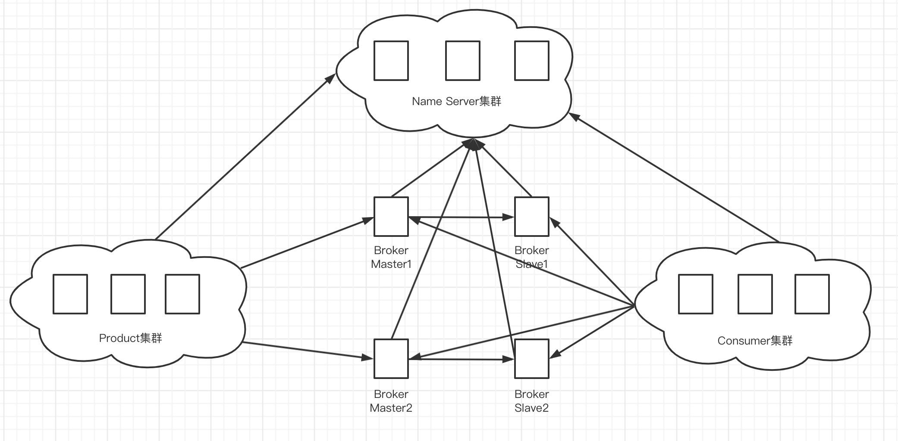
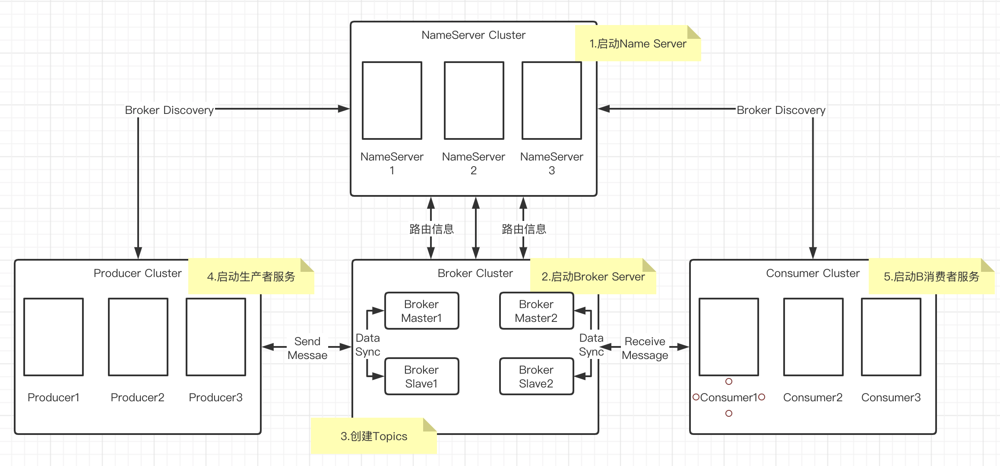
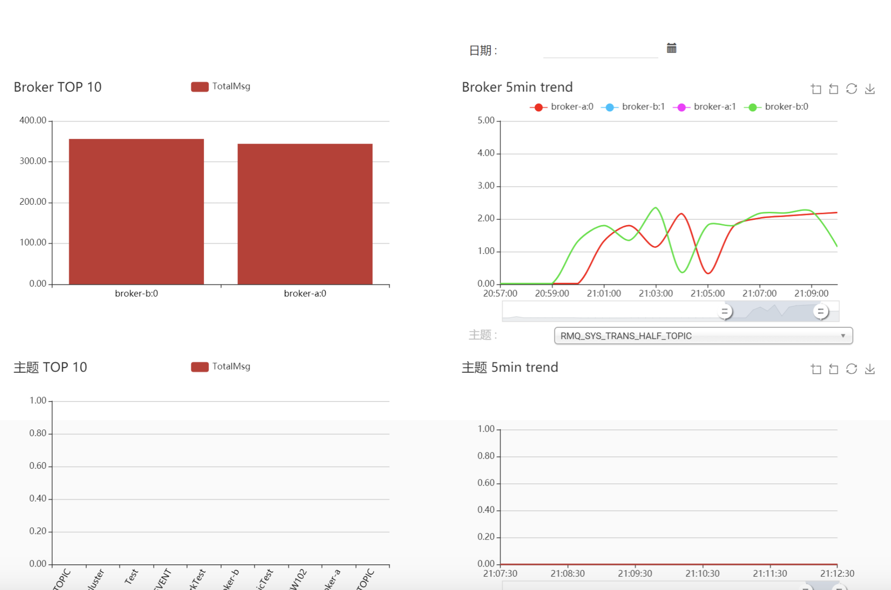
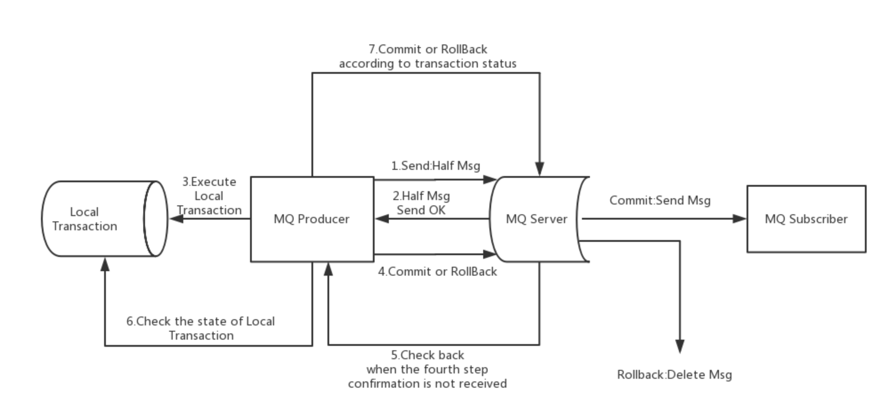

# 1.MQ介绍

## 1.1为什么要使用MQ

消息队列是一种“先进先出”的数据结构。

应用场景主要包括以下三个方面

- 应用解耦

系统的耦合性越高，容错性就越低。以电商应用为例，用户创建订单后，如果耦合调用库存系统、物流系统、支付系统，任何一个子系统出现了故障或因为升级等原因暂时不可用，都会造成下单操作异常，影响用户使用体验。



使用消息队列解耦合，系统的的耦合性就会提高了。比如物流系统发生故障，需要几分钟才能来修复，在这段时间内，物流系统要处理的数据被缓存到消息队列中，用户的下单操作正常完成。当物流系统恢复后，补充处理存在消费队列中的订单消息即可，终端系统感知不到物流系统发生过几分钟故障。



- 流量削峰



应用系统如果遇到系统请求流量的瞬间猛增，有可能会将系统压垮。有了消息队列可以将大量请求缓存起来，分散到很长一段时间处理，这样可以大大提高系统的稳定性和用户体验。



一般情况，为了保证系统的稳定性，如果系统负载超过阈值，就会阻止用户请求，这会影响用户体验，而如果使用消息队列将请求缓存起来，等待系统处理完毕后通知用户下单完毕，比不能下单体验更好。

业务系统正常时段的QPS如果是1000，流量最高峰是10000，为了应对流量高峰而配置高性能的服务器显然不划算，这时可以使用消息队列对峰值流量削峰。

- 数据分发



通过消息队列可以让数据在多个系统更加流通，数据的产生方不需要关心谁来使用数据，只需要将数据发送到消息队列，数据使用方直接在消息队列中直接获取数据即可。



## 1.2MQ的优点和缺点

优点：解耦、削峰、数据分发。

缺点：

- 系统可用性降低

  系统引入的外部依赖越多，系统稳定性越差。一旦MQ宕机，就会对业务造成影响。需要考虑如何保证MQ的高可用？

- 系统复杂度提高

  MQ的加入大大增加了系统的复杂度，以前系统是同步的远程调用，现在是通过MQ进行异步调用。需要考虑如何保证消息没有被重复消费？怎么处理消息丢失情况？保证消息传递的顺序性？

- 一致性问题

  A系统处理完业务，通过MQ给B、C、D三个系统发送消息数据，如果B系统、C系统处理成功，D系统处理失败。需要考虑如何保证消息数据处理的一致性？

## 1.3各种MQ产品的比较

常见的MQ包括KafKa、ActiveMQ、RabbitMQ、RocketMQ。

|    特性    |         ActiveMQ         |                  RabbitMQ                  |      RocketMQ      |              Kafka               |
| :--------: | :----------------------: | :----------------------------------------: | :----------------: | :------------------------------: |
|  开发语言  |           java           |                     er                     |        java        |              scala               |
| 单机吞吐量 |           万级           |                    万级                    |       10万级       |              10万级              |
|   时效性   |           ms级           |                    us级                    |        ms级        |             ms级以内             |
|   可用性   |        高（主从）        |                 高（主从）                 |  非常高（分布式）  |         非常高（分布式）         |
|  功能特性  | 成熟、文档、各种协议支持 | 并发能力强、性能极好、延时低、管理界面丰富 | 功能完备、扩展性好 | 只支持主要的MQ功能，大数据应用广 |


# 2.RocketMQ快速入门

RocketMQ是阿里巴巴2016年MQ中间件，使用Java语言开发，在阿里内部，RocketMQ承接了双11等高并发场景的消息流转，能够处理万亿级别的消息。

## 2.1准备工作

### 2.1.1下载RocketMQ

RocketMQ最新版本：4.8.0

下载地址：https://www.apache.org/dyn/closer.cgi?path=rocketmq/4.8.0/rocketmq-all-4.8.0-bin-release.zip

### 2.2.2环境要求

- Linux64位
- JDK1.8(64位)
- 源码安装系统安装Maven3.2.x
- Git
- Broker服务4G以上内存

## 2.2安装RocketMQ

### 2.2.1安装步骤

以二进制方式安装

1. 解压安装包
2. 进入安装目录

### 2.2.2目录介绍

- bin：启动脚本，包括shell脚本和cmd脚本；
- conf：实例配置文件，包括broker配置文件、logback配置文件等；
- lib：依赖jar包，包括Netty、commons-lang、FastJSON等。

## 2.3启动RocketMQ

**1.启动NameServer**

```bash
# 后台启动NameServer
nohup sh bin/mqnamesrv &
# 查看启动日志
tail -f ~/logs/rocketmqlogs/namesrv.log
```

**2.启动Broker**

```bash
# 后台启动broker
nohup sh bin/mqbroker -n localhost:9876 &
# 查看启动日志
tail -f ~/logs/rocketmqlogs/broker.log
```

可能存在以下问题：

- JDK版本采用11，导致NameServer和Broker无法启动，[解决方式](https://www.cnblogs.com/freephp/p/14227065.html)；

```reStructuredText
-Djava.ext.dirs=/jre/lib/ext:/opt/soft/rocketmq-all-4.8.0/bin/../lib:/lib/ext is not supported.  Use -classpath instead.
Error: Could not create the Java Virtual Machine.
Error: A fatal exception has occurred. Program will exit.
```

- RocketMQ默认的虚拟机内存较大，启动Broker如果因为内存不足失败，需要编辑如下两个配置文件，修改JVM内存大小。

```bash
vi runbroker.sh
vi runserver.sh
```

参考设置：`JAVA_OPT=${JAVA_OPT} -server -Xms256m -Xmx256m -Xmn128m -XX:MetaspaceSize=128m -XX:MaxMetaspaceSize=320m`

## 2.4测试RocketMQ

### 2.4.1发送消息

```bash
# 设置环境变量
export NAMESRV_ADDR=localhost:9876
# 使用安装包的demo发送消息
sh /bin/tools.sh org.apache.rocketmq.example.quickstart.Producer
```


### 2.4.2接收消息

```bash
# 设置环境变量
export NAMESRV_ADDR=localhost:9876
# 使用安装包的demo接收消息
sh /bin/tools.sh org.apache.rocketmq.example.quickstart.Consumer
```


## 2.5关闭RocketMQ

```bash
# 关闭NameServer
sh bin/mqshutdown namesrv
# 关闭broker
sh bin/mqshutdown broker
```


# 3.RocketMQ集群搭建

## 3.1角色介绍

- Product：消息的生产者；
- Consumer：消息的消费者；
- Broker：暂存和传输消息；
- NameServer：管理Broker；
- Topic：区分消息的种类，一个发送者可以发送消息给一个或者多个Topic，一个消息的接收者可以订阅一个或多个Topic消息；
- Message Queue：相当于是Topic的分区，用于并行发送和接收消息。



## 3.2集群搭建方式

### 3.2.1集群特点

- NameServer是一个几乎无状态节点，可集群部署，节点之间无任何信息同步。
- Broker部署相对复杂，Broker分为Master与Slave，一个Master可以对应多个Slave，但是一个Slave只能对应一个Master，Master与Slave的对应关系通过指定相同的BrokerName，不同的BrokerId来定义，BrokerId为0表示Master，非0表示Slave。Master也可以部署多个。每个Broker与NameServer集群中的所有节点建立长连接，定时注册Topic信息到所有NameServer。
- Product与NameServer集群中的其中一个节点随机选择建立长连接，定期从NameServer取Topic路由信息，并向提供Topic服务的Master建立长连接，且定时向Master发送心跳。Product完全无状态，可集群部署。
- Consumer与NameServer集群中的其中一个节点随机选择建立长连接，定期从NameServer取Topic路由信息，并向提供Topic服务的Master、Slave建立长连接，且定时向Master、Slave发送心跳。Consumer即可以从Master订阅消息，也可以从Slave订阅消息，订阅规则由Broker配置决定。

### 3.2.2集群模式

**1）单Master模式**

这种方式风险较大，一旦Broker重启或者宕机时，会导致整个服务不可用。不建议线上环境使用，可以用于本地测试。

**2）多Master模式**

一个集群无Slave，全是Master，例如2个Master或者3个Master，这种模式的优缺点如下：

- 优点：配置简单，单个Master宕机或重启维护对应用无影响，在磁盘配置为RAID10时，即使机器宕机不可恢复情况下，由于RAID10磁盘非常可靠，消息不会丢失（异步刷盘丢失少量消息，同步刷盘一条不丢），性能最高；
- 缺点：单台机器宕机期间，这台机器上未被消费的消息在机器恢复之前不可订阅，消息实时性会受到影响。

**3）多Master多Slave模式（异步）**

每个Master配置一个Slave，有多对Master-Slave，HA采用异步复制方式，主备有短暂消息延迟（毫秒级），这种模式的优缺点如下：

- 优点：即使磁盘损坏，消息丢失的非常少，且消息实时性不会受影响，同时Master宕机后，消费者仍然可以从Slave消费，而且此过程对应用透明，不需要人工干预，性能同多Master模式。
- 缺点：Master宕机，磁盘损坏情况下会丢失少量消息【主节点写的消息未写到从节点挂了】。

**4）多Master多Slave模式（同步）**

每个Master配置一个Slave，有多对Master-Slave，HA采用同步双写方式，即只有主备都写成功，才向应用返回成功，这种模式的优缺点如下：

- 优点：数据与服务都无单点故障，Master宕机情况下，消息无延迟，服务可用性与数据可用性都非常高；
- 缺点：性能比异步复制模式略低（10%），发送单个消息的RT会略高，且目前版本在主节点宕机后，备机不能自动切换为主机【主节点挂了无法写消息】。

## 3.3双主双从集群搭建

### 3.3.1总体架构

消息高可用采用2m-2s（同步双写）方式



### 3.3.2集群工作流程

1. 启动NameServer，NameServer起来后监听端口，等待Broker、Product、Consumer连上来，相当于·一个路由控制中心。
2. Broker启动，跟所有的NameServer保持长连接，定时发送心跳包。心跳包中包含当前Broker信息（IP+端口等）以及存储所有Topic信息。注册成功后，NameServer集群中就有Topic跟Broker的映射关系。
3. 收发消息前，先创建Topic，创建Topic时需要指定该Topic要存储在哪些Broker上，也可以在发送消息时自动创建Topic。
4. Producer发送消息，启动时先跟NameServer集群中的其中一台建立长连接，并从NameServer中获取当前发送的Topic存在哪些Broker上，轮询从队列列表中选择一个队列，然后与队列所在的Broker建立长连接从而向Broker发消息。
5. Consumer跟Producer类似，跟其中一台NameServer建立长连接，获取当前订阅Topic存在哪些Broker上，然后直接跟Broker建立连接通道，开始消费消息。

### 3.3.3服务器环境

| 序号 |      IP       |           角色           |    架构模式     |
| :--: | :-----------: | :----------------------: | :-------------: |
|  1   | 192.168.1.100 | NameServer、BrokerServer | Master1、Slave2 |
|  2   | 192.168.1.120 | NameServer、BrokerServer | Master2、Slave1 |

### 3.3.4Host添加信息

```bash
vi /etc/hosts
```

配置如下：

```reStructuredText
# nameserver
192.168.1.100 rocketmq-nameserver1
192.168.1.120 rocketmq-nameserver2
# broker
192.168.1.100 rocketmq-master1
192.168.1.100 rocketmq-slave2
192.168.1.120 rocketmq-master2
192.168.1.120 rocketmq-slave1
```

配置完成后，重启网卡

```bash
systemctl restart network
```


### 3.3.5防火墙配置

宿主机需要远程访问虚拟机的RocketMQ服务和Web服务，需要开放相关的端口号，简单粗暴的方式是直接关闭防火墙。

```bash
# 关闭防火墙
systemctl stop firewalld.service
# 查看状态
firewalld-cmd --state
# 禁止防火墙开机启动
systemctl disable firewalld.service
```

或者为了安全，只开放特定的端口，RocketMQ默认使用了三个端口，9876、10911、11011。如果防火墙没有关闭，那么防火墙就必须开放这些端口。

- nameserver默认使用9876端口
- master默认使用10911端口
- slave默认使用11011端口

```bash
# 开放name server默认端口
firewalld-cmd --remove-port=9876/tcp --permanent
# 开放master默认端口
firewalld-cmd --remove-port=10911/tcp --permanent
# 开放slave默认端口
firewall-cmd --remove-port=11011/tcp --permanent
# 重启防火墙
firewall-cmd --reload
```


### 3.3.6环境变量配置

```bash
vim /etc/profile
```

在profile文件的末尾加入如下命令

```sh
# set rocketmq
ROCKETMQ_HOME=/usr/local/rocketmq-all-4.8.0
PATH=$PATH:$ROCKETMQ_HOME/bin
export ROCKETMQ_HOME PATH
```

保存并退出，并使得配置立刻生效；

```bash
source /etc/profile
```


### 3.3.7创建消息存储路径

```bash
mkdir /usr/local/rocketmq/store
mkdir /usr/local/rocketmq/store/commitlog
mkdir /usr/local/rocketmq/store/consumequeue
mkdir /usr/local/rocketmq/store/index
```


### 3.3.8broker配置文件

1）Master1

服务器：192.168.1.100

```bash
vi /usr/local/rocketmq-all-4.8.0/conf/2m-2s-sync/broker-a.properties
```

修改配置如下：

``` sh
# 所属集群名称
brokerClusterName=rocketmq-cluster
# broker的名称
brokerName=broker-a
# 0表示Master，>0表示Slave
brokerId=0
# nameServer地址，分号分割
namesrvAddr=rocketmq-nameserver1:9876;rocketmq-nameserver2:9876
# 发送消息时，自动创建服务器不存在的topic，默认创建的队列数
defaultTopicQueueNums=4
# 是否允许Broker自动创建Topic，建议线下开启，线上关闭
autoCreateTopicEnable=true
# 是否允许Broker自动创建订阅组，建议线下开启，线上关闭
authCreateSubscriptionGroup=true
# Broker对外服务端口
listenPort=10911
# 删除文件时间点，默认凌晨4点
deleteWhen=04
# 文件保留时间，默认48小时
fileReservedTime=120
# commitLog每个文件的大小默认1G
mapedFileSizeCommitLog=1073741824
# ConsumeQueue每个文件默认存30w条，根据业务情况调整
mapedFileSizeConsumeQueue=300000
# destroyMapedFileIntervalForcibly=120000
# redeleteHangedFileInterval=120000
# 检测物理文件磁盘空间
diskMaxUsedSpaceRation=88
# 存储路径
storePathRootDir=/usr/local/rocketmq/store
# commitLog存储路径
storePathCommitLog=/usr/local/rocketmq/store/commitlog
# 消费队列存储路径存储路径
storePathConsumeQueue=/usr/local/rocketmq/store/consumequeue
# 消息索引存储路径
storePathIndex=/usr/local/rocketmq/store/index
# checkpoint文件存储路径
storeCheckpoint=/usr/local/rocketmq/store/checkpoint
# abort文件存储路径
abortFile=/usr/local/rocketmq/store/abort
# 限制消息的大小
maxMessageSize=65535
# flushCommitLogLeastPages=4
# flushConsumeQueueLeastPages=2
# flushCommitLogThoroughInterval=10000
# flushConsumeQueueThoroughInterval=60000
# Broker角色
# - ASYNC_MASTER 异步复制Master
# - SYNC_MASTER 同步双写Master
# - SLAVE
brokerRole=SYNC_MASTER
# 刷盘方式
# - ASYNC_FLUSH 异步刷盘
# - SYNC_FLUSH 同步刷盘
flushDiskType=SYNC_FLUSH
# checkTransactionMessageEnable=false
# 发送消息线程池数量
# sendMessageThreadPoolNums=128
# 拉消息线程池数量
# pullMessageThreadPoolNums=128
```

2）Slave2

服务器：192.168.1.100

```bash
vi /usr/local/rocketmq-all-4.8.0/conf/2m-2s-sync/broker-b-s.properties
```

修改配置如下：

```sh
# 所属集群名称
brokerClusterName=rocketmq-cluster
# broker的名称
brokerName=broker-b
# 0表示Master，>0表示Slave
brokerId=1
# nameServer地址，分号分割
namesrvAddr=rocketmq-nameserver1:9876;rocketmq-nameserver2:9876
# 发送消息时，自动创建服务器不存在的topic，默认创建的队列数
defaultTopicQueueNums=4
# 是否允许Broker自动创建Topic，建议线下开启，线上关闭
autoCreateTopicEnable=true
# 是否允许Broker自动创建订阅组，建议线下开启，线上关闭
authCreateSubscriptionGroup=true
# Broker对外服务端口
listenPort=11011
# 删除文件时间点，默认凌晨4点
deleteWhen=04
# 文件保留时间，默认48小时
fileReservedTime=120
# commitLog每个文件的大小默认1G
mapedFileSizeCommitLog=1073741824
# ConsumeQueue每个文件默认存30w条，根据业务情况调整
mapedFileSizeConsumeQueue=300000
# destroyMapedFileIntervalForcibly=120000
# redeleteHangedFileInterval=120000
# 检测物理文件磁盘空间
diskMaxUsedSpaceRation=88
# 存储路径
storePathRootDir=/usr/local/rocketmq/store
# commitLog存储路径
storePathCommitLog=/usr/local/rocketmq/store/commitlog
# 消费队列存储路径存储路径
storePathConsumeQueue=/usr/local/rocketmq/store/consumequeue
# 消息索引存储路径
storePathIndex=/usr/local/rocketmq/store/index
# checkpoint文件存储路径
storeCheckpoint=/usr/local/rocketmq/store/checkpoint
# abort文件存储路径
abortFile=/usr/local/rocketmq/store/abort
# 限制消息的大小
maxMessageSize=65535
# flushCommitLogLeastPages=4
# flushConsumeQueueLeastPages=2
# flushCommitLogThoroughInterval=10000
# flushConsumeQueueThoroughInterval=60000
# Broker角色
# - ASYNC_MASTER 异步复制Master
# - SYNC_MASTER 同步双写Master
# - SLAVE
brokerRole=SLAVE
# 刷盘方式
# - ASYNC_FLUSH 异步刷盘
# - SYNC_FLUSH 同步刷盘
flushDiskType=ASYNC_FLUSH
# checkTransactionMessageEnable=false
# 发送消息线程池数量
# sendMessageThreadPoolNums=128
# 拉消息线程池数量
# pullMessageThreadPoolNums=128
```

3）Master2

服务器：192.168.1.120

```bash
vi /usr/local/rocketmq-all-4.8.0/conf/2m-2s-sync/broker-b.properties
```

修改配置如下：

```sh
# 所属集群名称
brokerClusterName=rocketmq-cluster
# broker的名称
brokerName=broker-b
# 0表示Master，>0表示Slave
brokerId=0
# nameServer地址，分号分割
namesrvAddr=rocketmq-nameserver1:9876;rocketmq-nameserver2:9876
# 发送消息时，自动创建服务器不存在的topic，默认创建的队列数
defaultTopicQueueNums=4
# 是否允许Broker自动创建Topic，建议线下开启，线上关闭
autoCreateTopicEnable=true
# 是否允许Broker自动创建订阅组，建议线下开启，线上关闭
authCreateSubscriptionGroup=true
# Broker对外服务端口
listenPort=10911
# 删除文件时间点，默认凌晨4点
deleteWhen=04
# 文件保留时间，默认48小时
fileReservedTime=120
# commitLog每个文件的大小默认1G
mapedFileSizeCommitLog=1073741824
# ConsumeQueue每个文件默认存30w条，根据业务情况调整
mapedFileSizeConsumeQueue=300000
# destroyMapedFileIntervalForcibly=120000
# redeleteHangedFileInterval=120000
# 检测物理文件磁盘空间
diskMaxUsedSpaceRation=88
# 存储路径
storePathRootDir=/usr/local/rocketmq/store
# commitLog存储路径
storePathCommitLog=/usr/local/rocketmq/store/commitlog
# 消费队列存储路径存储路径
storePathConsumeQueue=/usr/local/rocketmq/store/consumequeue
# 消息索引存储路径
storePathIndex=/usr/local/rocketmq/store/index
# checkpoint文件存储路径
storeCheckpoint=/usr/local/rocketmq/store/checkpoint
# abort文件存储路径
abortFile=/usr/local/rocketmq/store/abort
# 限制消息的大小
maxMessageSize=65535
# flushCommitLogLeastPages=4
# flushConsumeQueueLeastPages=2
# flushCommitLogThoroughInterval=10000
# flushConsumeQueueThoroughInterval=60000
# Broker角色
# - ASYNC_MASTER 异步复制Master
# - SYNC_MASTER 同步双写Master
# - SLAVE
brokerRole=SYNC_MASTER
# 刷盘方式
# - ASYNC_FLUSH 异步刷盘
# - SYNC_FLUSH 同步刷盘
flushDiskType=SYNC_FLUSH
# checkTransactionMessageEnable=false
# 发送消息线程池数量
# sendMessageThreadPoolNums=128
# 拉消息线程池数量
# pullMessageThreadPoolNums=128
```

4）Slave1

服务器：192.168.1.120

```bash
vi /usr/local/rocketmq-all-4.8.0/conf/2m-2s-sync/broker-a-ss.properties
```

修改配置如下：

```sh
# 所属集群名称
brokerClusterName=rocketmq-cluster
# broker的名称
brokerName=broker-a
# 0表示Master，>0表示Slave
brokerId=1
# nameServer地址，分号分割
namesrvAddr=rocketmq-nameserver1:9876;rocketmq-nameserver2:9876
# 发送消息时，自动创建服务器不存在的topic，默认创建的队列数
defaultTopicQueueNums=4
# 是否允许Broker自动创建Topic，建议线下开启，线上关闭
autoCreateTopicEnable=true
# 是否允许Broker自动创建订阅组，建议线下开启，线上关闭
authCreateSubscriptionGroup=true
# Broker对外服务端口
listenPort=11011
# 删除文件时间点，默认凌晨4点
deleteWhen=04
# 文件保留时间，默认48小时
fileReservedTime=120
# commitLog每个文件的大小默认1G
mapedFileSizeCommitLog=1073741824
# ConsumeQueue每个文件默认存30w条，根据业务情况调整
mapedFileSizeConsumeQueue=300000
# destroyMapedFileIntervalForcibly=120000
# redeleteHangedFileInterval=120000
# 检测物理文件磁盘空间
diskMaxUsedSpaceRation=88
# 存储路径
storePathRootDir=/usr/local/rocketmq/store
# commitLog存储路径
storePathCommitLog=/usr/local/rocketmq/store/commitlog
# 消费队列存储路径存储路径
storePathConsumeQueue=/usr/local/rocketmq/store/consumequeue
# 消息索引存储路径
storePathIndex=/usr/local/rocketmq/store/index
# checkpoint文件存储路径
storeCheckpoint=/usr/local/rocketmq/store/checkpoint
# abort文件存储路径
abortFile=/usr/local/rocketmq/store/abort
# 限制消息的大小
maxMessageSize=65535
# flushCommitLogLeastPages=4
# flushConsumeQueueLeastPages=2
# flushCommitLogThoroughInterval=10000
# flushConsumeQueueThoroughInterval=60000
# Broker角色
# - ASYNC_MASTER 异步复制Master
# - SYNC_MASTER 同步双写Master
# - SLAVE
brokerRole=SLAVE
# 刷盘方式
# - ASYNC_FLUSH 异步刷盘
# - SYNC_FLUSH 同步刷盘
flushDiskType=ASYNC_FLUSH
# checkTransactionMessageEnable=false
# 发送消息线程池数量
# sendMessageThreadPoolNums=128
# 拉消息线程池数量
# pullMessageThreadPoolNums=128
```


### 3.3.9修改启动脚本文件

1) runbroker.sh

```bash
vi /usr/local/rocketmq/bin/runbroker.sh
```

需要根据内存大小进行适当的对JVM参数进行调整：

`JAVA_OPT="${JAVA_OPT} -server -Xms256m -Xmx256m -Xmn128m"`

2) runserver.sh

```bash
vi /usr/local/rocketmq/bin/runserver.sh
```

调整JVM参数

`JAVA_OPT="${JAVA_OPT} -server -Xms256m -Xmx256m -Xmn128m -XX:MetaspaceSize=128m -XX:MaxMetaspaceSize=320m"`


### 3.3.10服务启动

**1）启动NameServer集群**

分别在192.168.1.100和192.168.1.120启动NameServer

```bash
cd /usr/local/rocketmq/bin
nohup sh mqnamesrv &
```

**2）启动Broker集群**

- 在192.168.1.100上启动master1和slave2

Master1:

```bash
cd /usr/local/rocketmq/bin
nohup sh mqbroker -c /usr/local/rocketmq/conf/2m-2s-sync/broker-a.properties &
```

Slave2:

```bash
nohup sh mqbroker -c /usr/local/rocketmq/conf/2m-2s-sync/broker-b-s.properties &
```

- 在192.168.1.120上启动master2和slave1

Master2:

```bash
cd /usr/local/rocketmq/bin
nohup sh mqbroker -c /usr/local/rocketmq/conf/2m-2s-sync/broker-b.properties &
```

Slave1:

```bash
nohup sh mqbroker -c /usr/local/rocketmq/conf/2m-2s-sync/broker-a-s.properties &
```


### 3.3.11查看进程状态

启动后通过JPS命令查看启动进程，可查看到一个NameServer进程、两个Broker进程。

### 3.3.12查看日志

```bash
# 查看nameserver日志
tail -500f ~/log/rocketmqlos/namrsrv.log
# 查看broker日志
tail -500f ~/log/rocketmqlogs/broker.log
```


## 3.4mqadmin管理工具

### 3.4.1使用方式

1. 执行命令方法：`./mqadmin {command} {args}`
2. 几乎所有命令都需要配置-n表示NameServer地址，格式为ip:port
3. 几乎所有命令都可以通过-h获取帮助
4. 如果既有Broker地址（-b）配置项又有clusterName（-c）配置项，则优先以Broker地址执行命令，如果不配置Broker地址，则对集群中所有主机执行命令，只支持一个Broker地址。-b格式为ip:port，port默认是10911
5. 在tools下可以看到很多命令，但并不是所有命令都能使用，只有在MQAdminStartup中初始化的命令才能使用，你也可以修改这个类，增加或自定义命令

### 3.4.2命令介绍

1）Topic相关

|       名称       |                             含义                             | 命令选项 |                             说明                             |
| :--------------: | :----------------------------------------------------------: | :------: | :----------------------------------------------------------: |
|   updateTopic    |                      创建更新Topic配置                       |    -b    | Broker 地址，表示 topic 所在 Broker，只支持单台Broker，地址为ip:port |
|        -c        | cluster 名称，表示 topic 所在集群（集群可通过 clusterList 查询） |          |                                                              |
|       -h-        |                           打印帮助                           |          |                                                              |
|        -n        |               NameServer服务地址，格式 ip:port               |          |                                                              |
|        -p        |           指定新topic的读写权限( W=2\|R=4\|WR=6 )            |          |                                                              |
|        -r        |                    可读队列数（默认为 8）                    |          |                                                              |
|        -w        |                    可写队列数（默认为 8）                    |          |                                                              |
|        -t        |       topic 名称（名称只能使用字符 ^[a-zA-Z0-9_-]+$ ）       |          |                                                              |
|   deleteTopic    |                          删除Topic                           |    -c    | cluster 名称，表示删除某集群下的某个 topic （集群 可通过 clusterList 查询） |
|        -h        |                           打印帮助                           |          |                                                              |
|        -n        |              NameServer 服务地址，格式 ip:port               |          |                                                              |
|        -t        |       topic 名称（名称只能使用字符 ^[a-zA-Z0-9_-]+$ ）       |          |                                                              |
|    topicList     |                     查看 Topic 列表信息                      |    -h    |                           打印帮助                           |
|        -c        | 不配置-c只返回topic列表，增加-c返回clusterName, topic, consumerGroup信息，即topic的所属集群和订阅关系，没有参数 |          |                                                              |
|        -n        |              NameServer 服务地址，格式 ip:port               |          |                                                              |
|    topicRoute    |                     查看 Topic 路由信息                      |    -t    |                          topic 名称                          |
|        -h        |                           打印帮助                           |          |                                                              |
|        -n        |              NameServer 服务地址，格式 ip:port               |          |                                                              |
|   topicStatus    |                  查看 Topic 消息队列offset                   |    -t    |                          topic 名称                          |
|        -h        |                           打印帮助                           |          |                                                              |
|        -n        |              NameServer 服务地址，格式 ip:port               |          |                                                              |
| topicClusterList |                   查看 Topic 所在集群列表                    |    -t    |                          topic 名称                          |
|        -h        |                           打印帮助                           |          |                                                              |
|        -n        |              NameServer 服务地址，格式 ip:port               |          |                                                              |
| updateTopicPerm  |                     更新 Topic 读写权限                      |    -t    |                          topic 名称                          |
|        -h        |                           打印帮助                           |          |                                                              |
|        -n        |              NameServer 服务地址，格式 ip:port               |          |                                                              |
|        -b        | Broker 地址，表示 topic 所在 Broker，只支持单台Broker，地址为ip:port |          |                                                              |
|        -p        |          指定新 topic 的读写权限( W=2\|R=4\|WR=6 )           |          |                                                              |
|        -c        | cluster 名称，表示 topic 所在集群（集群可通过 clusterList 查询），-b优先，如果没有-b，则对集群中所有Broker执行命令 |          |                                                              |
| updateOrderConf  | 从NameServer上创建、删除、获取特定命名空间的kv配置，目前还未启用 |    -h    |                           打印帮助                           |
|        -n        |              NameServer 服务地址，格式 ip:port               |          |                                                              |
|        -t        |                          topic，键                           |          |                                                              |
|        -v        |                        orderConf，值                         |          |                                                              |
|        -m        |                 method，可选get、put、delete                 |          |                                                              |
|    allocateMQ    |      以平均负载算法计算消费者列表负载消息队列的负载结果      |    -t    |                          topic 名称                          |
|        -h        |                           打印帮助                           |          |                                                              |
|        -n        |              NameServer 服务地址，格式 ip:port               |          |                                                              |
|        -i        |     ipList，用逗号分隔，计算这些ip去负载Topic的消息队列      |          |                                                              |
|     statsAll     |      打印Topic订阅关系、TPS、积累量、24h读写总量等信息       |    -h    |                           打印帮助                           |
|        -n        |              NameServer 服务地址，格式 ip:port               |          |                                                              |
|        -a        |                     是否只打印活跃topic                      |          |                                                              |
|        -t        |                          指定topic                           |          |                                                              |

2）集群相关

|    名称     |                            含义                            | 命令选项 |                             说明                             |
| :---------: | :--------------------------------------------------------: | :------: | :----------------------------------------------------------: |
| clusterList |    查看集群信息，集群、BrokerName、BrokerId、TPS等信息     |    -m    | 打印更多信息 (增加打印出如下信息 #InTotalYest, #OutTotalYest, #InTotalToday ,#OutTotalToday) |
|     -h      |                          打印帮助                          |          |                                                              |
|     -n      |             NameServer 服务地址，格式 ip:port              |          |                                                              |
|     -i      |                      打印间隔，单位秒                      |          |                                                              |
|  clusterRT  | 发送消息检测集群各Broker RT。消息发往${BrokerName} Topic。 |    -a    |         amount，每次探测的总数，RT = 总时间 / amount         |
|     -s      |                      消息大小，单位B                       |          |                                                              |
|     -c      |                        探测哪个集群                        |          |                                                              |
|     -p      |          是否打印格式化日志，以\|分割，默认不打印          |          |                                                              |
|     -h      |                          打印帮助                          |          |                                                              |
|     -m      |                     所属机房，打印使用                     |          |                                                              |
|     -i      |                      发送间隔，单位秒                      |          |                                                              |
|     -n      |             NameServer 服务地址，格式 ip:port              |          |                                                              |

3）Broker相关

|        名称        |                             含义                             | 命令选项 |               说明                |
| :----------------: | :----------------------------------------------------------: | :------: | :-------------------------------: |
| updateBrokerConfig |           更新 Broker 配置文件，会修改Broker.conf            |    -b    |    Broker 地址，格式为ip:port     |
|         -c         |                         cluster 名称                         |          |                                   |
|         -k         |                            key 值                            |          |                                   |
|         -v         |                           value 值                           |          |                                   |
|         -h         |                           打印帮助                           |          |                                   |
|         -n         |              NameServer 服务地址，格式 ip:port               |          |                                   |
|    brokerStatus    |  查看 Broker 统计信息、运行状态（你想要的信息几乎都在里面）  |    -b    |    Broker 地址，地址为ip:port     |
|         -h         |                           打印帮助                           |          |                                   |
|         -n         |              NameServer 服务地址，格式 ip:port               |          |                                   |
| brokerConsumeStats | Broker中各个消费者的消费情况，按Message Queue维度返回Consume Offset，Broker Offset，Diff，TImestamp等信息 |    -b    |    Broker 地址，地址为ip:port     |
|         -t         |                         请求超时时间                         |          |                                   |
|         -l         |                   diff阈值，超过阈值才打印                   |          |                                   |
|         -o         |                 是否为顺序topic，一般为false                 |          |                                   |
|         -h         |                           打印帮助                           |          |                                   |
|         -n         |              NameServer 服务地址，格式 ip:port               |          |                                   |
|  getBrokerConfig   |                        获取Broker配置                        |    -b    |    Broker 地址，地址为ip:port     |
|         -n         |              NameServer 服务地址，格式 ip:port               |          |                                   |
|   wipeWritePerm    |               从NameServer上清除 Broker写权限                |    -b    |            BrokerName             |
|         -n         |              NameServer 服务地址，格式 ip:port               |          |                                   |
|         -h         |                           打印帮助                           |          |                                   |
|   cleanExpiredCQ   | 清理Broker上过期的Consume Queue，如果手动减少对列数可能产生过期队列 |    -n    | NameServer 服务地址，格式 ip:port |
|         -h         |                           打印帮助                           |          |                                   |
|         -b         |                  Broker 地址，地址为ip:port                  |          |                                   |
|         -c         |                           集群名称                           |          |                                   |
|  cleanUnusedTopic  | 清理Broker上不使用的Topic，从内存中释放Topic的Consume Queue，如果手动删除Topic会产生不使用的Topic |    -n    | NameServer 服务地址，格式 ip:port |
|         -h         |                           打印帮助                           |          |                                   |
|         -b         |                  Broker 地址，地址为ip:port                  |          |                                   |
|         -c         |                           集群名称                           |          |                                   |
|   sendMsgStatus    |               向Broker发消息，返回发送状态和RT               |    -n    | NameServer 服务地址，格式 ip:port |
|         -h         |                           打印帮助                           |          |                                   |
|         -b         |               BrokerName，注意不同于Broker地址               |          |                                   |
|         -s         |                       消息大小，单位B                        |          |                                   |
|         -c         |                           发送次数                           |          |                                   |

4）消息相关

|        名称         |                             含义                             | 命令选项 |                             说明                             |
| :-----------------: | :----------------------------------------------------------: | :------: | :----------------------------------------------------------: |
|    queryMsgById     | 根据offsetMsgId查询msg，如果使用开源控制台，应使用offsetMsgId，此命令还有其他参数，具体作用请阅读QueryMsgByIdSubCommand。 |    -i    |                            msgId                             |
|         -h          |                           打印帮助                           |          |                                                              |
|         -n          |              NameServer 服务地址，格式 ip:port               |          |                                                              |
|    queryMsgByKey    |                    根据消息 Key 查询消息                     |    -k    |                            msgKey                            |
|         -t          |                          Topic 名称                          |          |                                                              |
|         -h          |                           打印帮助                           |          |                                                              |
|         -n          |              NameServer 服务地址，格式 ip:port               |          |                                                              |
|  queryMsgByOffset   |                     根据 Offset 查询消息                     |    -b    | Broker 名称，（这里需要注意 填写的是 Broker 的名称，不是 Broker 的地址，Broker 名称可以在 clusterList 查到） |
|         -i          |                        query 队列 id                         |          |                                                              |
|         -o          |                          offset 值                           |          |                                                              |
|         -t          |                          topic 名称                          |          |                                                              |
|         -h          |                           打印帮助                           |          |                                                              |
|         -n          |              NameServer 服务地址，格式 ip:port               |          |                                                              |
| queryMsgByUniqueKey | 根据msgId查询，msgId不同于offsetMsgId，区别详见常见运维问题。-g，-d配合使用，查到消息后尝试让特定的消费者消费消息并返回消费结果 |    -h    |                           打印帮助                           |
|         -n          |              NameServer 服务地址，格式 ip:port               |          |                                                              |
|         -i          |                         uniqe msg id                         |          |                                                              |
|         -g          |                        consumerGroup                         |          |                                                              |
|         -d          |                           clientId                           |          |                                                              |
|         -t          |                          topic名称                           |          |                                                              |
|   checkMsgSendRT    |           检测向topic发消息的RT，功能类似clusterRT           |    -h    |                           打印帮助                           |
|         -n          |              NameServer 服务地址，格式 ip:port               |          |                                                              |
|         -t          |                          topic名称                           |          |                                                              |
|         -a          |                           探测次数                           |          |                                                              |
|         -s          |                           消息大小                           |          |                                                              |
|     sendMessage     | 发送一条消息，可以根据配置发往特定Message Queue，或普通发送。 |    -h    |                           打印帮助                           |
|         -n          |              NameServer 服务地址，格式 ip:port               |          |                                                              |
|         -t          |                          topic名称                           |          |                                                              |
|         -p          |                         body，消息体                         |          |                                                              |
|         -k          |                             keys                             |          |                                                              |
|         -c          |                             tags                             |          |                                                              |
|         -b          |                          BrokerName                          |          |                                                              |
|         -i          |                           queueId                            |          |                                                              |
|   consumeMessage    | 消费消息。可以根据offset、开始&结束时间戳、消息队列消费消息，配置不同执行不同消费逻辑，详见ConsumeMessageCommand。 |    -h    |                           打印帮助                           |
|         -n          |              NameServer 服务地址，格式 ip:port               |          |                                                              |
|         -t          |                          topic名称                           |          |                                                              |
|         -b          |                          BrokerName                          |          |                                                              |
|         -o          |                       从offset开始消费                       |          |                                                              |
|         -i          |                           queueId                            |          |                                                              |
|         -g          |                          消费者分组                          |          |                                                              |
|         -s          |                    开始时间戳，格式详见-h                    |          |                                                              |
|         -d          |                          结束时间戳                          |          |                                                              |
|         -c          |                        消费多少条消息                        |          |                                                              |
|      printMsg       |              从Broker消费消息并打印，可选时间段              |    -h    |                           打印帮助                           |
|         -n          |              NameServer 服务地址，格式 ip:port               |          |                                                              |
|         -t          |                          topic名称                           |          |                                                              |
|         -c          |                      字符集，例如UTF-8                       |          |                                                              |
|         -s          |                    subExpress，过滤表达式                    |          |                                                              |
|         -b          |                    开始时间戳，格式参见-h                    |          |                                                              |
|         -e          |                          结束时间戳                          |          |                                                              |
|         -d          |                        是否打印消息体                        |          |                                                              |
|   printMsgByQueue   |              类似printMsg，但指定Message Queue               |    -h    |                           打印帮助                           |
|         -n          |              NameServer 服务地址，格式 ip:port               |          |                                                              |
|         -t          |                          topic名称                           |          |                                                              |
|         -i          |                           queueId                            |          |                                                              |
|         -a          |                          BrokerName                          |          |                                                              |
|         -c          |                      字符集，例如UTF-8                       |          |                                                              |
|         -s          |                    subExpress，过滤表达式                    |          |                                                              |
|         -b          |                    开始时间戳，格式参见-h                    |          |                                                              |
|         -e          |                          结束时间戳                          |          |                                                              |
|         -p          |                         是否打印消息                         |          |                                                              |
|         -d          |                        是否打印消息体                        |          |                                                              |
|         -f          |                    是否统计tag数量并打印                     |          |                                                              |
|  resetOffsetByTime  |         按时间戳重置offset，Broker和consumer都会重置         |    -h    |                           打印帮助                           |
|         -n          |              NameServer 服务地址，格式 ip:port               |          |                                                              |
|         -g          |                          消费者分组                          |          |                                                              |
|         -t          |                          topic名称                           |          |                                                              |
|         -s          |                  重置为此时间戳对应的offset                  |          |                                                              |
|         -f          | 是否强制重置，如果false，只支持回溯offset，如果true，不管时间戳对应offset与consumeOffset关系 |          |                                                              |
|         -c          |                   是否重置c++客户端offset                    |          |                                                              |

5）消费者、消费组相关

|       名称       |                             含义                             | 命令选项 |               说明                |
| :--------------: | :----------------------------------------------------------: | :------: | :-------------------------------: |
| consumerProgress |   查看订阅组消费状态，可以查看具体的client IP的消息积累量    |    -g    |          消费者所属组名           |
|        -s        |                      是否打印client IP                       |          |                                   |
|        -h        |                           打印帮助                           |          |                                   |
|        -n        |              NameServer 服务地址，格式 ip:port               |          |                                   |
|  consumerStatus  | 查看消费者状态，包括同一个分组中是否都是相同的订阅，分析Process Queue是否堆积，返回消费者jstack结果，内容较多，使用者参见ConsumerStatusSubCommand |    -h    |             打印帮助              |
|        -n        |              NameServer 服务地址，格式 ip:port               |          |                                   |
|        -g        |                        consumer group                        |          |                                   |
|        -i        |                           clientId                           |          |                                   |
|        -s        |                        是否执行jstack                        |          |                                   |
|  updateSubGroup  |                      更新或创建订阅关系                      |    -n    | NameServer 服务地址，格式 ip:port |
|        -h        |                           打印帮助                           |          |                                   |
|        -b        |                          Broker地址                          |          |                                   |
|        -c        |                           集群名称                           |          |                                   |
|        -g        |                        消费者分组名称                        |          |                                   |
|        -s        |                       分组是否允许消费                       |          |                                   |
|        -m        |                   是否从最小offset开始消费                   |          |                                   |
|        -d        |                        是否是广播模式                        |          |                                   |
|        -q        |                         重试队列数量                         |          |                                   |
|        -r        |                         最大重试次数                         |          |                                   |
|        -i        | 当slaveReadEnable开启时有效，且还未达到从slave消费时建议从哪个BrokerId消费，可以配置备机id，主动从备机消费 |          |                                   |
|        -w        | 如果Broker建议从slave消费，配置决定从哪个slave消费，配置BrokerId，例如1 |          |                                   |
|        -a        |         当消费者数量变化时是否通知其他消费者负载均衡         |          |                                   |
|  deleteSubGroup  |                     从Broker删除订阅关系                     |    -n    | NameServer 服务地址，格式 ip:port |
|        -h        |                           打印帮助                           |          |                                   |
|        -b        |                          Broker地址                          |          |                                   |
|        -c        |                           集群名称                           |          |                                   |
|        -g        |                        消费者分组名称                        |          |                                   |
| cloneGroupOffset |                在目标群组中使用源群组的offset                |    -n    | NameServer 服务地址，格式 ip:port |
|        -h        |                           打印帮助                           |          |                                   |
|        -s        |                          源消费者组                          |          |                                   |
|        -d        |                         目标消费者组                         |          |                                   |
|        -t        |                          topic名称                           |          |                                   |
|        -o        |                           暂未使用                           |          |                                   |

6）连接相关

|        名称        |               含义                | 命令选项 |      说明      |
| :----------------: | :-------------------------------: | :------: | :------------: |
| consumerConnection |     查询 Consumer 的网络连接      |    -g    | 消费者所属组名 |
|         -n         | NameServer 服务地址，格式 ip:port |          |                |
|         -h         |             打印帮助              |          |                |
| producerConnection |     查询 Producer 的网络连接      |    -g    | 生产者所属组名 |
|         -t         |             主题名称              |          |                |
|         -n         | NameServer 服务地址，格式 ip:port |          |                |
|         -h         |             打印帮助              |          |                |

7）NameServer相关

|        名称         |                 含义                 | 命令选项 |               说明                |
| :-----------------: | :----------------------------------: | :------: | :-------------------------------: |
|   updateKvConfig    | 更新NameServer的kv配置，目前还未使用 |    -s    |             命名空间              |
|         -k          |                 key                  |          |                                   |
|         -v          |                value                 |          |                                   |
|         -n          |  NameServer 服务地址，格式 ip:port   |          |                                   |
|         -h          |               打印帮助               |          |                                   |
|   deleteKvConfig    |        删除NameServer的kv配置        |    -s    |             命名空间              |
|         -k          |                 key                  |          |                                   |
|         -n          |  NameServer 服务地址，格式 ip:port   |          |                                   |
|         -h          |               打印帮助               |          |                                   |
|  getNamesrvConfig   |          获取NameServer配置          |    -n    | NameServer 服务地址，格式 ip:port |
|         -h          |               打印帮助               |          |                                   |
| updateNamesrvConfig |          修改NameServer配置          |    -n    | NameServer 服务地址，格式 ip:port |
|         -h          |               打印帮助               |          |                                   |
|         -k          |                 key                  |          |                                   |
|         -v          |                value                 |          |                                   |

8）其它

|      名称       |                     含义                     | 命令选项 |               说明                |
| :-------------: | :------------------------------------------: | :------: | :-------------------------------: |
| startMonitoring | 开启监控进程，监控消息误删、重试队列消息数等 |    -n    | NameServer 服务地址，格式 ip:port |
|       -h        |                   打印帮助                   |          |                                   |

### 3.4.3常见问题

1. 性能调优问题

   异步刷盘建议使用自旋锁，同步刷盘建议使用重入锁，调整Broker配置项 `useReentrantLockWhenPutMessage`，默认为false；异步刷盘建议开启`TransientStorePoolEnable`；建议关闭transferMsgByHeap，提高拉消息效率；同步刷盘建议适当增大`sendMessageThreadPoolNums`，具体配置需要经过压测。

## 3.5集群监控平台搭建

### 3.5.1概述

RocketMQ有一个对其扩展的开源项目，这个项目中有一个子模块叫rocketmq-console，这个便是管理控制台项目。

github仓库地址：https://github.com/apache/rocketmq-externals

### 3.5.2监控平台搭建

```bash
git clone https://github.com/apache/rocketmq-externals
cd rocketmq-console
mvc clean package -Dmaven.test.skip=true
```

注意：打包前在rocketmq-console中配置namesrv集群地址：

```bash
rocketmq.config.namesrvAddr=192.168.1.100:9876;192.168.1.200:9876
```

启动rocketmq-console：

```bash
java -jar rocketmq-console-1.0.0.jar
```

启动成功后，我们就可以通过浏览器访问`http://localhost:8080`进入控制台界面了。



# 4.消息发送案例

- 导入MQ客户端依赖

```xml
<dependency>
	<groupId>org.apache.rocketmq</groupId>
  <artifactId>rocketmq-client</artifactId>
  <version>4.4.0</version>
</dependency>
```

- 消息发送者步骤分析

```
1.创建消息生产者producer，并制定生产者组名
2.指定NameServer地址
3.启动Producer
4.创建消息对象，指定主题Topic、Tag和消息体
5.发送消息
6.关闭生产者Producer
```

- 消费消息者步骤分析

```
1.创建消息者Consumer，并制定消费者组名
2.指定NameServer地址
3.订阅主题Topic和Tag
4.设置回调函数，处理消息
5.启动消费者Comsumer
```

## 4.1基本案例

### 4.1.1消息发送

**1）发送同步消息**

这种可靠性同步地发送方式使用的比较广泛，比如：重要的消息通知、短信通知。

```java
public class SyncProducer {
  public static void main(Stirng[] args) throw Exception {
    DefaultMQPoducer producer = new DefaultMQProducer("group-name");
    producer.setNamesrvAddr("localhost:9876");
    producer.start();
    for (int i=0; i < 100; i++) {
      Message msg = new Message("Topic", "Tag", ("Hello Rocket" + i).getBytes(RemotingHelper.DEFAULT_CHARSET));
      SendResult result = producer.send(msg);
      System.out.printf("%s%n", result);
    }
    producer.shutdown();
	}
}
```

**2）发送异步消息**

异步消息通常在对响应时间敏感的业务场景，即发送端不能容忍长时间地等待Broker的响应。

```java
public class AsyncProducer {
  public static void main(Stirng[] args) throw Exception {
    DefaultMQPoducer producer = new DefaultMQProducer("group-name");
    producer.setNamesrvAddr("localhost:9876");
    producer.start();
    producer.setRetryTimesWhenSendAsyncFailed(0);
    for (int i=0; i < 100; i++) {
      final int index = i;
      Message msg = new Message("Topic", "Tag", ("Hello Rocket" + i).getBytes(RemotingHelper.DEFAULT_CHARSET));
      producer.send(msg, new SendCallBack() {
        public void onSuccess(SendResult result) {
          System.out.printf("%-10d OK %s %n", index, result.getMsgId());
        }
        public void onException(Throwable e) {
          System.out.printf("%-10d Exception %s %n", index, e);
          e.printStackTrace();
        }
      });
    }
    producer.shutdown();
	}
}
```

**3）单向消息**

这种方式主要用在不特别关心发送结果的场景，例如日志发送。

```java
public class OnewayProducer {
  public static void main(Stirng[] args) throw Exception {
    DefaultMQPoducer producer = new DefaultMQProducer("group-name");
    producer.setNamesrvAddr("localhost:9876");
    producer.start();
    for (int i=0; i < 100; i++) {
      Message msg = new Message("Topic", "Tag", ("Hello Rocket" + i).getBytes(RemotingHelper.DEFAULT_CHARSET));
      producer.sendOneway(msg);
    }
    producer.shutdown();
	}
}
```

### 4.1.2消费消息

**1）负载均衡模式**

消费者采用负载均衡方式消费消息，多个消费者共同消费队列消息，每个消费者处理的消息不同。

```java
public static void main(Stirng[] args) throw Exception {
    DefaultMQPushConsumer consumer = new DefaultMQPushConsumer("group-name");
    consumer.setNamesrvAddr("localhost:9876");
    consumer.subscribe("Topic", "expression");
 		consumer.setMessageMode(MessageModel.CLUSTERING);
  	consumer.registerMessageListener(new MessageListenerConcurrently() {
      public ConsumeConcurrentlyStatus consumeMessage(List<MessageExt> msgs, ConsumeConcurrentlyContext context) {
        System.out.printf("%s Receive New Messages: %s %n", Thread.currentThread().getName(), msgs);
        return ConsumeConcurrentlyStatus.CONSUME_SUCCESS;
      }
    });
    consumer.start();
  System.out.println("Consumer Started...");
	}
```


**2）广播模式**

消费者采用广播的方式消费消息，每个消费者消费的消息都是相同的。

```java
public static void main(Stirng[] args) throw Exception {
    DefaultMQPushConsumer consumer = new DefaultMQPushConsumer("group-name");
    consumer.setNamesrvAddr("localhost:9876");
    consumer.subscribe("Topic", "expression");
 		consumer.setMessageMode(MessageModel.BROADCASTING);
  	consumer.registerMessageListener(new MessageListenerConcurrently() {
      public ConsumeConcurrentlyStatus consumeMessage(List<MessageExt> msgs, ConsumeConcurrentlyContext context) {
        System.out.printf("%s Receive New Messages: %s %n", Thread.currentThread().getName(), msgs);
        return ConsumeConcurrentlyStatus.CONSUME_SUCCESS;
      }
    });
    consumer.start();
  System.out.println("Consumer Started...");
	}
```


## 4.2顺序消息

消息有序指的是可以按照消费的发送顺序来消费（FIFO），RocketMQ可以严格的保证消息有序，可以区分有序或者全局有序。

顺序消费的原理解析，在默认情况下消息发送会采取Round Robin轮询的方式把消息发送到不同的queue（分区队列）；而消费者消息的时候从多个queue上拉取消息，这种情况发送和消费是不能保障顺序。但是如果控制发送的顺序消息只依次发送到同一个queue中，消费的时候只从这个queue上依次拉取，则就保证了顺序。当发送和消费参与的queue只有一个，则是全局有序；如果多个queue参与，则为分区有序，则相对于每个queue，消息都是有序的。

下面用订单进行分区有序的示例，一个订单的顺序流程是：创建、付款、推送、完成。订单号相同的消息会被先后发送到同一个队列中，消费时，同一个OrderId获取到的肯定是同一个队列。

### 4.2.1顺序消息生产

```java
public class Producer {

    public static void main(String[] args)
        throws MQClientException, RemotingException, InterruptedException, MQBrokerException {
        DefaultMQProducer producer = new DefaultMQProducer("group-name");
        producer.setNamesrvAddr("localhost:9876");
        producer.start();
        String[] tags = new String[] {"TAGA", "TAGB", "TAGC"};
        // 订单列表
        List<OrderStep> orderStepList = new Producer().buildOrders();
        Date date = new Date();
        SimpleDateFormat format = new SimpleDateFormat("yyyy-MM-dd HH:mm:ss");
        String dateStr = format.format(date);
        for (int i = 0; i < 10; i++) {
            String body = dateStr + "Hello RocketMQ" + orderStepList.get(i);
            Message msg = new Message("Topic", tags[i % tags.length], "KEY" + i, body.getBytes());
            SendResult sendResult = producer.send(msg, new MessageQueueSelector() {
                @Override
                public MessageQueue select(List<MessageQueue> list, Message message, Object o) {
                    Long id = (Long) o;
                    long index = id % list.size();
                    return list.get((int) index);
                }
            }, orderStepList.get(i).getOrderId());

            System.out.println(String.format("SendResult status: %s, queueId: %d, body:%s", sendResult.getSendStatus(),
                sendResult.getMessageQueue().getQueueId(), body));
        }
        producer.shutdown();
    }

    // 生成模拟订单数据
    private List<OrderStep> buildOrders() {
        List<OrderStep> list = new ArrayList<>();
        list.add(OrderStep.builder().orderId(100L).desc("创建").build());
        list.add(OrderStep.builder().orderId(200L).desc("创建").build());
        list.add(OrderStep.builder().orderId(100L).desc("付款").build());
        list.add(OrderStep.builder().orderId(300L).desc("创建").build());
        list.add(OrderStep.builder().orderId(200L).desc("付款").build());
        list.add(OrderStep.builder().orderId(300L).desc("付款").build());
        list.add(OrderStep.builder().orderId(200L).desc("完成").build());
        list.add(OrderStep.builder().orderId(100L).desc("推送").build());
        list.add(OrderStep.builder().orderId(300L).desc("完成").build());
        list.add(OrderStep.builder().orderId(100L).desc("完成").build());
        return list;
    }
    
    @Data
    @Builder
    private static class OrderStep {
        private Long orderId;
        private String desc;
    }
}
```

### 4.2.2顺序消费消息

```java
public class ConsumerInOrder {

    public static void main(String[] args) throws MQClientException {
        DefaultMQPushConsumer consumer = new DefaultMQPushConsumer("group-name");
        consumer.setNamesrvAddr("127.0.0.1:9876");
        /**
         * 设置Consumer第一次启动是从队列头部开始消费还是队列尾部开始消费
         * 如果非第一次启动，那么按照上次消费的位置继续消费
         */
        consumer.setConsumeFromWhere(ConsumeFromWhere.CONSUME_FROM_FIRST_OFFSET);
        consumer.subscribe("Topic", "TagA || TAGB || TAGC");
        
        consumer.registerMessageListener(new MessageListenerOrderly() {
            Random random = new Random();
            @Override
            public ConsumeOrderlyStatus consumeMessage(List<MessageExt> list, ConsumeOrderlyContext context) {
                context.setAutoCommit(true);
                for (MessageExt messageExt : list) {
                    // 可以看到每个queue有唯一的consumer线程来消费，订单对每个queue有序
                    System.out.println("consumeThread=" + Thread.currentThread().getName() +
                        "queueId=" + messageExt.getQueueId() + ", content=" + new String(messageExt.getBody()));
                }
                try {
                    // 模拟业务逻辑处理中...
                    TimeUnit.SECONDS.sleep(random.nextInt(10));
                } catch (Exception e) {
                    e.printStackTrace();
                }
                return ConsumeOrderlyStatus.SUCCESS;
            }
        });
        consumer.start();
        System.out.println("Consumer Started..");
    }
}
```


## 4.3延迟消息

比如在电商里，提交了一个订单就可以发送一个延时消息，1h后去检查这个订单的状态，如果还是微付款就取消订单释放库存。

### 4.3.1启动消息消费者

```java
public class ScheduledMessageConsumer {

    public static void main(String[] args) throws MQClientException {
        DefaultMQPushConsumer consumer = new DefaultMQPushConsumer("group-name");
        consumer.subscribe("Topic", "expression");
        consumer.registerMessageListener(new MessageListenerConcurrently() {
            @Override
            public ConsumeConcurrentlyStatus consumeMessage(List<MessageExt> list, ConsumeConcurrentlyContext context) {
                for (MessageExt message : list) {
                    System.out.println("Receive message[msgId=" + message.getMsgId() + "]" +
                        (System.currentTimeMillis() - message.getStoreTimestamp()) + "ms later");
                }
                return ConsumeConcurrentlyStatus.CONSUME_SUCCESS;
            }
        });
        consumer.start();
    }
}
```


### 4.3.2发送延时消息

```java
public class ScheduledMessageProducer {

    public static void main(String[] args)
        throws MQClientException, RemotingException, InterruptedException, MQBrokerException {
        DefaultMQProducer producer = new DefaultMQProducer("group-name");
        producer.start();
        int total = 100;
        for (int i = 0; i < total; i++) {
            Message message = new Message("Topic", ("Hello Scheduled Message " + i).getBytes());
            // 设置延时等级3，这个消息将在10s之后发送（现在只支持固定的几个时间）
            message.setDelayTimeLevel(3);
            producer.send(message);
        }
        producer.shutdown();
    }
}
```


### 4.3.3验证

你将会看到消息的消费比存储时间晚10秒。

### 4.3.4使用限制

```java
private String messageDelayLevel = "1s 5s 10s 30s 1m 2m 3m 4m 5m 6m 7m 8m 9m 10m 20m 30m 1h 2h";
```

RocketMQ并不支持任意时间的延迟，需要设置几个固定的延时等级，从1s到2h分别对应着等级1到18。

## 4.4批量消息

批量发送消息能够显著提交传递小消息的性能。限制是这些批量消息应该有相同的topic，相同的waitStoreMsgOK，而且不能是延时消息。此外，这一批消息的总大小不应超过4MB。

### 4.4.1发送批量消息

如果每次只发送不超过4MB的消息，则很容易使用批处理，样例如下：

```java
String topic = "Topic";
List<Message> messageList = new ArrayList<>();
messageList.add(new Message(topic, "TAGA", "OrderID001", "Hello RocketMQ 0".getBytes()));
messageList.add(new Message(topic, "TAGB", "OrderID002", "Hello RocketMQ 1".getBytes()));
messageList.add(new Message(topic, "TAGC", "OrderID003", "Hello RocketMQ 2".getBytes()));
try {
    producer.send(messageList);
} catch (Exception e) {
    e.printStackTrace();
    // 处理错误
} 
```

如果消息的总长度可能大于4MB时，这时候最好把消息进行分割。

```java
public class ListSplitter implements Iterator<List<Message>> {
    
    private final int SIZE_LIMIT = 1024 * 1024 * 4;
    private final List<Message> messages;
    private int currIdx;
    public ListSplitter(List<Message> messages) {
        this.messages = messages;
    }

    @Override
    public boolean hasNext() {
        return currIdx < messages.size();
    }

    @Override
    public List<Message> next() {
        int nextIdx = currIdx;
        int total = 0;
        for (; nextIdx < messages.size(); nextIdx++) {
            Message message = messages.get(nextIdx);
            int tmpSize = message.getTopic().length() + message.getBody().length;
            Map<String, String> properties = message.getProperties();
            for (Map.Entry<String, String> entry : properties.entrySet()) {
                tmpSize += entry.getKey().length() + entry.getValue().length();
            }
            // 增加20字节日志开销
            tmpSize = tmpSize + 20;
            if (tmpSize > SIZE_LIMIT) {
                // 单个消息超过了最大的限制忽略，否则会阻塞分裂的进程
                if (nextIdx - currIdx == 0) {
                    // 假如下一个子列表没有元素，则添加这个子列表然后退出循环，否则只是退出循环
                    nextIdx++;
                }
                break;
            }
            if (tmpSize + total > SIZE_LIMIT) {
                break;
            } else {
                total += tmpSize;
            }
            
        }
        List<Message> sub = this.messages.subList(currIdx, nextIdx);
        currIdx = nextIdx;
        return sub;
    }
}
```


```java
ListSplitter listSplitter = new ListSplitter(messages);
while (listSplitter.hasNext()) {
    List<Message> next = listSplitter.next();
    producer.send(next);
}
```


## 4.5过滤消息

在大多数情况下，TAG是一个简单而有用的设计，其可以来选择您想要的消息。例如：

```java
DefaultMQPushConsumer consumer = new DefaultMQPushConsumer("CID_EXAMPLE");
consumer.subscribe("TOPIC", "TAGA || TAGB || TAGC");
```

消费者将接收包含TAGA或TAGB或TAGC的消息。但是限制是一个消息只能有一个标签，这对于复杂的场景可能不起作用。在这种情况下，可以使用SQL表达式筛选消息。SQL特性可以通过发送消息时的属性来进行计算。在RocketMQ定义的语法下，可以实现一些简单的逻辑。下面是一个例子：

```
------------
| message  |
|----------|  a > 5 AND b = 'abc'
| a = 10   |  --------------------> Gotten
| b = 'abc'|
| c = true |
------------
------------
| message  |
|----------|   a > 5 AND b = 'abc'
| a = 1    |  --------------------> Missed
| b = 'abc'|
| c = true |
------------
```

### 4.5.1 SQL基本语法

RocketMQ只定义了一些基本语法来支持这个特性。你也可以很容易地扩展它。

- 数值比较，比如：**>，>=，<，<=，BETWEEN，=；**
- 字符比较，比如：**=，<>，IN；**
- **IS NULL** 或者 **IS NOT NULL；**
- 逻辑符号 **AND，OR，NOT；**

常量支持类型为：

- 数值，比如：123，3.1415；
- 字符，比如：**'abc'，必须用单引号包裹起来；**
- **NULL**，特殊的常量
- 布尔值，**TRUE** 或 **FALSE**

只有使用push模式的消费者才能用使用SQL92标准的sql语句，接口如下：

```java
public void subscribe(finalString topic, final MessageSelector messageSelector)
```

### 4.5.2消息生产者

发送消息时，你能通过`putUserProperty`来设置消息的属性

```java
DefaultMQProducer producer = new DefaultMQProducer("please_rename_unique_group_name");
producer.start();
Message msg = new Message("TopicTest",
   tag,
   ("Hello RocketMQ " + i).getBytes(RemotingHelper.DEFAULT_CHARSET)
);
// 设置一些属性
msg.putUserProperty("a", String.valueOf(i));
SendResult sendResult = producer.send(msg);

producer.shutdown();
```

### 4.5.3消息消费者

用MessageSelector.bySql来使用sql筛选消息

```java
DefaultMQPushConsumer consumer = new DefaultMQPushConsumer("please_rename_unique_group_name_4");
// 只有订阅的消息有这个属性a, a >=0 and a <= 3
consumer.subscribe("TopicTest", MessageSelector.bySql("a between 0 and 3");
consumer.registerMessageListener(new MessageListenerConcurrently() {
   @Override
   public ConsumeConcurrentlyStatus consumeMessage(List<MessageExt> msgs, ConsumeConcurrentlyContext context) {
       return ConsumeConcurrentlyStatus.CONSUME_SUCCESS;
   }
});
consumer.start();
```


## 4.6事务消息

### 4.6.1流程分析



上图说明了事务消息的大致方案，其中分为两个流程：正常事务消息的发送及提交、事务消息的补偿流程。

**1）事务消息发送及提交**

1. 发送消息（Half消息）；
2. 服务端响应消息写入结果；
3. 根据发送结果执行本地事务（如果写入失败，此时half消息对业务不可见，本地逻辑不执行）；
4. 根据本地事务状态执行Commit或者Rollback（Commit操作生存消息索引，消息对消费者可见）。

**2）事务补偿**

1. 对没有Commit/Rollback的事务消息（pending状态的消息），从服务端发起一次回查；
2. Producer收到回查消息，检查回查消息对应的本地事务的状态；
3. 根据本地事务状态，重新Commit或者Rollback。

其中，补偿阶段用于解决消息Commit或者Rollback发生超时或者失败的情况。

**3）事务消息状态**

事务消息共有三种状态，提交状态、回滚状态、中间状态：

1. TransactionStatus.CommitTransaction：提交事务，它允许消费者消费此消息。
2. TransactionStatus.RollbackTransaction：回滚事务，它代表该消息将被删除，不允许被消息。
3. TransactionStatus.Unknown：中间状态，它代表需要检查消息队列来确定状态。

### 4.6.2发送事务消息

**1）创建事务性生产者**

使用TransactionMQProducer类来创建生产者，并且指定唯一的ProducerGroup，就可以设置自定义线程池来处理这些检查请求。执行本地事务后、需要根据执行结果对消息队列进行回复。

```java
public class TransactionProducer {

    public static void main(String[] args) throws Exception {
        TransactionListener listener = new TransactionListener() {
            @Override
            public LocalTransactionState executeLocalTransaction(Message message, Object o) {
                System.out.println("执行本地事务");
                if (StringUtils.equals("TAGA", message.getTags())) {
                    return LocalTransactionState.COMMIT_MESSAGE;
                } else if (StringUtils.equals("TAGB", message.getTags())) {
                    return LocalTransactionState.ROLLBACK_MESSAGE;
                }
                return LocalTransactionState.UNKNOW;
            }

            @Override
            public LocalTransactionState checkLocalTransaction(MessageExt messageExt) {
                System.out.println("MQ检查消息TAG【" + messageExt.getTags() + "】的本地事务执行结果");
                return LocalTransactionState.COMMIT_MESSAGE;
            }
        };

        TransactionMQProducer producer = new TransactionMQProducer("group");
        producer.setNamesrvAddr("localhost:9876");
        producer.setTransactionListener(listener);
        producer.start();
        String[] tags = new String[] {"TAGA", "TAGB", "TAGC"};
        for (int i = 0; i < 3; i++) {
            Message message = new Message("Topic", tags[i % tags.length], "KEY" + i,
                ("Hello RocketMQ" + i).getBytes(RemotingHelper.DEFAULT_CHARSET));
            TransactionSendResult sendResult = producer.sendMessageInTransaction(message, null);
            System.out.printf("%s%n", sendResult);
            TimeUnit.SECONDS.sleep(1);

        }
    }
}
```

当发送半消息成功时，我们使用executeLocalTransaction方法来执行本地事务。它返回前一节提到的三个事务状态之一。checkLocalTransaction方法用于检查本地事务状态，并回应消息队列的检查请求。

### 4.6.3使用限制

1. 事务消息不支持延时消息和批量消息；
2. 为了避免单个消息被检查太多次而导致半队列消息累积，默认将单个消息的检查次数限制为15次，但是用户可以通过Broker配置文件的transactionCheckMax参数来修改此限制。如果已经检查某条消息超过N次的话（N=transactionCheckMax）则Broker将丢弃此消息，并在默认情况下同时打印错误日志。用户可以通过重写AbstractTransactionCheckListener类来修改这个行为；
3. 事务消息将在Broker配置文件中的参数transactionMsgTimeout这样的特定时间长度之后被检查。当发送事务消息时，用户还可以通过配置用户属性CHECK_IMMUNITY_IN_SECONDS来改变这个限制，该参数优先于transactionMsgTimeout参数；
4. 事务性消息可能不止一次被检查或消费；
5. 提交给用户的目标主题消息可能会失败，目前这依日志而定。它的高可用性通过RocketMQ本身的可用性机制来保证，如果希望确保事务消息不丢失、并且事务完整性得到保证、建议使用同步的双重写入机制；
6. 事务消息的生产者id不能与其他类型消息的生产者ID共享，与其他类型的消息不同，事物消息允许反向查询、MQ服务器能通过它们的生产者ID查询到消费者。


来源：https://github.com/apache/rocketmq/blob/master/docs/cn/operation.md