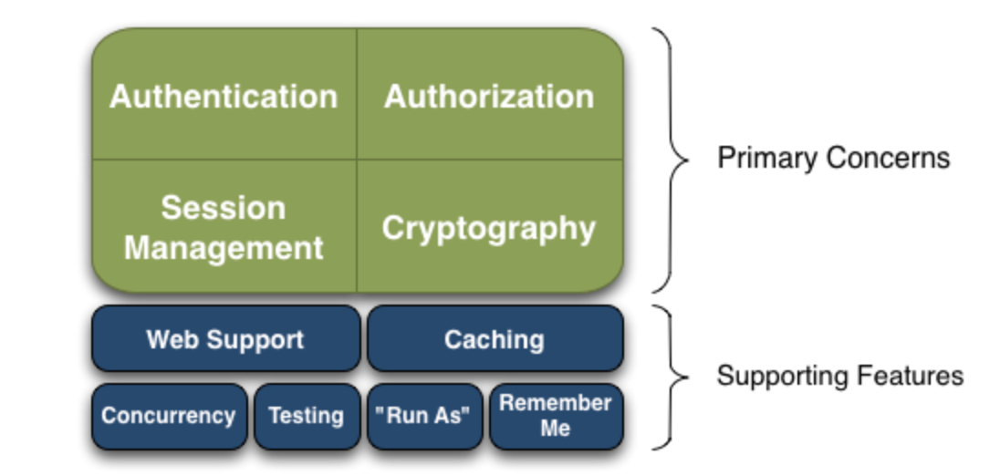
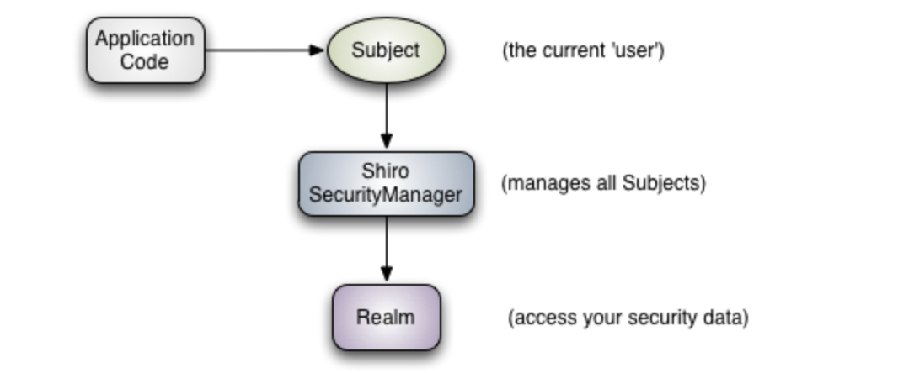
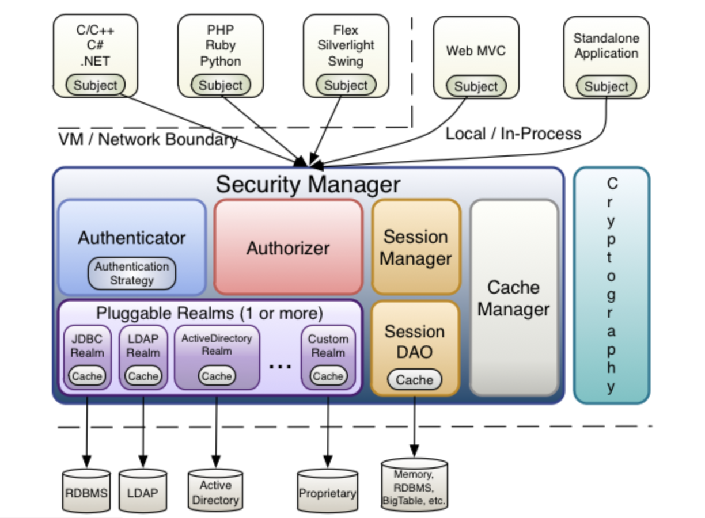
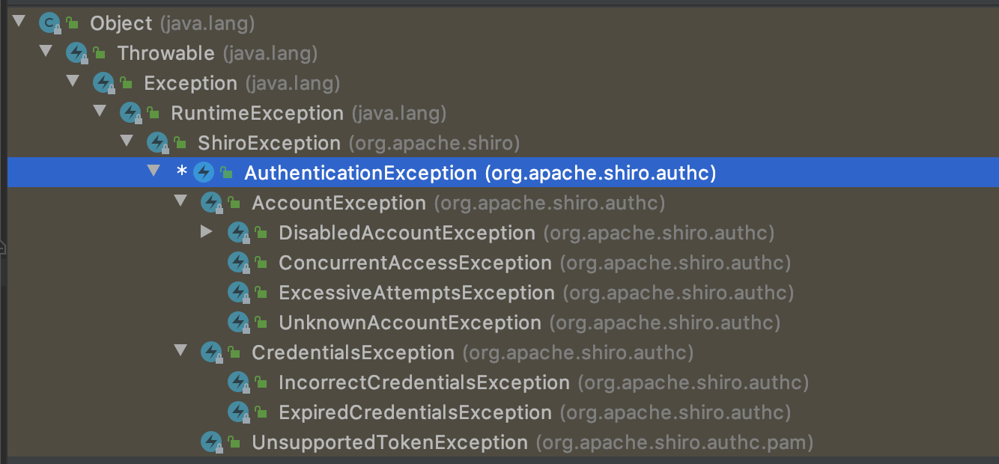

# Shiro

## 什么是Shiro

Shiro是一个功能强大且易于使用的Java安全框架，它执行身份验证、授权、加密和会话管理。使用易于理解的Shiro的API，可以快速轻松地保护任何应用程序。

对比Spring Security，没有Spring Security做的功能强大，但是在工作上可能并不需要那么复杂的东西，使用小而简单的Shiro就足够了。


## Shiro架构

Apache Shiro是具有许多功能的全面的应用程序安全框架。



- **Authentication**：身份认证，验证用户是不是拥有相应的身份,例如账号密码登陆；
- **Authorization**：授权，即权限验证，验证某个已认证的用户是否拥有某个权限；即判断用户是否能做事情，常见的如：验证某个用户是否拥有某个角色。或者细粒度的验证某个用户对某个资源是否具有某个权限；
- **Session Management**：会话管理，即用户登录后就是一次会话，在没有退出之前，它的所有信息都在会话中；会话可以是普通JavaSE环境的，也可以是如Web环境的；
- **Cryptography**：加密，保护数据的安全性，如密码加密存储到数据库，而不是明文存储；
- Web Support：Web支持，可以非常容易的集成到Web环境；
- Caching：缓存，比如用户登录后，其用户信息、拥有的角色/权限不必每次去查，这样可以提高效率；
- Concurrency：shiro支持多线程应用的并发验证，即如在一个线程中开启另一个线程，能把权限自动传播过去；
- Testing：提供测试支持；
- Run As：允许一个用户假装为另一个用户（如果他们允许）的身份进行访问；
- Remember Me：记住我，这个是非常常见的功能，即一次登录后，下次再来的话不用登录了。


从外部看，Shiro是如何完成工作的？



可以了解到，应用代码直接交互的对象是Subject，也就是说Shiro的对外API核心就是Subject。

- Subject：主题，代表当前“用户”，所有Subject都绑定到Security Manager，与Subject的所有交互都会委托给Security Manager，可以把Subject认为是一个门面，Security Manager才是实际的执行者。
- Security Manager：安全管理器，所有与安全有关的操作都会与Security Manager交互，且它管理着所有Subject，它是Shiro的核心，负责与其它组件进行交互。
- Realm：域，Shiro从Realm获取安全数据（如用户、角色和权限），Security Manager要验证用户身份，那么它必须从Realm获取相应的用户进行比较以确认用户身份是否合法，也需要从Realm得到用户相应的角色/权限进行验证用户是否能进行操作；可以把Realm看成是DataSource，即安全数据源。

总结：

1. 应用代码通过Subject来进行认证和授权，而Subject又委托给Security Manager；
2. 我们需要给Security Manager注入Realm，从而让Security Manager能够得到合法的用户及其权限进行判断。

可以得出，Shiro不会维护用户、用户权限；需要我们自己设计和提供，通过相应的接口注入给Shiro，这个相应的接口就是Realm。


从内部看，Shiro又有那些内容？



- Subject：泛指任何可以与应用交互的“用户”；
- Security Manager：所有具体的交互都通过SecurityManager进行控制；它管理着所有Subject、且负责进行认证和授权、及会话、缓存的管理；
- Authenticator：认证器，负责主体认证的，这是一个扩展点，如果用户觉得Shiro默认的不好，可以自定义实现；其需要认证策略（Authentication Strategy），即什么情况下算用户认证通过了；
- Authorizer：授权器，或者访问控制器，用来决定主体是否有权限进行相应的操作；即控制着用户能访问应用中的哪些功能；
- Relam：可以有1个或多个Realm，可以认为是安全实体数据源，即用于获取安全实体的；可以是JDBC实现，也可以是LDAP实现，或者内存实现等等；由用户提供；注意：Shiro不知道你的用户/权限存储在哪及以何种格式存储；所以我们一般在应用中都需要实现自己的Realm；
- Session Manager：管理Session的生命周期，可将数据存储到Memcached实现分布式会话。
- Session Dao：数据访问对象，用于会话的CRUD，比如我们想把Session保存到数据库，那么可以实现自己的SessionDAO，通过如JDBC写到数据库；比如想把Session放到Memcached中，可以实现自己的Memcached SessionDAO；另外SessionDAO中可以使用Cache进行缓存，以提高性能；
- Cache Manager：缓存控制器，来管理如用户、角色、权限等的缓存的；因为这些数据基本上很少去改变，放到缓存中后可以提高访问的性能；
- Cryptography：密码模块，Shiro提供了一些常见的加密组件，用于如密码加密/解密的。


## 过滤器

当Shiro被运用到web项目时，Shiro会自动创建一些默认的过滤器对客户端请求进行过滤。比如：身份验证、授权等，默认过滤器可以参考org.apache.shiro.web.filter.mgt.DefaultFilter枚举类。

|    过滤器简称     |          对应的Java类          |
| :---------------: | :----------------------------: |
|       anon        |        AnonymousFilter         |
|       authc       |    FormAuthenticationFilter    |
|    authcBasic     | BasicHttpAuthenticationFilter  |
|       perms       | PermissionsAuthorizationFilter |
|       port        |           PortFilter           |
|       rest        |   HttpMethodPermissionFilter   |
|       roles       |    RolesAuthorizationFilter    |
|        ssl        |           SslFilter            |
|       user        |           UserFilter           |
|      logout       |          LogoutFilter          |
| noSessionCreation |    NoSessionCreationFilter     |

解释：

1. `/admins/**=anon` # 表示该 uri 可以匿名访问
2. `/admins/**=authc` # 表示该 uri 需要认证才能访问
3. `/admins/**=authcBasic` # 表示该 uri 需要 httpBasic 认证
4. `/admins/**=perms[user:add:*]` # 表示该 uri 需要认证用户拥有 user:add:* 权限才能访问
5. `/admins/**=port[8081]` # 表示该 uri 需要使用 8081 端口
6. `/admins/**=rest[user]` # 相当于 /admins/**=perms[user:method]，其中，method 表示 get、post、delete 等
7. `/admins/**=roles[admin]` # 表示该 uri 需要认证用户拥有 admin 角色才能访问
8. `/admins/**=ssl` # 表示该 uri 需要使用 https 协议
9. `/admins/**=user` # 表示该 uri 需要认证或通过记住我认证才能访问
10. `/logout=logout` # 表示注销,可以当作固定配置

注意：

anon、authc、authcBasic、user是认证过滤器。

perms、roles、ssl、rest、port是授权过滤器。


### URL模式支持Ant风格模式，

- ？：匹配一个字符
- *：匹配0个或多个字符
- **：匹配路径中的0个多个路径


### URL匹配顺序

- URL权限采用第一次匹配优先的方式，即从头开始使用第一个匹配的url模式对应的拦截器链。

如：

- /bb/**=filter1
- /bb/aa=filter2
- /**=filter3

如果请求的url是/bb/aa，因为按照声明顺序进行匹配，那么将使用filter1进行拦截。


## 异常体系



如果身份验证失败或者授权失败，需要捕获异常。


## 多Realm认证策略

Shiro提供了AuthenticationStrategy接口，其中提供了三种认证策略。

- FirstSuccessfulStrategy：只要有一个 Realm 验证成功即可，只返回第一个 Realm 身份验证成功的认证信息，其它忽略；
- AtLeastOneSuccessfulStrategy：只要有一个Realm验证成功即可，和 FirstSuccessfulStrategy 不同，将返回所有Realm身份验证成功的认证信息；
- AllSuccessfulStrategy：所有Realm验证成功才算成功，且返回所有 Realm身份验证成功的认证信息，如果有一个失败就失败了。ModularRealmAuthenticator 默认是 AtLeastOneSuccessfulStrategy 策略。


## Shiro授权的方式

- 编程式：通过写if/else授权代码块完成。
- 注解式：通过在执行的Java方法上放置相应的注解完成，没有权限将抛出相应的异常。

编程式

```java
if (subject.hasRole("admin")) {
  //..
}
```

注解式

```java
@RequiresRole("admin")
public void addUser() {
  //...
}
```


### 权限规则规定

规则：资源标识符:操作:对象实例ID，即对哪个资源的哪个实例可以进行什么操作，默认支持通配符权限字符串，:表示资源/操作/实例的分割；逗号表示操作的分割，*表示任意资源/操作/实例。

例如：user:query、user:edit


## 权限注解

- RequiresAuthentication：表示当前Subject已经通过了身份认证，等价于subject.isAuthenticated()。
- RequiresUser：表示当前Subject已经身份验证或通过记住我登录。
- RequiresGuest：表示当前Subject没有身份验证或通过记住我登录过，是游客身份。
- RequiresRoles：表示当前Subject需要角色。
- RequiresPermissions：表示当前Subject需要权限。

可以在Controller或者Service层上，但是如果Service上加了事务的注解，就不能再加这个了。


## 缓存

### 授权缓存

1. Shiro 内部相应的组件（DefaultSecurityManager）会自动检测相应的对象（如Realm）是否实现了 CacheManagerAware 并自动注入相应的 CacheManager；
2. Shiro 提供了 CachingRealm，其实现了 CacheManagerAware 接口，提供了缓存的一些基础实现；
3. AuthenticatingRealm 及 AuthorizingRealm 也分别提供了对AuthenticationInfo 和 AuthorizationInfo 信息的缓存。所以默认是启用了缓存的。


### Session缓存

如 SecurityManager 实现了 SessionSecurityManager， 其会判断 SessionManager 是否实现了 CacheManagerAware 接口，如果实现了会把 CacheManager 设置给它。

- SessionManager 也会判断相应的 SessionDAO（如继承CachingSessionDAO）是否实现了CacheManagerAware，如果实现了会把 CacheManager 设置给它；
- 设置了缓存的 SessionManager，查询时会先查缓存，如果找不到才查数据库。