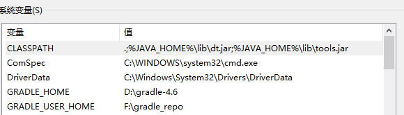
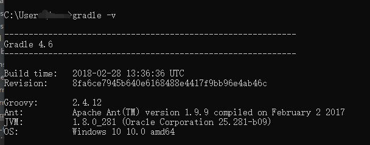
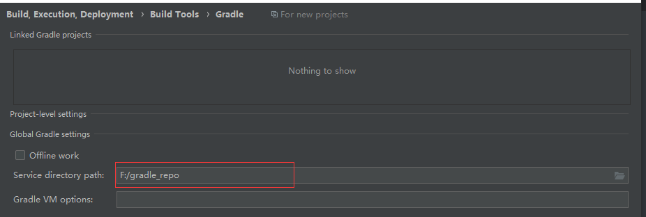
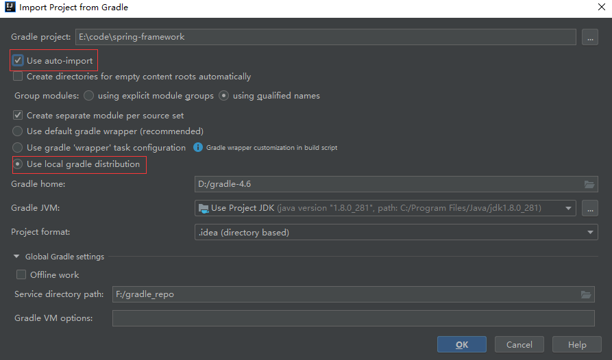
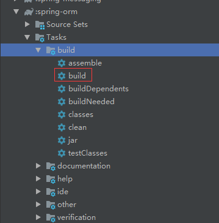
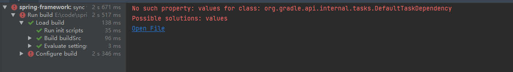
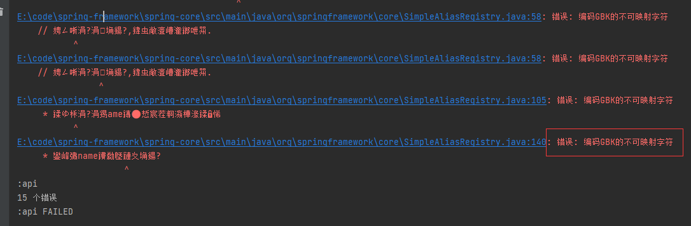
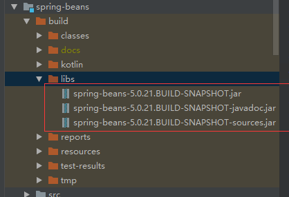

# 记录一次Spring源码的编译过程

Spring源码仓库地址：https://github.com/spring-projects/spring-framework

针对网上的教程大多数都是下载某一个版本的源码，但是如果我们想要切换到其它版本就显得不方便了。这里将克隆Spring的整个项目，并且针对4.3、5.0版本的源码进行编译。


编译环境：

|  工具  |  版本  |
| :----: | :----: |
|  IDEA  | 2018.3 |
| gradle |  4.6   |
|  jdk   |   8    |

工具的版本不需要一致。


## gradle环境配置

下载地址：https://gradle.org/releases/，下载binary-only即可，解压到某个盘符。

网上教程也很多，这里简单说明一下。在系统变量中添加 GRADLE_HOME 变量，对于以后升级版本，只需要修改该变量即可。GRADLE_USER_HOME变量值将作为gradle的本地仓库。



同时在path系统变量中添加 %GRADLE_HOME%\bin ，在任何路径都能执行 gradle 命令。




gradle从仓库中下载资源慢的很，和maven一样，也可配置。在GRADLE_USER_HOME变量值路径下新建init.gradle，作为gradle的全局配置文件，配置如下：

```gradle
allprojects{
    repositories {
        def REPOSITORY_URL = 'http://maven.aliyun.com/nexus/content/groups/public/'
        all { ArtifactRepository repo ->
            if(repo instanceof MavenArtifactRepository){
                def url = repo.url.toString()
                if (url.startsWith('https://repo1.maven.org/maven2') || url.startsWith('https://jcenter.bintray.com/')) {
                    project.logger.lifecycle "Repository ${repo.url} replaced by $REPOSITORY_URL."
                    remove repo
                }
            }
        }
        maven {
            url REPOSITORY_URL
        }
    }
}  
```


在idea中配置gradle




## 导入源码

在导入之前，最好留一份拷贝，毕竟从GitHub clone一份也需要时间。



导入之后，有一个漫长的下载依赖的过程。

## 编译源码

导入完成之后，我们先编译spring-oxm模块，在import-into-idea.md中也说明了。编译成功后，再编译spring模块。



4.3版本编译

将JasperReportsUtilsTests中的renderAsCsvWithExporterParameters测试方法、renderAsCsvWithDataSourcec测试方法、renderAsCsvWithCollection测试方法中的assertXxx先注释了。重新编译即可。


5.0版本编译

导入后下载依赖报错：



spring-beans.gradle文件的最后三行注释了。替换成如下

```gradle
def deps = compileGroovy.taskDependencies.immutableValues + compileGroovy.taskDependencies.mutableValues
compileGroovy.dependsOn = deps - "compileJava"
compileKotlin.dependsOn(compileGroovy)
compileKotlin.classpath += files(compileGroovy.destinationDir)
```

重新编译，报错如下：



经过验证，设置IDEA中的项目编码行不通，这里将那些中文注释删了。编译成功后：



之前编译了4.3的版本，切换了版本之后，模块中的build版本并不会切换，因此需要先clean module清空之前编译的版本，再build module。