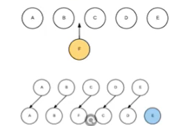
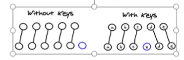

# 六、列表渲染

## 6.1、v-for指令

我们可以用 `v-for` 指令基于一个数组来渲染一个列表。`v-for` 指令需要使用 `item in items` 形式的特殊语法，其中 `items` 是源数据数组，而 `item` 则是被迭代的数组元素的**别名**。

```vue
<ul id="example-2">
  <li v-for="(item, index) in items">
    {{ parentMessage }} - {{ index }} - {{ item.message }}
  </li>
</ul>
```


```js
var example2 = new Vue({
  el: '#example-2',
  data: {
    parentMessage: 'Parent',
    items: [
      { message: 'Foo' },
      { message: 'Bar' }
    ]
  }
})
```


## 6.2、维护状态

当 Vue 正在更新使用 `v-for` 渲染的元素列表时，它默认使用“就地更新”的策略。如果数据项的顺序被改变，Vue 将不会移动 DOM 元素来匹配数据项的顺序，而是就地更新每个元素，并且确保它们在每个索引位置正确渲染。

这个默认的模式是高效的，但是**只适用于不依赖子组件状态或临时 DOM 状态 (例如：表单输入值) 的列表渲染输出**。

为了给 Vue 一个提示，以便它能跟踪每个节点的身份，从而重用和重新排序现有元素，你需要为每项提供一个唯一 `key` attribute：

```vue
<div v-for="item in items" v-bind:key="item.id">
  <!-- 内容 -->
</div>
```

建议尽可能在使用 `v-for` 时提供 `key` attribute，除非遍历输出的 DOM 内容非常简单，或者是刻意依赖默认行为以获取性能上的提升。


为什么需要这个key属性：和vue的虚拟DOM的diff算法有关系。

diff算法：

当某一层有很多的节点时，也就是列表节点时，我们希望插入一个新的节点。我们希望可以在B和C之间加一个F，Diff算法默认执行起来是把C更新成F，D更新成C，E更新成D，最后再插入E，效率不高。所以我们需要使用key来给每个节点做一个唯一标识。Diff算法就可以正确的识别此节点，找到正确的位置区插入新的节点。





key的作用主要是为了高效的更新虚拟DOM。


## 6.3、数组更新检测

Vue 将被侦听的数组的变更方法进行了包裹，所以它们也将会触发视图更新。这些被包裹过的方法包括：

### 变更方法

- `push()`：向数组最后面添加元素。
- `pop()`：删除数组中的最后一个元素。
- `shift()`：删除数组中的第一个元素。
- `unshift()`：在数组前面添加多个元素。
- `splice()`：删除/插入/替换指定位置的元素。
- `sort()`：排序元素，支持自定义排序规则。
- `reverse()`：反转元素。

### 替换数组

变更方法，顾名思义，会变更调用了这些方法的原始数组。相比之下，也有非变更方法，例如 `filter()`、`concat()` 和 `slice()`。它们不会变更原始数组，而**总是返回一个新数组**。当使用非变更方法时，可以用新数组替换旧数组：

```vue
example1.items = example1.items.filter(function (item) {
  return item.message.match(/Foo/)
})
```

你可能认为这将导致 Vue 丢弃现有 DOM 并重新渲染整个列表。幸运的是，事实并非如此。Vue 为了使得 DOM 元素得到最大范围的重用而实现了一些智能的启发式方法，所以用一个含有相同元素的数组去替换原来的数组是非常高效的操作。


注意：由于 JavaScript 的限制，Vue **不能检测**数组和对象的变化。


## 6.4、过滤和排序

有时，我们想要显示一个数组经过过滤或排序后的版本，而不实际变更或重置原始数据。在这种情况下，可以创建一个计算属性，来返回过滤或排序后的数组。

```vue
<li v-for="n in evenNumbers">{{ n }}</li>
```

```vue
data: {
  numbers: [ 1, 2, 3, 4, 5 ]
},
computed: {
  evenNumbers: function () {
    return this.numbers.filter(function (number) {
      return number % 2 === 0
    })
  }
}
```

在计算属性不适用的情况下 (例如，在嵌套 `v-for` 循环中) 你可以使用一个方法：

```vue
<ul v-for="set in sets">
  <li v-for="n in even(set)">{{ n }}</li>
</ul>
```

```vue
data: {
  sets: [[ 1, 2, 3, 4, 5 ], [6, 7, 8, 9, 10]]
},
methods: {
  even: function (numbers) {
    return numbers.filter(function (number) {
      return number % 2 === 0
    })
  }
}
```

