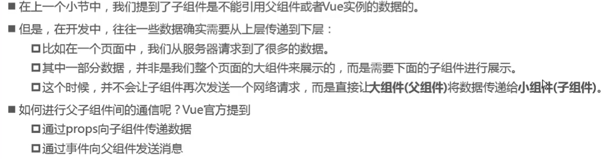
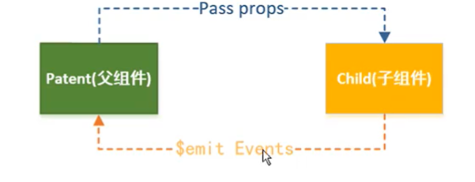

# 八、组件化

所谓组件化，就是把页面拆分成多个组件 (component)，每个组件依赖的 CSS、JavaScript、模板、图片等资源放在一起开发和维护。组件是资源独立的，组件在系统内部可复用，组件和组件之间可以嵌套。

组件的使用三步走：

- 创建组件构造器：调用Vue.extend()方法创建。
- 注册组件：调用Vue.component()方法注册。
- 使用组件：在Vue实例范围内使用。

```vue
<div id="app">
    <cpn-c></cpn-c>
    <cpn-c></cpn-c>
</div>
<script>
	const cpnC = Vue.extend({
        template: `
			<div>
    			<h2>标题</h2>
    		</div>`
    });
    Vue.component('cpn-c',cpnC);
    const vm = new Vue({
        el: '#app',
        data: {}
    })
</script>
```


## 8.1、全局组件和局部组件

通过Vue.component 注册的组件是全局组件，全局注册的组件可以用在其被注册之后的任何 (通过 `new Vue`) 新创建的 Vue 根实例，也包括其组件树中的所有子组件的模板中。

局部组件

```vue
<div id="app">
    <my-component></my-component>
</div>
<script>
    const myComponent = Vue.extend({
       template: `<h1>标题</h1>` 
    });
    
    const vm = new Vue({
        el: '#app',
        data: {},
        components: {'my-component', myComponent}
    })
</script>
```


注册全局组件的新语法糖：

```vue
<div id="app">
    <cpn-c></cpn-c>
    <cpn-c></cpn-c>
</div>
<script>
    Vue.component('cpn-c',{
        template: `
			<div>
    			<h2>标题</h2>
    		</div>`
    });
    const vm = new Vue({
        el: '#app',
        data: {}
    })
</script>
```

局部组件新语法糖：

```vue
<div id="app">
    <my-component></my-component>
</div>
<script>
    const myComponent = Vue.extend();
    
    const vm = new Vue({
        el: '#app',
        data: {},
        components: {
          'my-component', {
       		template: `<h1>标题</h1>` 
    	  }
    	}
    })
</script>
```

本质上还是调用了Vue.extends方法。


## 8.2、父子组件通信

```vue
<div id="app">
    <my-component1></my-component1>
</div>
<script>
    // 子组件
    const myComponent = Vue.extend({
       template: `<div><h1>标题</h1></div>` 
    });
    
    // 父组件
    const myComponent1 = Vue.extend({
        template: `<div><my-component></my-component><p>正文</p></div>`,
        components: {'my-component', myComponent}
    })
    // root组件
    const vm = new Vue({
        el: '#app',
        data: {},
        components: {'my-component1', myComponent1}
    })
</script>
```


### 组件可以访问Vue实例数据吗？

- 组件是一个单独功能模块的封装：
  - 这个模块有属于自己的HTML模板，也应该有属于自己的数据data。
- 组件中的数据是保存在哪里呢？顶层的Vue实例中？
  - 实际上并不是。
  - 组件对象也有一个data属性（methods等），只是这个data属性必须是一个函数。
  - 而且这个函数返回一个对象，对象内部保存着数据。

```vue
<div id="app">
    <my-cpn></my-cpn>
</div>
<template id="myCpn">
	<div>
        消息: {{message}}
    </div>
</template>
<script>
	let app = new Vue({
        el: '#app',
        components: {
            'my-cpn': {
                template: 'myCpn',
                data: function() {
                    return {
                        message: 'Hello World'
                    }
                }
            }
        }
    })
</script>
```


### 为什么组件data必须是函数？

- 保证每个组件实例的data独立性，如果是属性，那么每次修改其中一个组件，其它组件也会跟着修改。


## 8.3、组件间的通信





父组件向子组件传递数据例子：

```vue
<div id="app">
    <cpn v-bind:cmovies="movies" :cmessage="message"></cpn>
</div>
<template id="cpn">
	<div>
        <h2>{{cmessage}}</h2>
        <ul>
            <li v-for="item in cmovies">{{item}}</li>
    	</ul>
    </div>
</template>
<script>
    const cpn = {
        template: '#cpn',
        props: ['cmovies','cmessage']
    }
	const vm = new Vue({
        el: '#app',
        data: {
            message: 'hi',
            movies: ['海王','海绵宝宝','葫芦娃'],
        },
        components: {
            cpn: 
        }
    })
</script>
```

另外的语法，包含验证：

```vue
<div id="app">
    <cpn v-bind:cmovies="movies" :cmessage="message"></cpn>
</div>
<template id="cpn">
	<div>
        <h2>{{cmessage}}</h2>
        <ul>
            <li v-for="item in cmovies">{{item}}</li>
    	</ul>
    </div>
</template>
<script>
    const cpn = {
        template: '#cpn',
        props: {
            // 1.类型限制
            //cmovies: Array,
            //cmessage: String,
            
            // 2.提供一些默认值
            cmessage: {
                type: String,
                default: 'xxxxx',
                required: true
            }
        }
    }
	const vm = new Vue({
        el: '#app',
        data: {
            message: 'hi',
            movies: ['海王','海绵宝宝','葫芦娃'],
        },
        components: {
            cpn: 
        }
    })
</script>
```

对象或数组的默认值必须是一个函数。

```vue
cmessage: {
    type: String,
    default() {
		return []
	},
    required: true
}
```


子组件向父组件传递数据例子：

```vue
<div id="app">
    <!--监听子组件发送的事件,子组件传递的数据在Vue中传递-->
    <cpn v-on:item-click="cpnClick"></cpn>
</div>
<template id="cpn">
	<div>
        <button v-for="item in categories" @click="btnClick(item)">{{item.name}}</button>
    </div>
</template>
<script>
    const cpn = {
        template: '#cpn',
        data() {
            return {
                categories: [
                    {id: '1',name: '热门推荐'},
                    {id: '2',name: '手机数码'},
                    {id: '3',name: '家用电器'},
                    {id: '4',name: '电脑办公'},
                ]
            }
        },
        methods: {
            btnClick(item) {
                console.log(item)
                this.$emit('item-click',item)
            }
        }
    }
	const vm = new Vue({
        el: '#app',
        data: {
            message: 'hi',
        },
        methods: {
            cpnClick(item) {
                console.log("cpn click", item);
            }
        }
        components: {
            cpn: 
        }
    })
</script>
```

### 父子组件的访问方式

有时候我们需要父组件直接访问子组件，子组件直接访问父组件，或者是子组件访问根组件。

- 父组件访问子组件：使用$children或$refs。
  - this.$children是一个数组类型，它包含所有子组件对象。
- 子组件访问父组件：使用$parent。

$children访问的例子：

```vue
<div id="app">
    <cpn></cpn>
    <button @click="btnClick">按钮</button>
</div>
<template id="cpn">
  <div>我是子组件</div>
</template>
<script>
  const vm = new Vue({
      el: '#app',
      data: {
          message: '你好啊'
      },
      methods: {
          btnClick() {
              console.log(this.$children);
              // 调用子组件中的showMessage方法
              this.$children[0].showMessage();
              // 遍历子组件中的属性和方法
              for (let c of this.$children) {
                  console.log(c.name);
                  c.showMessage();
              }
          }
      }
      components: {
          cpn: {
              template: '#cpn',
      		  data() { return {name: '我是子组件中的name'} }
              methods: {
                  showMessage() {
      				console.log("show message");
  				  }
              }
          }
      }
  })
</script>
```

但是$children用的并不多，因为当有多个组件的时候，需要获取子组件中的属性和方法就不够灵活。比较常用的是$refs，相当于给组件起了一个别名，要获取哪个组件就根据别名进行获取。

$refs例子：

```vue
<div id="app">
    <cpn ref="aaa"></cpn>
    <button @click="btnClick">按钮</button>
</div>
<template id="cpn">
  <div>我是子组件</div>
</template>
<script>
  const vm = new Vue({
      el: '#app',
      data: {
          message: '你好啊'
      },
      methods: {
          btnClick() {
              console.log(this.$refs.aaa);
              console.log(this.$refs.aaa.name);
          }
      }
      components: {
          cpn: {
              template: '#cpn',
      		  data() { return {name: '我是子组件中的name'} }
              methods: {
                  showMessage() {
      				console.log("show message");
  				  }
              }
          }
      }
  })
</script>
```


子访问父组件例子：

$parent访问父组件，父组件可能是root组件【Vue】，也可能是当前组件的父组件【VueComponent】。$root可直接访问根组件。

```vue
<div id="app">
    <cpn ref="aaa"></cpn>
</div>
<template id="cpn">
  <div>
      <div>我是子组件</div>
      <button @click="btnClick">按钮</button>
    </div>
</template>
<script>
  const vm = new Vue({
      el: '#app',
      data: {
          message: '你好啊',
          name: '我是root组件中的name'
      },
      methods: {
          showMessage() {
              console.log("parent");
          }
      }
      components: {
          cpn: {
              template: '#cpn',
      		  methods: {
      			btnClick() {
      			  console.log(this.$parent);
      			  this.$parent.name;
      			  this.$parent.showMessage();
  				}
  			  }
          }
      }
  })
</script>
```
