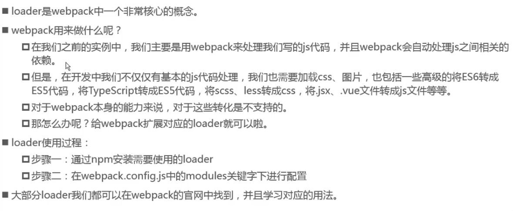

# 一、webpack安装

全局安装：

```bash
npm install webpack@3.6.0 -g
```

打包后，在项目中就会产生node_modules目录，存放了包。在控制台中打包都是全局打包，文件可能会很大。


局部安装：

```bash
npm install webpack@3.6.0 --save-dev
```

通过.node_modules/.bin/webpack进行局部打包。


初次之外，也能在package.js中定义自己的执行脚本，会按照一定的顺序寻找命令对应的位置。首先，会寻找本地的node_modules/.bin路径中对应的命令。如果没有找到，会去全局的环境变量中寻找。

```js
{
    "scripts": {
        "build": "webpack"
    }
}
```

执行npm run build即可。


# 二、webpack配置文件

## 2.1、webpack.config.js

webpack管理的文件

```js
const path = require('path')	//引入node环境中的包,动态获取项目路径
module.exports = {	//导出模块
    entry: './src/main.js', //入口
    output: {	// 出口
        path: './dist',	// 打包的绝对路径
        path: path.resolve(_dirname, 'dist'), //_dirname获取当前项目路径
        filename: 'bundle.js', 	// 打包后的文件名
    }, 
)
```

## 2.2、package.js

node管理的文件

```js
{
    "devDependencies": {}, //开发环境所使用到的依赖
    "dependencies": {},	//生产环境所使用到的依赖
    "scripts": {
        "build": "webpack", // 命令映射,执行npm run build就会执行webpack命令
    }
}
```


## 2.3、loader



```bash
npm install --save-dev css-loader
npm install --save-dev style-loader
```

wepack.config.js

```js
module.exports = {
    module: {
        rules: [
            {
                test: /\.css$/, //匹配所有的css文件
                use: ['style-loader','css-loader']
            }
        ]
    }
}
```

css-loader只负责将css文件进行加载，style-loader将模块导出作为样式应用到DOM中。

使用多个loader时，是从右向左。如果位置不对，会解析错误。

main.js

```js
require("./css/xxx.css")
```

其它loader，查看http://www.webpackjs.com。