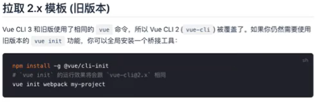
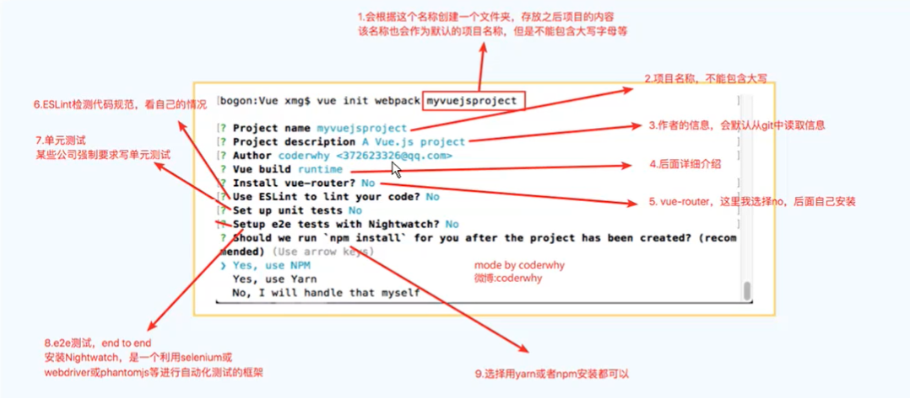
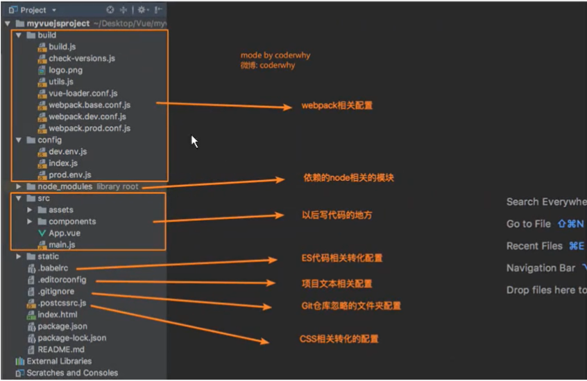
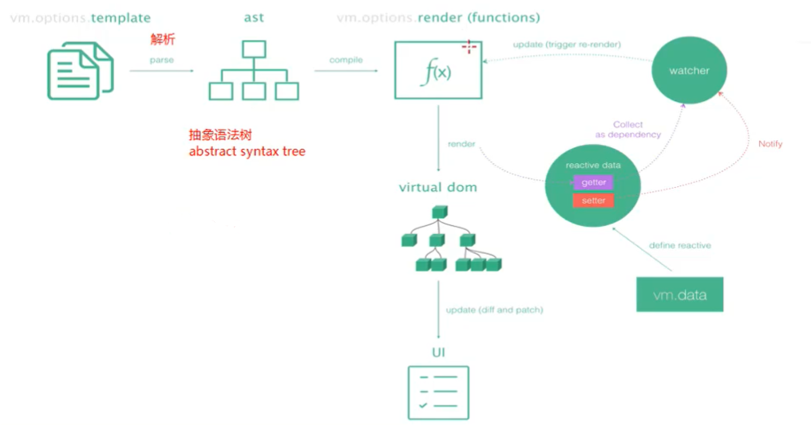
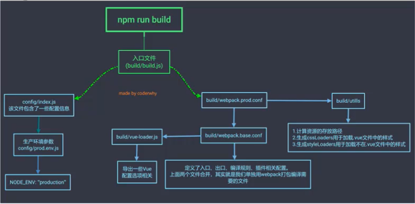
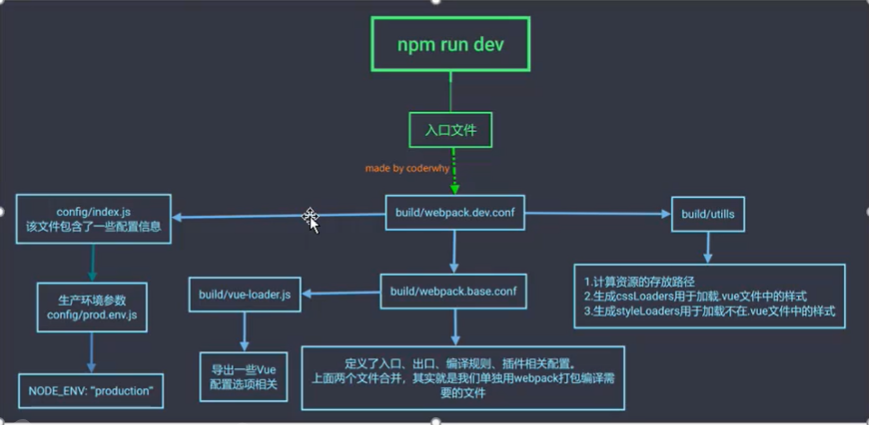
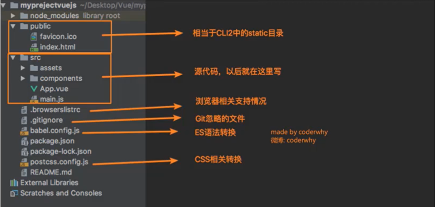
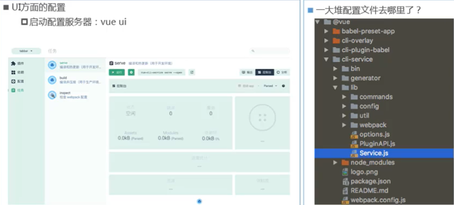

# 十一、vue_cli

## 11.1、什么是Vue CLI

- CLI 是Command-Line Interface，翻译为命令行界面，俗称脚手架。
- Vue CLI是官方发布 vue.js 项目脚手架。
- 使用 vue-cli 可以快速搭建Vue 开发环境以及对应的webpack配置。


### Vue CLI使用前提Node

- 安装Node JS
  - 可以直接在官方网站中下载安装。
- 检测安装的版本
  - 默认情况下自动安装Node和NPM
  - Node环境要求8.9以上或者更高版本
- 什么是NPM？
  - NPM的全称是Node Package Manager
  - 是一个NodeJS包管理和分发工具，已经成为了非官方的发布Node模块（包）的标准。
  - 后续我们会经常使用NPM来安装一些开发过程中依赖包。


### Vue CLI使用前提Webpack

- Vue.js官方脚手架工具就使用了webpack模板
  - 对所有的资源会压缩等优化操作。
  - 它在开发过程中提供了一套完整的功能，能够使得我们开发过程中变得高效。
- Webpack的全局安装
  - `npm install webpack -g`


## 11.2、Vue CLI的使用

- 安装Vue脚手架【全局安装】
  - `npm install -g @vue/cli`
- 查看vue cli版本
  - `vue --version`
  - 
- Vue CLI2初始化项目
  - `vue init webpack my-project`
- Vue CLI3初始化项目
  - `vue create my-project`



## 11.3、Vue CLI2目录解析

```bash
$ tree -L 1
.
|-- README.md
|-- build
|-- config
|-- index.html
|-- node_modules
|-- package-lock.json
|-- package.json
|-- src
`-- static
```

build目录

```bash
$ tree
.
|-- build.js
|-- check-versions.js
|-- logo.png
|-- utils.js
|-- vue-loader.conf.js
|-- webpack.base.conf.js
|-- webpack.dev.conf.js
`-- webpack.prod.conf.js
```

config目录

```bash
$ tree
.
|-- dev.env.js
|-- index.js
`-- prod.env.js
```

以上两个是webpack相关的配置。

package.json

```json
"scripts": {	// 运行的脚本命令
    "dev": "webpack-dev-server --inline --progress --config build/webpack.dev.conf.js",
    "start": "npm run dev",
    "build": "node build/build.js"
},
"devDependencies": {	// 项目所依赖的所有包
 	"autoprefixer": "^7.1.2",   
}
```

build：打包命令，利用node去执行build.js文件，build.js引用了webpack.prod.conf的配置，而基础配置在webpack.base.config.js中定义。

dev：启动服务，配置文件使用webpack.dev.conf.js。




## 11.4、runtime-compiler和runtime-only的区别

主要体现在main.js入口文件，通过runtime-compiler方式创建的入口文件

```js
new Vue({
    el: '#app',	// 挂载点
    template: '<App/>',	// 使用App组件
    components: { App } // 先注册组件
})
```

通过runtime-only方式创建的入口文件

```js
new Vue({
    el: '#app',
    render: function(h) { //简化为 render: h => h(App)
		return h(App)
	}
})
```

执行过程：



可以知道，使用runtime-only不经过template的解析和编译。


render分析

```js
const cpn = {
    template: `<div>{{msg}}</div>`,
    data() {
        return {
            msg: '我是组件中的msg'
        }
    }
}
new Vue({
    el: '#app',
    render: function(createElement) {
        // 1.普通用法：createElement('标签',{标签的属性},[''])
		// return createElement('h2',{class: 'box'}, ['Hello World',createElement('button', ['按钮'])])
        // 2.传入组件对象：
        return createElement(cpn)
	}
})
```

那么.vue文件中的template是由谁处理的了？是由vue-template-compiler将template转换为render了。


npm run build过程



npm run dev过程




修改配置：webpack.base.conf.js起别名

```js
resolve: {
    extensions: ['.js','.vue','.json'],
    alias: {
        '@': resolve('src'),
        'pages': resolve('src/pages'),
        'common': resolve('src/common'),
        'components': resolve('src/components'),
        'network': resolve('src/network')
    }
}
```


## 11.5、认识Vue CLI3

vue-cli 3与2版本的区别

- vue-cli 3是基于 webpack 4打造，vue-cli 2 还是 webpack 3。
- vue-cli 3的设计原则是"0配置"，移除的配置文件根目录下的，build和config等目录。
- vue-cli 3提供了vue ui命令，提供了可视化配置，更加人性化。
- 移除了static文件夹，新增了public文件夹，并且index.html移动到public中。

1. 如果安装了vue-cli 1.x或者2.x 先通过 `npm uninstall vue-cli -g` 进行卸载。
2. 通过 `npm install -g @vue/cli` 进行全局安装。

在升级过程中，可能会存在说没有权限的，我们看哪个目录没有权限，我们就向该目录赋予权限。


目录结构：

```bash
$ tree -L 1
.
|-- README.md
|-- babel.config.js
|-- node_modules
|-- package-lock.json
|-- package.json
|-- public
`-- src
```

src目录

```bash
$ tree
.
|-- App.vue
|-- assets
|   `-- logo.png
|-- components
|   `-- HelloWorld.vue
`-- main.js
```

public目录

```bash
$ tree
.
|-- favicon.ico
`-- index.html
```



配置呢？位于包中的@vue模块中。



