# 十二、路由

## 12.1、什么是路由？

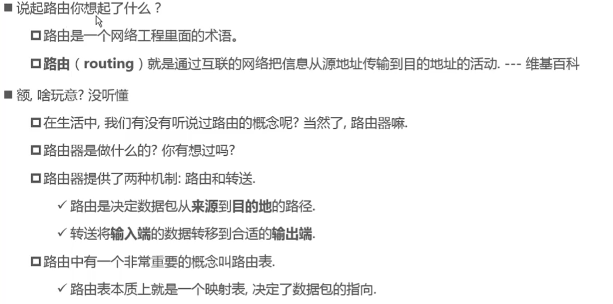

## 12.2、URL的两种模式

### URL的hash模式

- URL的hash也就是锚点(#)，本质上是改变window.location的href属性。
- 我们可以通过直接赋值location.hash来改变href，但是页面不发生刷新。


初始界面

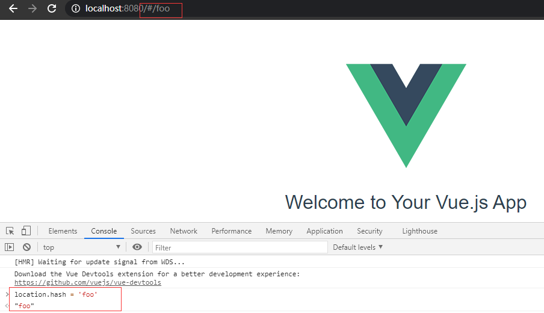

通过location.hash改变href之后，但是在Network中并没有访问服务器。

### URL的history模式

- HTML5的history模式：pushState
- HTML5的history模式：replaceState
- HTML5的history模式：go
  - history.back()等价于history.go(-1)
  - history.forward()等价于history.go(1)

通过history对象中提供的pushState方法，本质上是一个栈的数据结构，显示的是栈顶的哪一个元素。

注意到，可实现前进、后退的效果，实际上前进相当于pushState，后退相当于back。pushState又相当于入栈操作，back相当于出栈操作。


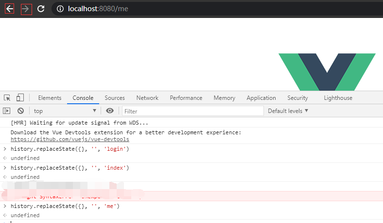

而使用history对象的replaceState也可实现页面的跳转，但是并不能进行前进和后退操作，因此，该方法并未使用栈的数据结构。

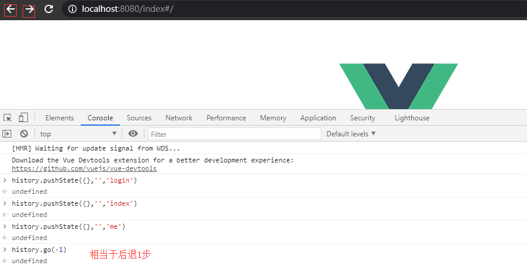

go方法需要依赖于pushState，go中的参数n>0，表示前进n步，参数n<0表示后退n步。


## 12.3、认识vue-router

目前前端流行的三大框架，都有自己的路由实现：

- Angular的ngRouter
- React的ReactRouter
- Vue的vue-router

vue-router是Vue官方的路由插件，它和vue.js是深度集成的，适合用于构建单页面应用。

vue-router是基于路由和组件的

- 路由用于设定访问路径，将路径和组件映射起来。
- 在vue-router的单页面应用中，页面的路径的改变就是组件的切换。


### 安装和使用vue-router

步骤一：安装vue-router

`npm install vue-router --save`

步骤二：在模块化工程中使用它。

- 导入路由对象，并且调用 Vue.use(VueRouter)
- 创建路由实例，并且传入路由映射配置
- 在Vue实例中挂载创建的路由实例


使用vue-router的步骤：

1. 创建路由组件
2. 配置路由映射：组件和路径映射关系
3. 使用路由，通过\<router-link\>和\<router-view\>

\<router-link\>是一个vue-router中已经内置的组件，它会被渲染成一个\<a\>标签。

\<router-view\>该标签会根据当前的路径，动态渲染出不同的组件。

在路由切换时，切换的是\<router-view\>挂载的组件，其它内容不会发生改变。


### 路由的默认路径

默认情况下，进入网站的首页，我们希望\<router-view\>渲染首页的内容，但是我们的实现中，默认没有显示首页组件，必须让用户点击才可以。

```js
const routes = [
    path: '/',
    redirect: '/home'
]
```

我们只需要多配置一个路由映射，path配置的是根路径，redirect是重定向，也就是将根路径重定向到/home的路径下。


### 路由的模式

默认路由为hash模式，如何切换成history模式呢？修改了之后最后重启一下项目。

```js
export default new Router({
  routes,
  mode: 'history'
})
```


## 12.4、router-link

\<router-link\>中，使用了一个属性:to，用于指定跳转的路径。

\<router-link\>还有一些其他属性：

- tag：可以指定\<router-link\>之后渲染成什么组件。

```js
<div id="app">
    <router-view/>
    <router-link to="/" tag="button">首页</router-link>
    <router-link to="/login" tag="button">登录</router-link>
</div>
```

- replace：不会留下history记录，指定该情况，后退键不能返回到上一个页面中。

```js
<div id="app">
    <router-view/>

    <router-link to="/index" tag="button" replace>首页</router-link>
    <router-link to="/login" tag="button" replace>登录</router-link>
</div>
```

- active-class：当\<router-link\>对应的路由匹配成功时，会自动给当前元素设置一个router-link-active的class，设置active-class可以修改默认的名称。
  - 在进行高亮显示的导航菜单或者底部tabbar时，会使用到该类。
  - 但是通常不会修改类的属性，会直接使用默认的router-link-active即可。

```vue
<template>
  <div id="app">
    <!-- 占位,组件渲染的位置 -->
    <router-view/>

    <!-- router-link是vue-router注册的组件 -->
    <router-link to="/index" tag="button" replace active-class="active">首页</router-link>
    <router-link to="/login" tag="button" replace>登录</router-link>
  </div>
</template>

<script>
export default {
  name: 'App'
}
</script>

<style>
.active {
  color: red;
}
</style>
```


## 12.5、代码跳转路由

之前实现路由跳转，我们是通过\<router-link\>，现在我们不使用该组件。

```vue
<template>
  <div id="app">
    <router-view/>

    <button @click="btnIndex">首页code</button>
    <button @click="btnLogin">登录code</button>

  </div>
</template>

<script>
export default {
  name: 'App',
  methods: {
    btnIndex() {
      // this.$router.push('/index')
      this.$router.replace('/index')
      console.log(this.$router)
    },
    btnLogin() {
      // this.$router.push('/login')
      this.$router.replace('/login')

    }
  }
}
</script>

<style>

</style>

```

this.$router对象，表示router目录中index.js中配置的所有路由对象。

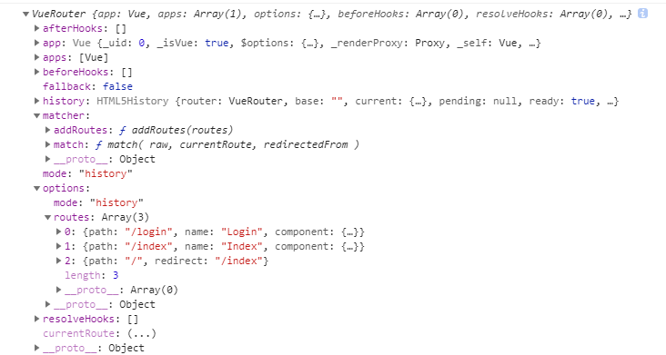

push就相当于pushState，可前进后退。而replace不可前进后退。


## 12.6、动态路由

在某些情况下，一个页面的path路径可能是不确定的，比如我们进入用户界面时，希望是如下的路径：

- /user/aaa或者/user/bbb【aaa表示id】

准备组件

```vue
<template>
  <div>
      <h2>我是User</h2>
      <p>{{userId}}</p>
  </div>
</template>

<script>
export default {
  name: 'User',
  computed: {
    userId() {
      console.log(this.$route)
      // 处于活跃状态的路由
      return this.$route.params
    }
  }
}
</script>
```

配置路由映射

```js
import User from './../components/User'
{
// :id动态路由参数
path: '/user/:id',
name: 'User',
component: User
},
```

组件的使用

```vue
<template>
  <div id="app">
    <router-view/>

    <router-link to="/index" tag="button" replace active-class="active">首页</router-link>
    <router-link to="/login" tag="button" replace>登录</router-link>
    <router-link :to="'/user/'+userId" tag="button" replace>用户</router-link>


  </div>
</template>

<script>
export default {
  name: 'App',
  data() {
    return {
      userId: '1'
    }
  },
}
</script>
```

在User组件中打印的路由信息。

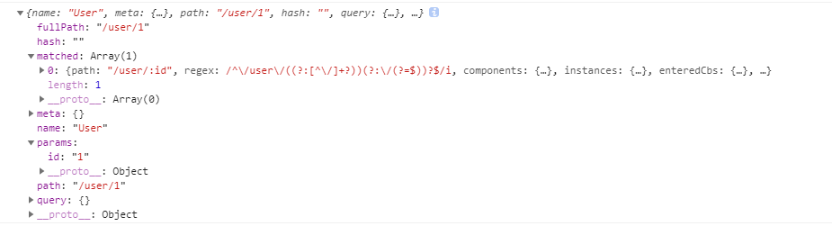

## 12.7、vue-router路由打包

打包命令`npm run buid`

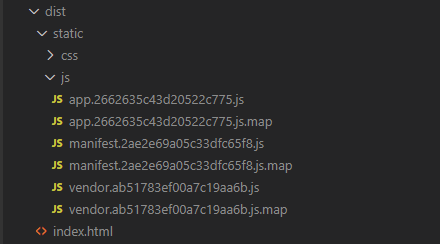

app：业务代码。

manifest：底层支撑相关的代码。

vendor：第三方相关的代码。


## 12.8、路由懒加载

当打包构建应用时，JS包会变得非常大，影响页面加载。如果我们能把不同路由对应的组件分割成不同的代码块，然后当路由被访问的适合才加载对应组件，这样就更高效了。

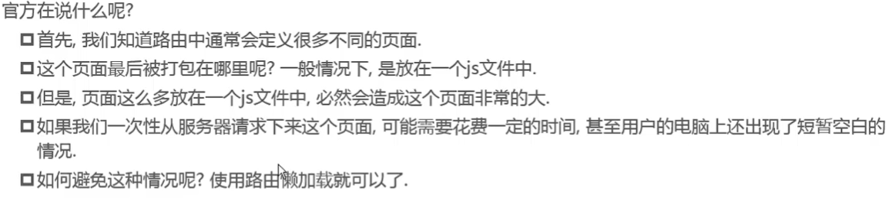


路由懒加载做了什么？

- 路由懒加载的主要作用就是将路由对应的组件打包成一个个的js代码块。
- 只有在这个路由被访问到的时候，才加载对应的组件。

懒加载方式：

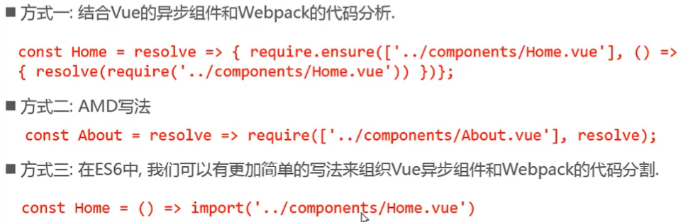

```js
const routes = [
    {
        path: '/index',
        component: () => import('./../components/Index')
    },
    {
        path: '/login',
        component: () => import('./../components/Login')
    },
    {
        path: '/user',
        component: () => import('./../components/User')
    }
]
```

Index、Login组件也就被打包到两个js文件中。

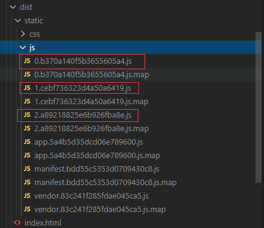

## 12.9、嵌套路由

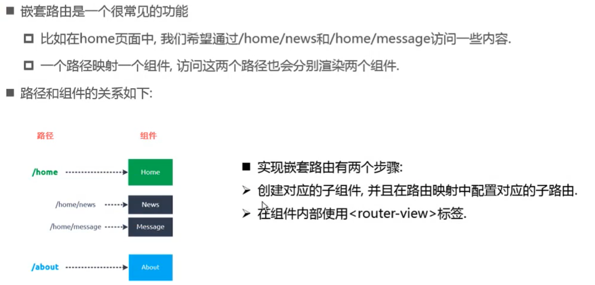

定义两个组件

```vue
<template>
  <div>
    <ul>
      <li>新闻1</li>
      <li>新闻2</li>
      <li>新闻3</li>
      <li>新闻4</li>
      <li>新闻5</li>
    </ul>
  </div>
</template>

<script>
export default {
  name: "News",
};
</script>

<style>
</style>
```

```vue
<template>
  <div>
    <h2>消息</h2>
  </div>
</template>

<script>
export default {
  name: "Message",
};
</script>

<style>
</style>
```

路由

```js
import Vue from 'vue'
import Router from 'vue-router'

Vue.use(Router)

const routes = [
  {
    path: '/login',
    name: 'Login',
    // component: Login
    component: () => import('./../components/Login')
  },
  {
    path: '/index',
    name: 'Index',
    // component: Index,
    component: () => import('../components/Index'),
    children: [
      {
        path: 'news',
        name: 'News',
        component: () => import('./../components/News'),
      },
      {
        path: 'message',
        name: 'Message',
        component: () => import('./../components/Message'),
      },
      {
        path: '',
        redirect: '/index/news'
      }
    ]
  },
  {
    path: '/user/:id',
    name: 'User',
    // component: User
    component: () => import('./../components/User')
  },
  {
    path: '/',
    redirect: '/index'
  }
]

export default new Router({
  mode: 'history',
  routes,
})
```


## 12.10、参数传递

- 传递参数主要有两种类型：params和query。
- params的类型：
  - 配置路由格式：**/router/:id**
  - 传递的方式：在path后面跟上对应的值。
  - 例子：/router/1
- query的类型：
  - 配置路由格式：/router。
  - 传递的方式：对象中使用query的key作为传递方式。
  - 例子：/router?id=1

## 12.11、全局守卫


## 12.12、keep-alive

- keep-alive是Vue内置的一个组件，可以使被包含的组件保留状态，或避免重新渲染。
- router-view也是一个组件，如果直接被包在keep-alive里面，所有路径匹配到的视图组件都会被缓存。

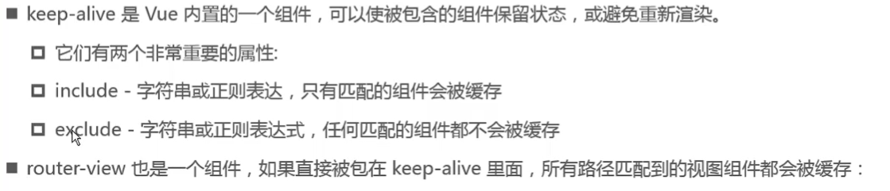

keep-alive博客：https://blog.csdn.net/fu983531588/article/details/90321827

