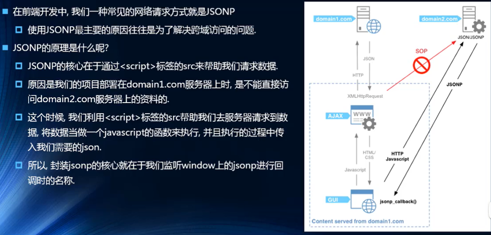
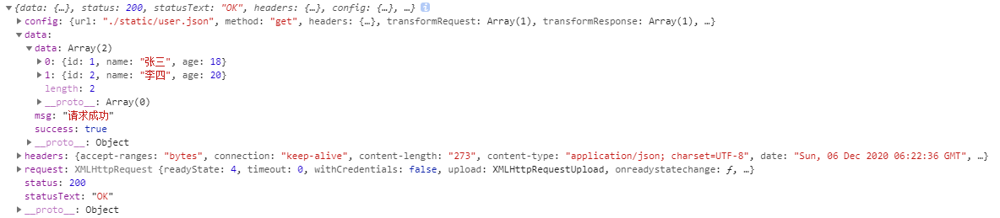
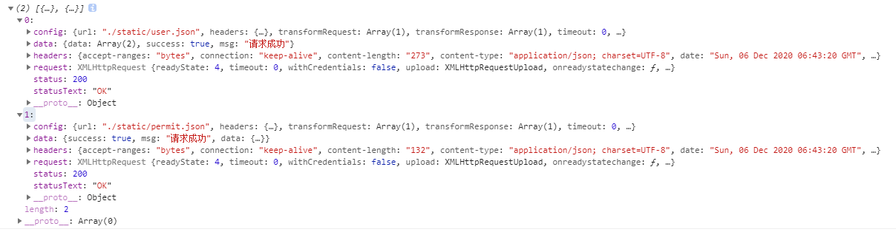
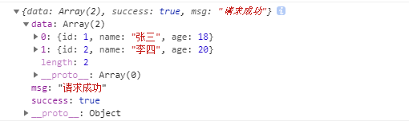

# 十六、axios

## 16.1、选择什么网络模块




为什么选择axios？

功能特点：

- 在浏览器中发送 XMLHttpRequest 请求。
- 在 node.js 中发送http请求。
- 支持 Promise API。
- 拦截请求和响应。
- 转换请求和响应数据。


## 16.2、axios基本使用

支持多种请求方式：

- axios(config)
- axios.request(config)
- axios.get(url[,config])
- axios.delete(url[,config])
- axios.post(url[,data[,config]])
- axios.put(url[,data[,config]])
- axios.head(url[,config])
- axios.patch(url,[,data[,config]])


准备数据：

```json
{
    "data": [
        {
            "id": 1,
            "name": "张三",
            "age": 18
        },
        {
            "id": 2,
            "name": "李四",
            "age": 20
        }
    ],
    "success": true,
    "msg": "请求成功"
}
```

发送网络请求

```js
axios({
  url: 'http://localhost:8080/static/user.json',
  method: 'GET'
}).then(resp => { // 返回一个promise
  console.log(resp)
})
```

简写

```js
axios.get('http://localhost:8080/static/user.json', {

}).then(resp => {
  console.log(resp)
})
```



带参数的网络请求

```js
axios.get('http://localhost:8080/static/user.json', {
  params: {
    id: '1',
    age: 10
  }
}).then(resp => {
  console.log(resp)
})
```


## 16.3、axios并发请求

有时候我们需要同时发送两个请求

- 使用axios.all，可以放入多个请求的数组。
- axios.all([]) 返回的结果是一个数组，使用 axios.spread 可将数组[res1,res2] 展开为 res1,res2。

准备数据

```json
{
    "success": true,
    "msg": "请求成功",
    "data": {
        "role": "admin",
        "permission": "CURD"
    }
}
```


```js
axios.all([axios({
  url: 'http://localhost:8080/static/user.json',
}),
axios({
  url: 'http://localhost:8080/static/permit.json'
})]).then(resps => {
  console.log(resps)
})
```

 

## 16.4、全局配置

我们项目的Base URL是固定的，我们可以抽取出来。

```js
axios.defaults.baseURL = 'http://127.0.0.1:8080'
axios.defaults.timeout = 5000
```

常用的配置选项：

- 请求根路径
  - baseURL
- 请求前的数据处理
  - transformRequest
- 请求后的数据处理
  - transformResponse
- 自定义的请求头
  - headers
- URL查询对象
  - params
- 跨域是否带Token
  - withCredentials: false
- 身份验证信息
  - auth
- 响应的数据格式
  - responseType

缺点：在面对分布式架构的设计，不同的服务分布在不同的服务器，请求的baseURL也不一样。


## 16.5、创建axios实例

```js
// 服务1
const api1 = axios.create({
    baseURL: 'http://192.168.31.100:8080',
    timeout: 5000
})

// 服务2
const api2 = axios.create({
    baseURL: 'http://192.168.31.110:8080',
    timeout: 5000
})
```


```js
api1({
    url: '/static/user.json'
}).then(resp => {
    console.log(resp)
})

ap2({
    url: '/static/permit.json'
}).then(resp => {
    console.log(resp)
})
```


## 16.6、模块封装

通过回调函数的方式封装网络请求

```js
import axios from 'axios'
export default function request(config, success, failure) {
    // 创建axios的实例
    const inst = axios.create({
        baseURL: 'http://127.0.0.1:8080',
        timeout: 5000
    })
    
    // 发送真正的网络请求
    inst(config)
    .then(resp => {
        success(resp)
    })
    .catch(err => {
        failure(err)
    })
}
```


使用

```js
import request from './request'
request({
    url: '/static/user.json'
},(resp) => {	// sucess回调
    console.log(resp)
},(err) => {	// failure回调
    console.log(err)
})
```


第二种回调

```js
export default function request(config) {
    // 创建axios的实例
    const inst = axios.create({
        baseURL: 'http://127.0.0.1:8080',
        timeout: 5000
    })
    
    // 发送真正的网络请求
    inst(config.baseConfig)
    .then(resp => {
        config.success(resp)
    })
    .catch(err => {
        config.failure(err)
    })
}
```


```js
request({
    baseConfig: {
        
    },
    success: function(res) {
        
    },
    failure: function(err) {
        
    }
})
```


通过Promise

```js
export function request(config) {
    return new Promise((resolve, reject) => {
        // 创建axios的实例
        const inst = axios.create({
            baseURL: 'http://127.0.0.1:8080',
            timeout: 5000
        })

        // 发送真正的网络请求
        inst(config)
        .then(resp => {
            resolve(resp)
        })
        .catch(err => {
            reject(err)
        })
    })
}
```


```js
request({	// config
    url: 'xxx'
}).then(resp => {
    console.log(resp)
}).catch(err => {
    console.log(err)
})
```


Promis简写

```js
export function request(config) {
    // 创建axios的实例
    const inst = axios.create({
        baseURL: 'http://127.0.0.1:8080',
        timeout: 5000
    })
    // 返回的是 Promise
    return inst(config)
}
```

使用方式不变


## 16.7、axios的拦截器

axios提供了拦截器，用于我们在发送每次请求或者得到响应后，进行对应的处理。

```js
export function request(config) {
    // 创建axios的实例
    const inst = axios.create({
        baseURL: 'http://127.0.0.1:8080',
        timeout: 5000
    })
    
    // 拦截请求
    inst.interceptors.request.use((config) => {
        // 1.config中的一些信息不符合服务器的要求
        // 2.比如每次发送网络请求时,都希望在界面中显示一个请求的图标
        // 3.某些网络请求(登录),必须携带一些特殊的信息(token)
        console.log(config)
        // 必须返回,否则其它请求拿不到config
        return config
    }, (err) => {
        console.log(config)
    })
    // 拦截响应
    inst.interceptors.response.use(resp => {
        console.log(resp)
        return resp.data
    }, err => {
        console.log(err)
    })
    
    // 返回的是 Promise
    return inst(config)
}
```




