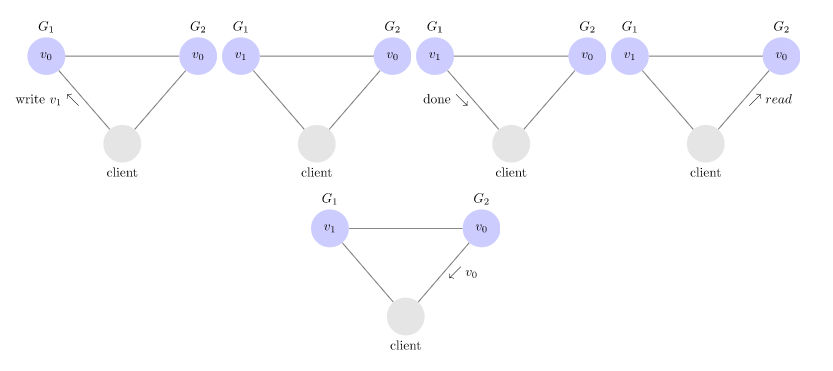
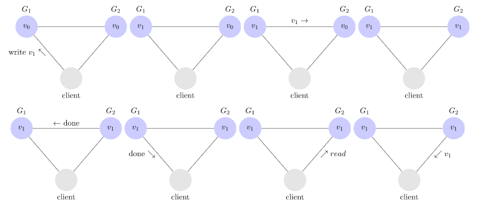
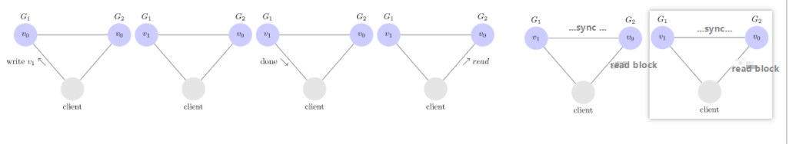

# CAP理论

CAP理论作为分布式系统的基础理论，描述的是一个分布式系统在以下三个特性中：

- 一致性【consistency】
- 可用性【availability】
- 分区容错性【partition tolerance】

最多满足其中两个特性，如下图所示。分布式系统要么满足CA，要么满足CP，要么AP，无法同时满足CAP。

[^https://baike.baidu.com/item/CAP%E5%8E%9F%E5%88%99/5712863?fr=aladdin]: 图片来源百度百科

## 一致性

在分布式系统完成某写操作后任何读操作，都应该获取到该写操作写入的那个最新的值。相当于要求分布式系统中的各节点时时刻刻保持数据的一致性。

不一致的例子：

如图假设分布式系统有G1，G2两个节点，初始值都是v0。现在有一个client向系统写入了值v1，这里假设直接写的是节点G1。写完之后client再去读取这个值，这时读到了G2节点，由于G2节点与G1节点失去连接，这时G1节点上的数据还未同步到G2节点，因此客户端读取到的是修改之前的值v0。 这就出现了不满足一致性的情况了，相当于**满足了可用性，失去了一致性**。

一致性的例子：

G1将其值复制到G2，G2完成后再向G1发送确认，G1再向客户端发送确认。当客户端从G2读取值时就是最新值。

强一致性：对于关系型数据库，要求更新过的数据能被后续的访问都能看到，这是强一致性。

弱一致性：如果能容忍后续的部分或者全部访问不到，则是弱一致性。

最终一致性：如果经过一段时间后要求能访问到更新后的数据，则是最终一致性。

## 可用性

一直可以正常的做读写操作。简单而言就是客户端一直可以正常访问并得到系统的正常响应。用户角度来看就是不会出现系统操作失败或者访问超时等问题。

不可用的例子：

如果系统保证了强的一致性，那么在client 写完G1节点后， 而G1向G2节点同步数据出现了问题，这时如果client再去读取G2节点的数据时，client就会一直处于等待状态，因为系统内各节点数据为同步上，需要等同步上才能使用。这就相当于**满足了一致性，而失去了可用性**。

## 分区容错性

指的分布式系统中的某个节点或者网络分区出现了故障的时候，整个系统仍然能对外提供满足一致性和可用性的服务。也就是说部分故障不影响整体使用。

当网络分区故障发生时，我们应该决定

- 取消操作从而降低可用性但确保一致性；
- 继续操作，从而提供可用性，但存在不一致的风险。

CAP 定理意味着在存在网络分区的情况下，必须在一致性和可用性之间做出选择。

## 如何取舍

1. CA: 优先保证一致性和可用性，放弃分区容错。 这也意味着放弃系统的扩展性，系统不再是分布式的，有违设计的初衷；传统的关系型数据库RDBMS：Oracle、MySQL就是CA。
2. CP: 优先保证一致性和分区容错性，放弃可用性。在数据一致性要求比较高的场合(譬如:zookeeper,Hbase) 是比较常见的做法，一旦发生网络故障或者消息丢失，就会牺牲用户体验，等恢复之后用户才逐渐能访问；最典型的就是分布式数据库：Redis、HBase等。
3. AP: 优先保证可用性和分区容错性，放弃一致性。NoSQL中的Cassandra 就是这种架构。跟CP一样，放弃一致性不是说一致性就不保证了，而是逐渐的变得一致。

参考链接：https://mwhittaker.github.io/blog/an_illustrated_proof_of_the_cap_theorem/

https://en.wikipedia.org/wiki/CAP_theorem

