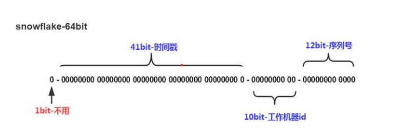

# 分布式ID

## 什么是分布式ID

举个例子，在业务系统中数据量不是很大的时候，单库单表就可以支撑业务，数据量大搞个主从同步读写分离也OK。随着数据量的增长，需要对数据库进行分库分表，分库分表需要有一个唯一ID来标识一条数据，数据库的自增ID显然不能满足，此时就需要一个唯一ID来做标识，并且是全局唯一的。这个全局唯一ID就是分布式ID。

## 分布式ID需要满足哪些条件

- 全局唯一：必须保证ID是全局性唯一的，基本要求；
- 高性能：高可用低延时，ID生成响应要块，否则反倒会成为业务瓶颈；
- 高可用：100%的可用性是骗人的，但是也要无限接近于100%的可用性；

系统设计和实现尽可能简单；ID最好是递增的。

## 分布式ID生成方式

### UUID

在Java中，UUID具有唯一性，但是并不推荐使用作为分布式ID。

优点：生成简单，无网络消耗，唯一性；

缺点：无序字符串，不具备自增；无具体业务含义；长度过长，存储及查询对MySQL的性能消耗较大，MySQL官方建议主键要尽量越短越好，UUID作为数据库主键，会导致数据位置频繁变动，严重影响性能；

### 数据库自增

利用数据库的auto_increment自增也具有唯一性，但当访问量激增时MySQL本身就是系统瓶颈，需要要提供服务，又需要维护表自增的id，用自增实现分布式服务风险大。

优点：实现简单，数值类型查询快；

缺点：单节点存在宕机风险，无法扛住高并发场景。

### Redis

利用Redis中的incr命令实现ID的自增，但需要考虑redis持久化。

会出现如下问题：

- RDB会定时打一个快照进行持久化，假如连续自增但redis没及时持久化，Redis挂了，重启Redis后会出现ID重复情况；
- AOF会对每条写命令进行持久化，即使Redis挂掉了也不会出现ID重复的情况，但会导致redis重启恢复的数据时间过长；


### 数据库号段模式

号段模式是当下分布式ID生成器的主流实现方式之一 ，号段模式可以理解成从数据库批量获取ID。将ID缓存在本地，提升效率。


例如 (1,1000] 代表1000个ID，具体的业务服务将本号段，生成1~1000的自增ID并加载到内存。

```sql
CREATE TABLE id_generator (
  id int(10) NOT NULL,
  max_id bigint(20) NOT NULL COMMENT '当前最大id',
  step int(20) NOT NULL COMMENT '号段的布长',
  biz_type	int(20) NOT NULL COMMENT '业务类型',
  version int(20) NOT NULL COMMENT '版本号',
  PRIMARY KEY (`id`)
) 
```

biz_type ：代表不同业务类型；

max_id ：当前最大的可用id；

step ：代表号段的长度；

version ：是一个乐观锁，每次都更新version，保证并发时数据的正确性；


等这批号段ID用完，再次向数据库申请新号段，对`max_id`字段做一次`update`操作，`update max_id= max_id + step`，update成功则说明新号段获取成功，新的号段范围是`(max_id ,max_id +step]`。


```sql
update id_generator set max_id = #{max_id+step}, version = version + 1 where version = # {version} and biz_type = XXX
```

由于多业务端可能同时操作，所以采用版本号`version`乐观锁方式更新，这种`分布式ID`生成方式不强依赖于数据库，不会频繁的访问数据库，对数据库的压力小很多。


### 雪花算法

雪花算法（Snowflake）是twitter公司内部分布式项目采用的ID生成算法，开源后广受国内大厂的好评，在该算法影响下各大公司相继开发出各具特色的分布式生成器。



`Snowflake`生成的是Long类型的ID，一个Long类型占8个字节，每个字节占8比特，也就是说一个Long类型占64个比特。

Snowflake ID组成结构：`符号位`（占1比特）+ `时间戳`（占41比特）+ `机器ID`（占5比特）+ `数据中心`（占5比特）+ `自增值`（占12比特）。

- 第一个bit位（1bit）：Java中long的最高位是符号位代表正负，正数是0，负数是1，一般生成ID都为正数，所以默认为0；
- 时间戳部分（41bit）：毫秒级的时间，不建议存当前时间戳，而是用（当前时间戳 - 固定开始时间戳）的差值，可以使产生的ID从更小的值开始；41位的时间戳可以使用69年，(1L << 41) / (1000L * 60 * 60 * 24 * 365) = 69年；
- 工作机器id（10bit）：也被叫做`workId`，这个可以灵活配置，机房或者机器号组合都可以；
- 序列号部分（12bit），自增值支持同一毫秒内同一个节点可以生成4096个ID；

### 滴滴

基于号段模式原理实现，项目地址：https://github.com/didi/tinyid

### 百度

基于雪花算法实现，项目地址：https://github.com/baidu/uid-generator

### 美团——叶子

同时支持号段模式和雪花算法原理实现，项目地址：https://github.com/Meituan-Dianping/Leaf