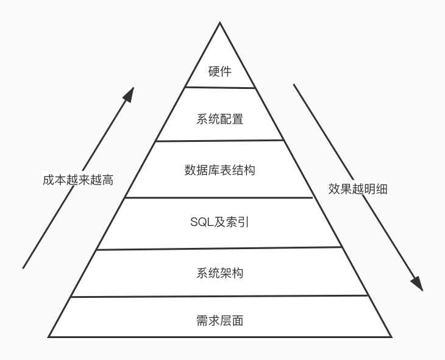
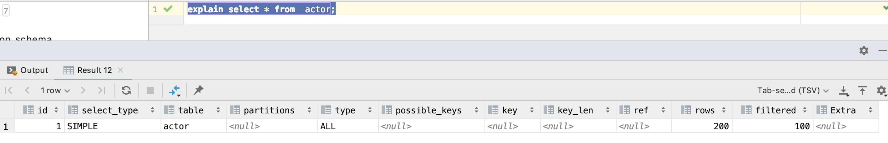

## 序言

### MySQL数据库优化层面



- 需求层面需要让产品经理和项目经理参与其中，进行优化。
  - 不合理的需求造成资源投入产出比过低。
  - 无用功能堆积使系统过度复杂影响整体性能。
- 系统架构层面需要让系统架构师和项目经理参与其中。
  - 数据库中存放的数据都是适合在数据库中存放的吗？
  - 是否合理的利用了应用层Cache机制？
  - 数据层实现都是最精间的吗？
- SQL及索引需要让开发介入。
  - 根据需求写出良好的SQL，并创建有效的索引，实现某一种需求可以多种写法，选择一种效率最高的写法。
  - sql优化的目的之一就是减少中间结果集，降低物理IO。
- 数据库表结构需要让开发者介入。
  - 根据数据库的范式，设计表结构，表结构设计的好坏直接关系到SQL语句的复杂度。
  - 适当的将表进行拆分，原本需要做join的查询只需要一张单表查询就可以了【冗余字段】。
- 系统配置需要DBA介入。
  - 大多数运行在Linux机器上，如tcp连接数的限制、打开文件数的限制、安全性的限制，因此我们要对这些配置进行相应的优化。
- 硬件需要运维介入。
  - 数据库主机的IO性能是需要最优先考虑的一个月因素。
  - 数据库主机和普通的应用程序服务器相比，资源要相对集中很多，单台主机上所需要进行的计算量自然也就比较多，所以数据库主机的CPU处理能力也是一个重要的因素。
  - 数据库主机的网络设备（一般指网卡）的性能也可能成为系统的瓶颈。


## JMeter压测

### 连接数据库

可能出现如下问题：

```bash
Cannot load JDBC driver class 'com.mysql.jdbc.Driver'
```

解决：下载相应的数据库连接jar包，将其复制到jmeter目录下的lib或者lib\ext路径下，复制后，需要重启，否则无法生效。


## MySQLDumpSlow工具

### 简介

如果开启了慢查询日志，就会生成大量的数据，然后我们就可以通过对日志的分析，生成分析报表，通过报表进行优化。

用法：

```bash
mysqldumpslow --help
```


```bash
mysqldumpslow -v /var/lib/mysql/VM-0-5-centos-slow.log 
```

查看慢查询日志。

```bash
mysqldumpslow -v -s l -t 10 /var/lib/mysql/VM-0-5-centos-slow.log 
```

按照锁表时间进行排序，并且查看慢日志的前10个。


优缺点：通过安装mysql进行附带安装，但是该工具统计的结果比较少，对我们的优化所提供的信息还是比较少，比如CPU、IO等信息都没有。


## pt-query-digest工具

### 简介

pt-query-digest是用于分析mysql慢查询的一个第三方工具，它可以分析binlog、General log、slowlog，也可以通过SHOWPROCESSLIST或者通过tcpdump抓取的MySQL协议数据来进行分析。可以把分析结果输出到文件中，分析过程是先对查询语句的条件进行参数化，然后对参数化以后的查询进行分组统计，统计出各查询的执行时间、次数、占比等，可以借助分析结果找出问题进行优化。


pt-query-digest本质是perl脚本，所以首先安装perl模块。

```bash
wget https://downloads.percona.com/downloads/percona-toolkit/3.3.1/binary/redhat/7/x86_64/percona-toolkit-3.3.1-1.el7.x86_64.rpm && yum localinstall -y percona-toolkit-3.3.1-1.el7.x86_64.rpm
```


检查是否安装成功

```bash
pt-query-digest --help
```


### pt-query-digest命令

```bash
pt-summary
```

查看服务器信息。

```bash
pt-diskstats
```

查看磁盘开销使用信息。

```bash
pt-mysql-summary --user=root --password=xxx
```

查看mysql服务信息。

```bash
pt-query-digest /var/lib/mysql/VM-0-5-centos-slow.log
```

**分析慢查询日志**，一般加上--limit=100%参数展示所有总体描述。

开头是总体描述，其余为单个慢查询的统计信息。

```bash
# 150ms user time, 20ms system time, 25.96M rss, 220.37M vsz
# 用户花费时间
# Current date: Tue Jun  8 14:59:13 2021
# 当前时间
# Hostname: VM-0-5-centos
# 主机
# Files: /var/lib/mysql/VM-0-5-centos-slow.log
# 分析文件名
# Overall: 7 total, 5 unique, 0.00 QPS, 0.20x concurrency ________________
# 总共7次查询，5次是不一样的，吞吐量为0
# Time range: 2021-06-07T14:43:25 to 2021-06-07T15:52:02
# 时间范围
# Attribute          total     min     max     avg     95%  stddev  median
# ============     ======= ======= ======= ======= ======= ======= =======
# Exec time           828s      1s    808s    118s    793s    276s      2s
# 执行的时间
# Lock time            2ms       0   681us   250us   657us   254us   144us
# 锁表时间
# Rows sent          1.02k       0     996  149.57  964.41  334.95    0.99
# 发给用户的行数
# Rows examine     101.93k       0  97.66k  14.56k  97.04k  33.74k    0.99
# 检测行数
# Query size           516      13     157   73.71  151.03   50.37   54.21
# 用户查询大小

# Profile
# Rank Query ID                            Response time  Calls R/Call   V
# ==== =================================== ============== ===== ======== =
#    1 0xA9879F2ED6A25D90799B558649A52BE4  808.0540 97.5%     1 808.0540  0.00 CALL pro_t1
# MISC 0xMISC                               20.3532  2.5%     6   3.3922   0.0 <4 ITEMS>
```

- Total：总共时间
- min：最少时间
- max：最多时间
- avg：平均时间
- 95%：x次查询，95%查询花费的时间
- stddev：标准时间
- median：中位值


```bash
pt-slave-find --host=xxx --user=root --password=xxx
```

查询主从状态。

```bash
pt-deadlock-logger --run-time=10 --interval=3 --create-dest-table --dest D=test,t=deadlocks u=root,p=xxx
```

**检测死锁状态**，将保持到test裤中的deadlocks表中。

```bash
pt-index-usage --user=root --password=e7d0b9446bfc4cbd8b9633814a7b746a --host=localhost /var/lib/mysql/VM-0-5-centos-slow.log 
```

从慢查询日志中分析索引使用情况。

```bash
pt-duplicate-key-checker --host=localhost --user=root --password=xxx
```

从慢查找数据库表中重复的索引。

```bash
pt-ioprofile
```

查看mysql表和文件的当前活动IO开销（不要在高峰时用）

```bash
pt-find --user=root --password=xxx --tablesize +1M
```

查找数据库大于1M的表。

```bash
pt-find --user=root --password=xxx --printf "%T\t%D.%N\n" | sort -rn
```

查找表和索引大小并排序。

```bash
pt-kill --user=root --password=xxx --busy-time 3 --print
```

显示查询时间大于3s的查询。

```bash
pt-kill --user=root --password=xxx --busy-time 3 --kill
```

kill掉大于3s的查询。

```bash
pt-show-grants --user=root --password=xxx
pt-show-grants --user=root --password=xxx --separate--revoke
```

查看mysql授权，集群常用，授权复制。
```bash
pt-table-checksum --user=root --password=xxx
```

验证数据库复制的完整性（集群常用，主从复制后校验）。


pt-query-digest可解决三大有问题的SQL

- 查询次数多且每次查询占用时间长的sql；
- IO大的sql，主要关注Rows examine项，扫描的行数越多，IO越大；
- 未命中索引的SQL，主要关注Rows examine和Rows Send，相差比较大，说明该SQL的索引命中率不高。


## SQL执行计划

### 通过explain分析SQL执行计划

SQL的执行计划反映出了SQL的执行效率，在执行的SQL前面加上explain即可。



- id列：数字越大越先执行，如果数字一样大，那么就从上往下依次执行，id列为null表示这是一个结果集，不需要使用它来进行查询。

- select_type列

  - simple：表示不需要union操作或者不包含子查询的简单select查询，有连接查询时，外层的查询为simple，且只有一个；
  - primary：一个需要union操作或者包含子查询的select，位于最外层的查询，select_type即为primary，且只有一个；
  - union：union连接的两个select查询，第一个查询是derived派生表，除了第一个表外，第二个以后的表select_type都是union。

  在5.x版本中，还包含union result。

  union result：包含union的结果集，在union和union all语句中，因为它不需要参与查询，所以id字段为null。

  dependent union：与union一样，出现在union或union all语句中，但是这个查询要受到外部查询的影响；

  subquery：除了from子句中包含的子查询外，其他地方出现的子查询可能是subquery。

  dependent subquery：与dependent union类似，表示这个subquery的查询要受到外部查询的影响；

  derived：from子句中出现的子查询，也叫做派生表，其他数据库中可能叫做内联试图或嵌套select；

  materialized：物化通过将子查询结果作为一个临时表来加快查询执行速度，正常来说是常驻内存，下次查询会再次引用临时表。

- table列

  - 显示的查询表名，如果查询使用了别名，那么显示的是别名，如果不涉及对数据库表的操作，那么显示为null，如果显示为尖括号\<derived N>就表示这个是临时表，后边N是执行计划中的id，表示结果来自于这个查询产生。如果是尖括号\<union M,N>，与\<derived N>类似，也是一个临时表，表示这个结果来自于union查询的id为M，N的结果集。

- partitions列

